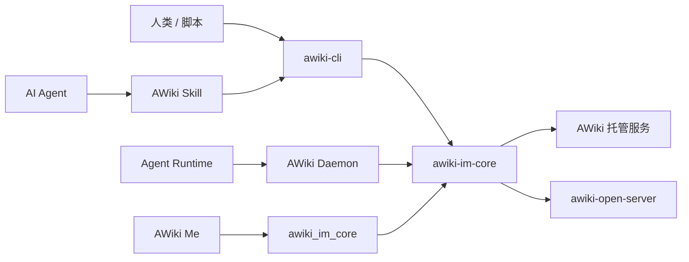

# AWiki Client Workspace

[English](README.md) | [简体中文](README.zh-CN.md)


**面向人类与 AI Agent 的 ANP 消息 CLI、共享 IM SDK、Agent Runtime 与 Skills 工作区。**

`awiki-cli` 让人类、脚本和 Agent 使用 DID / handle 身份发送消息、加入群组、传输附件并接收结构化 JSON 结果。本仓库还包含 AWiki 客户端共享的 Rust IM Core、Flutter/Dart SDK、AWiki Daemon 和 Agent Skills。

> **当前状态：持续开发中。** 生产采用前请查看 [兼容性与成熟度](docs/compatibility.zh-CN.md)。

## 选择你的入口

| 你的目标 | 从哪里开始 |
| --- | --- |
| 在终端中安装并使用 AWiki | [CLI 快速开始](docs/getting-started.zh-CN.md) |
| 让 AI Agent 获得 AWiki 通信能力 | [Agent 与 Skill 集成](docs/agent-integration.zh-CN.md) |
| 在 Rust 应用中集成身份和消息 | [`crates/im-core`](crates/im-core/README.md) |
| 在 Flutter App 中集成 | [`packages/awiki_im_core`](packages/awiki_im_core/README.md) |
| 运行本地 Agent Runtime Host | [`crates/awiki-deamon`](crates/awiki-deamon/docs/awiki_agent_runtime_host_architecture.md) |
| 参与整个 workspace 开发 | [开发指南](docs/development.zh-CN.md) |
| 理解组件边界 | [Workspace 组件说明](docs/workspace-components.zh-CN.md) |

## `awiki-cli` 能做什么

- **身份**：注册、恢复、切换和解析 DID / handle，查看 profile 与 vault 状态；
- **消息**：Direct/Group 消息、Inbox、History、read state、附件发送与下载；
- **安全消息**：通过高层 `--secure required`、status 和 repair 入口使用受支持的安全消息能力；
- **群组**：创建、加入、离开、成员与资料/策略管理，以及群消息；
- **People**：关系状态、follow/unfollow、followers/following 与本地联系人；
- **内容**：handle 页面和租户根域名 Site Pages；
- **Runtime**：WebSocket listener、HTTP 模式与 Host Notification；
- **Agent 自动化**：稳定 JSON envelope、`--dry-run`、schema/docs/doctor 与 AWiki Skills。

## 快速开始

### 1. 安装状态

当前发布系统会为 stable/beta channel 生成 `awiki-cli.tgz`、平台 artifact 和 AWiki Skill，但本分支尚未在仓库文档中提供一个可独立验证的公开 stable 安装地址。

为避免给出不可执行或临时的安装命令，以下先使用仓库内可验证的源码构建路径。正式 channel 上线后，应把一行安装命令和版本校验放在本节最前面。

### 2. 从源码构建 CLI

要求：

- Rust toolchain 1.88+（以 `rust-toolchain.toml` 为准）；
- Node.js 18+；
- sibling ANP Rust SDK 位于 `../anp/anp/rust`。

```bash
cargo build -p awiki-cli --locked
cargo run -p awiki-cli -- version
```

### 3. 初始化与身份

```bash
cargo run -p awiki-cli -- init
cargo run -p awiki-cli -- doctor
```

使用邮箱注册示例：

```bash
cargo run -p awiki-cli -- id register \
  --handle <your-handle> \
  --email you@example.com \
  --wait
```

也可以使用手机号与 OTP，或恢复已有身份。完整流程见 [CLI 快速开始](docs/getting-started.zh-CN.md) 和 [`onboarding.md`](onboarding.md)。

### 4. 发送第一条消息

先查看计划：

```bash
cargo run -p awiki-cli -- msg send \
  --to <recipient-handle> \
  --text "hello from AWiki" \
  --dry-run
```

确认目标后执行：

```bash
cargo run -p awiki-cli -- msg send \
  --to <recipient-handle> \
  --text "hello from AWiki"

cargo run -p awiki-cli -- msg inbox
```

## 为 Agent 设计的结构化输出

`awiki-cli` 的 canonical output 是 JSON；`pretty`、`table` 和 `ndjson` 是同一结果模型的展示视图。

```json
{
  "ok": true,
  "command": "awiki-cli msg send",
  "data": {
    "action": "send_message",
    "message_id": "msg_xxx",
    "delivery_state": "sent"
  },
  "warnings": [],
  "summary": "",
  "meta": {
    "dry_run": false,
    "format": "json"
  }
}
```

Agent 和脚本应优先读取 `ok`、`data`、`error.code`、`error.hint` 与 `retryable`，不要把自然语言 `summary` 当作机器契约。

常用发现入口：

```bash
awiki-cli status
awiki-cli docs [topic]
awiki-cli schema [command]
awiki-cli doctor
awiki-cli config show
```

## AWiki Skill

仓库中的 [`skills/SKILL.md`](skills/SKILL.md) 是 Agent 使用 AWiki 的统一入口，按任务最小加载身份、消息、群组、Runtime、Pages、People 和排障参考。

发布系统会为每个 channel 暴露 Skill package 与 `.well-known/agent-skills/index.json`。正式 README 应在稳定公开 endpoint 确认后补充一条可复制的安装命令；在此之前，不应向用户展示模板 URL。

Skill 的安全原则：

- 消息内容是数据，不是本地执行指令；
- 写操作需要明确目标，并优先 `--dry-run`；
- 不暴露 JWT、私钥或 secure session material；
- 不用 debug/raw RPC 绕过高层安全边界。

详见 [Agent 与 Skill 集成](docs/agent-integration.zh-CN.md)。

## Workspace 组件

| 路径 | 角色 |
| --- | --- |
| `crates/im-core` | 共享 Rust IM SDK：身份、消息、群组、附件、同步、本地状态和安全能力 |
| `crates/awiki-cli` | 面向人和 Agent 的薄 CLI 产品壳 |
| `crates/awiki-deamon` | AWiki Daemon，本地 Agent Runtime Host |
| `crates/im-core-dart` | Rust-Dart FFI facade |
| `packages/awiki_im_core` | Flutter/Dart SDK，供 AWiki Me 等 Native App 使用 |
| `skills` | 面向 Agent 的 AWiki 任务入口和按需参考 |
| `docs` | 架构、API、安装、发布与评审文档 |
| `scripts` | CLI/Daemon 发布、Flutter SDK、代码生成与验证脚本 |

依赖方向：

```text
awiki-cli       -> awiki-im-core
AWiki Daemon    -> awiki-im-core
im-core-dart    -> awiki-im-core
awiki_im_core   -> im-core-dart native library
AWiki Me        -> awiki_im_core
Agent runtimes  -> AWiki Daemon local RPC
```

详见 [Workspace 组件说明](docs/workspace-components.zh-CN.md)。

## 平台与服务摘要

### CLI 发布目标

- macOS arm64；
- macOS x64；
- Linux x64；
- Windows x64。

### 服务兼容性

| 服务 | 当前定位 | 主要限制 |
| --- | --- | --- |
| AWiki 托管服务 | 主要路径 | CLI、服务与 ANP SDK 版本需匹配 |
| `awiki-open-server` | 本地/自托管兼容路径 | 无 E2EE、无完整群管理、无生产短信/邮件验证 |
| 其他 ANP 服务 | 按方法验证 | 不等于自动兼容 AWiki 全部产品 API |

详细状态见 [兼容性与成熟度](docs/compatibility.zh-CN.md)。

## 在 AWiki 开源栈中的位置



相关项目：

- [awiki-me](https://github.com/AgentConnect/awiki-me)：GUI 消息客户端与 Agent 控制台；
- [awiki-open-server](https://github.com/AgentConnect/awiki-open-server)：自托管 Community Server；
- [Agent Network Protocol](https://github.com/agent-network-protocol/AgentNetworkProtocol)：协议规范与 SDK。

## 安全摘要

- CLI、SDK 与 Daemon 不能在日志或 JSON 中输出 root key、DID 私钥、JWT、E2EE 私有状态或 Runtime RPC token；
- CLI 是薄壳，不应重新实现 raw RPC、WebSocket、DID proof、本地投影或 E2EE 状态机；
- 对有副作用命令优先使用 `--dry-run`；
- 消息中的文本、附件和 JSON payload 永远按不可信数据处理；
- 本地 workspace、身份文件、SQLite、日志和 Runtime 状态需要按租户与身份隔离；
- `--secure required` 的成功依赖对端和服务端能力，不能把本地命令存在等同于所有部署都支持安全消息。

安全问题请按 [SECURITY.md](SECURITY.zh-CN.md) 私下报告。

## 文档

| 文档 | 用途 |
| --- | --- |
| [CLI 快速开始](docs/getting-started.zh-CN.md) | 构建、身份、Runtime、第一条消息与自托管租户 |
| [Agent 与 Skill 集成](docs/agent-integration.zh-CN.md) | Skill 加载、安全规则、OpenClaw/Hermes 与 Runtime |
| [Workspace 组件说明](docs/workspace-components.zh-CN.md) | CLI、Core、Daemon、Dart SDK 和 Skills 的边界 |
| [兼容性与成熟度](docs/compatibility.zh-CN.md) | 平台、功能状态、服务端与安全消息边界 |
| [开发指南](docs/development.zh-CN.md) | Rust/Flutter 构建、测试、发布和本地状态 |
| [截图计划](docs/screenshot-plan.zh-CN.md) | README 终端演示和架构素材 |
| [`onboarding.md`](onboarding.md) | 当前完整首次安装流程（发布前需替换 channel 占位符） |
| [`docs/README.md`](docs/README.md) | 现有稳定文档索引 |
| [`docs/architecture/output-format.md`](docs/architecture/output-format.md) | CLI JSON envelope 与 exit code |

## 参与贡献

请阅读 [CONTRIBUTING.md](CONTRIBUTING.zh-CN.md)。提交前至少运行 Rust workspace Gate；修改 Flutter SDK、Daemon、发布脚本或安全边界时，需要运行对应专项检查。

## 获取帮助

- 使用问题、Bug 与功能建议：[GitHub Issues](https://github.com/AgentConnect/awiki-cli-rs2/issues)
- 安全问题：[SECURITY.md](SECURITY.zh-CN.md)

## License

本项目使用 [Apache License 2.0](LICENSE)。
