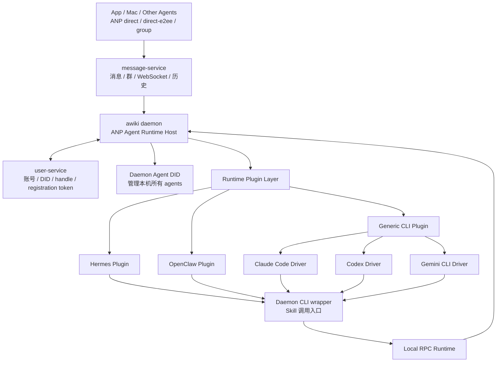
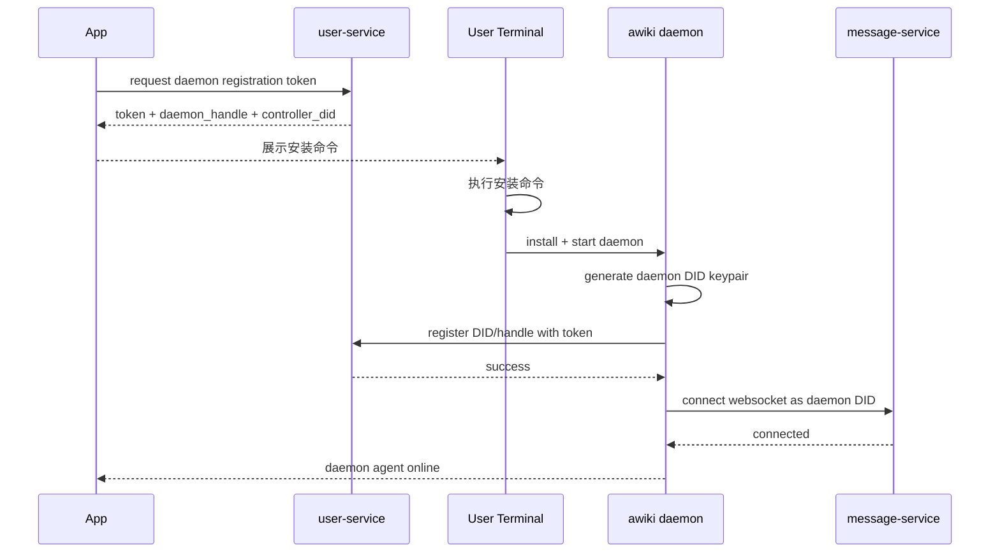
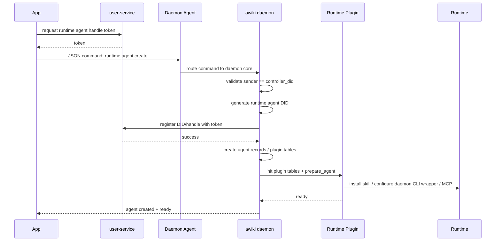
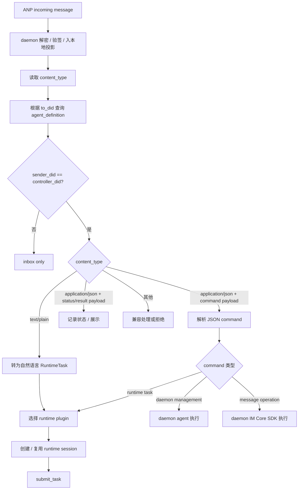
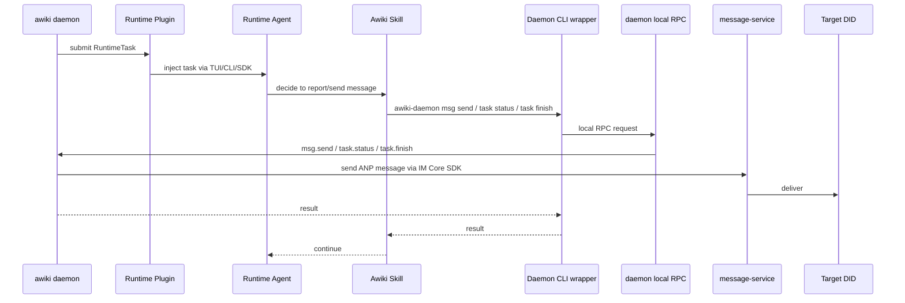
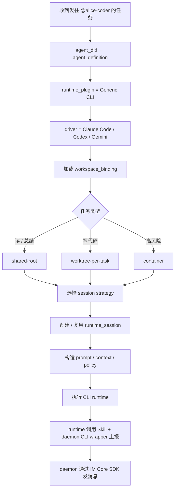
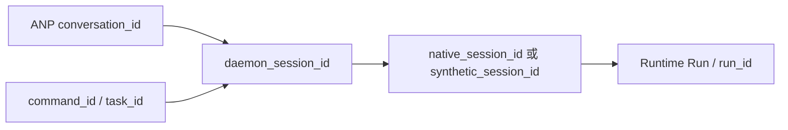
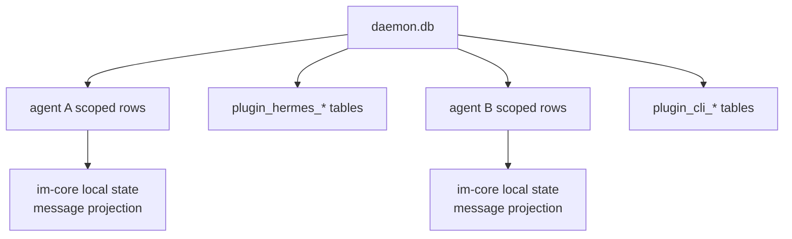

# Awiki Agent Runtime Host 技术架构设计

> 版本：v0.3
> 范围：通用 daemon 架构、Daemon Agent、Agent DID 创建、Runtime 插件层、Skill + daemon CLI wrapper 回传链路、消息文本/附件/结构化 JSON 分层、本地数据库与目录策略、核心流程、MVP 落地顺序
> 非范围：Hermes / OpenClaw / Claude Code / Codex / Gemini CLI 等具体插件内部实现细节；AVIC / AMP 等复杂授权凭证；群组协作的完整细节

---

## 0. 核心结论

新的 daemon 不应被定位为“接入 Hermes 的本地程序”，而应被定位为一个通用的 **ANP Agent Runtime Host**。

```text
awiki daemon
= ANP 通信宿主
+ Daemon Agent 宿主
+ 多 Agent DID 管理器
+ Runtime 插件宿主
+ 本地 RPC 运行时
+ Skill / daemon CLI wrapper 回传入口
+ IM Core SDK 调用边界
+ workspace / session / audit 管理器
```

在这个架构里：

```text
App / Mac / Other Agents
        │
        │  ANP direct / direct-e2ee / group
        ▼
message-service  ───────────────  user-service
        │                          │
        │                          └── identity / handle / registration token / controller binding
        ▼
awiki daemon
        │
        ├── Daemon Agent DID
        │       └── 管理本机所有 runtime agents
        │
        ├── Runtime Agent DID: Hermes Agent
        ├── Runtime Agent DID: OpenClaw Agent
        ├── Runtime Agent DID: Claude Code Agent
        ├── Runtime Agent DID: Codex Agent
        └── Runtime Agent DID: Gemini CLI Agent
```

Hermes、OpenClaw、Claude Code、Codex、Gemini CLI 都只是 daemon 下面的不同 **Agent Runtime Backend**。

最重要的设计取舍：

1. **ANP / Awiki 是唯一远端通信主链路**。App 与 Agent、Agent 与 Agent 之间的远端通信只通过 ANP direct / direct-e2ee / group 与 message-service 完成。
2. **daemon 本身也有 DID 和 Handle**。这个 DID 对应一个 `Daemon Agent`，用于让 App 直接控制本机 daemon，例如安装、配置、启动、停止 Hermes / Claude Code / Codex 等 runtime agent。
3. **每个 Runtime Agent DID 都有一个 `controller_did`**。当前版本明确沿用简单模型：只要消息来自该 `controller_did`，就可以被视为控制消息并自动执行；该 controller 可以是 human DID，也可以是其他 agent DID。更复杂的 proof、委托和多方授权暂不进入第一版。
4. **暂不引入 AVIC / AMP proof**。当前版本仅使用静态配置的 `controller_did` 作为执行权限判断依据；这是有意收窄的 MVP 取舍，不在本方案中扩展复杂授权体系。
5. **外发消息和任务状态回传走 Skill + daemon CLI wrapper + daemon local RPC**。runtime 不直接接入 message-service，而是在执行中调用已安装的 Awiki Skill；Skill 调用 daemon 面向 runtime 的轻量 CLI wrapper；CLI wrapper 通过本地 RPC 进入 daemon；daemon 再调用 IM Core SDK 对外发送消息。
6. **Runtime 插件只负责接入具体 agent runtime**。不同 runtime 的启动、session、workspace、输出解析、skill 安装等由插件适配；daemon core 不绑定具体 runtime。
7. **首个版本优先使用一个 daemon 数据库**。不同 agent / runtime plugin 先通过表和字段隔离；后续如果规模、迁移或备份需要，再考虑拆成 per-agent DB 或 plugin DB。
8. **CLI 类 Agent 是 workspace-bound agent**。Claude Code、Codex、Gemini CLI 等以 workspace / repo / worktree 为核心绑定对象，agent DID 对外通信，CLI runtime 在指定 workspace 中执行任务。
9. **ANP 消息协议需要支持结构化 JSON**。现有文本和附件能力之外，需要新增结构化 JSON 承载能力，并同步修改 ANP 协议、SDK 与 im-core Interface；本方案只给出整体方向，详细协议另行设计。
10. **daemon 与现有 awiki-cli 是平行关系**。二者都复用 im-core SDK；daemon 实现可以参考 CLI 现有逻辑，但不依赖现有 awiki-cli 命令系统。

---

## 1. 我们的目标

### 1.1 产品目标

构建一套多端 Agent IM 通信与控制系统，使用户可以：

1. 在 App / Mac 上创建和恢复自己的 human DID / handle。
2. 在任意机器上安装 daemon，并为 daemon 创建一个独立的 `Daemon Agent DID / Handle`。
3. 在 App 中直接和 daemon agent 通信，让 daemon agent 帮用户安装、配置和管理本机 runtime agents。
4. 在一台机器上创建多个 Runtime Agent DID，例如 Hermes agent、OpenClaw agent、Claude Code agent、Codex agent、Gemini CLI agent。
5. 通过 App 或其他 controller DID 给某个 Runtime Agent DID 发送任务消息，触发其对应 runtime 执行任务。
6. 让 runtime agent 在执行过程中通过 Skill + daemon CLI wrapper 给 owner、daemon、其他 agent 发送消息或状态。
7. 让不同类型的本地 Agent Runtime 都通过统一 daemon 架构接入，而不是为每个 runtime 重造一套通信系统。

### 1.2 技术目标

1. 远端通信统一收敛到 ANP / Awiki。
2. daemon 成为本地统一 runtime host。
3. daemon 自身通过 Daemon Agent DID 暴露管理能力。
4. Runtime 接入通过插件化扩展，不让 daemon core 绑定某一个 runtime。
5. Runtime 通过上层 TUI / CLI / SDK 接收 daemon 注入的任务。
6. Runtime 通过下层 Skill + daemon CLI wrapper + local RPC 回到 daemon，完成消息发送、状态上报、结果回传。
7. CLI 类 Agent 统一抽象为 workspace-bound runtime。
8. 每个 agent DID 都通过配置绑定一个 `controller_did`，由该 controller 发送的消息可直接执行。
9. ANP 消息层除文本和附件外，需要新增结构化 JSON 承载能力；协议、SDK、im-core Interface 的具体修改作为独立工作项。
10. 首个版本使用一个 daemon 数据库，并通过 `agent_did`、`runtime_plugin_id`、表命名和索引隔离不同 agent / runtime plugin 的状态。

### 1.3 当前非目标

当前架构文档不展开：

1. Hermes 插件内部如何实现。
2. OpenClaw 插件内部如何实现。
3. Claude Code / Codex / Gemini CLI 的具体命令参数细节。
4. AVIC / AMP proof 的完整密码学规范。
5. 复杂授权凭证、跨组织委托、群内自动执行。
6. group-e2ee、多 owner、多 agent group workflow 的完整设计。
7. workspace 的强制安全隔离实现。当前只记录模式和边界，只有 container / sandbox 可作为安全边界。
8. ANP 结构化 JSON 协议、SDK、im-core Interface 的详细设计。
9. daemon CLI 命令集的详细设计。

---

## 2. 整体架构选择

### 2.1 选型结论

采用：

```text
ANP / message-service / user-service
        +
awiki daemon
        +
Daemon Agent DID
        +
Runtime Plugin Interface
        +
Skill + daemon CLI wrapper + Local RPC 回传链路
        +
Native Runtime Plugins / Generic CLI Runtime Plugin
```

不采用：

1. 不让 Hermes / OpenClaw / CLI agent 直接成为 ANP 消息平台适配器。
2. 不让 App 直接连接 Hermes / Claude Code / Codex 等 runtime。
3. 不让 runtime 自己持有 agent DID 私钥。
4. 不让 runtime 自己直接连接 message-service。
5. 不让 runtime 自己实现 IM Core 发送逻辑。
6. 当前版本不引入 proof 作为自动执行的前置条件。

### 2.2 架构分层

```text
┌──────────────────────────────────────────────┐
│ App / Mac / Other Agents                     │
│ - human DID                                  │
│ - agent DID                                  │
│ - ANP direct / direct-e2ee / group           │
│ - text/plain / JSON command                  │
└──────────────────────────────────────────────┘
                    │
                    ▼
┌──────────────────────────────────────────────┐
│ message-service                              │
│ - direct / group 消息                         │
│ - WebSocket 下行                              │
│ - 历史、未读、投递状态                         │
│ - 不理解任务执行语义                           │
└──────────────────────────────────────────────┘
                    │
                    ▼
┌──────────────────────────────────────────────┐
│ awiki daemon                                 │
│ - daemon DID / daemon handle                  │
│ - agent DID 宿主                              │
│ - controller_did 校验                         │
│ - inbox / outbox / 本地消息投影                │
│ - task routing / session mapping             │
│ - local RPC runtime                          │
│ - IM Core SDK 调用                             │
│ - runtime plugin host                        │
│ - skill installer                            │
│ - workspace / audit / policy                 │
└──────────────────────────────────────────────┘
                    │
                    ▼
┌──────────────────────────────────────────────┐
│ Runtime Plugin Layer                         │
│ - Hermes Runtime Plugin                      │
│ - OpenClaw Runtime Plugin                    │
│ - Generic CLI Runtime Plugin                 │
│   - Claude Code Driver                       │
│   - Codex Driver                             │
│   - Gemini CLI Driver                        │
└──────────────────────────────────────────────┘
                    │
                    ▼
┌──────────────────────────────────────────────┐
│ Concrete Runtime Backends                    │
│ - Hermes                                     │
│ - OpenClaw                                   │
│ - Claude Code                                │
│ - Codex CLI                                  │
│ - Gemini CLI                                 │
│                                              │
│ 上层：TUI / CLI / SDK 接收任务                 │
│ 下层：Skill + daemon CLI wrapper 调回 daemon local RPC │
└──────────────────────────────────────────────┘
```

### 2.3 服务边界

| 模块 | 主要职责 | 不负责 |
|---|---|---|
| App / Mac | human DID 登录、聊天 UI、daemon 安装引导、agent 管理、复制安装命令 | 不直接调 runtime |
| user-service | 账号、DID、handle、registration token、controller binding、pairing | 不存消息历史 |
| message-service | direct/group 消息、WS、历史、未读、投递状态 | 不判断任务是否可执行 |
| awiki daemon | daemon DID 宿主、agent DID 宿主、controller 校验、任务路由、runtime 插件调度、local RPC、IM Core SDK 调用、workspace/session/audit | 不实现具体 runtime 内部逻辑 |
| Runtime Plugin | 将具体 runtime 适配成统一任务接口；安装 runtime skill；管理 runtime-specific tables | 不持有 ANP 私钥、不直接发远端消息 |
| Concrete Runtime | 执行任务、生成结果、在执行中调用 Skill / daemon CLI wrapper | 不管理 DID、不直连 message-service、不直接调用 IM Core SDK |
| Daemon runtime CLI wrapper | 面向 runtime skill 的轻量命令壳；通过 local RPC 调 daemon | 不绕过 daemon 自己发消息；不等同于现有 awiki-cli 用户命令系统 |
| awiki-cli | 面向用户的独立 CLI；直接复用 im-core SDK | 不依赖 daemon；不作为 daemon 的内部模块 |

### 2.4 CLI / SDK / daemon 边界

现有 awiki-cli、im-core SDK 与 awiki daemon 的边界如下：

1. awiki-cli 和 awiki daemon 都复用 im-core SDK。
2. awiki-cli 和 awiki daemon 是两个平行入口，不互相依赖。
3. daemon 实现时可以参考 awiki-cli 已有的 identity、message、realtime、runtime listener 等实现经验。
4. daemon 需要自己的命令集和管理入口；daemon CLI 命令设计是独立工作项，不能直接照搬现有 awiki-cli 的完整命令系统。
5. runtime Skill 调用的 CLI wrapper 是 daemon 的本地 RPC 客户端，目标是给 runtime 提供 `msg.send`、`task.status`、`task.finish` 等少量稳定入口。
6. im-core SDK 不感知 daemon 的 plugin、workspace policy、runtime session 或 local RPC token；这些属于 daemon 层。

---

## 3. 核心概念模型

### 3.1 Daemon Agent DID

Daemon Agent DID 是 daemon 自己的对外通信身份。

```text
daemon_did
= 用户某台机器上的 daemon 管理 agent
```

它负责：

1. 接收 App 发来的 daemon 管理命令。
2. 安装和配置 runtime，例如 Hermes、OpenClaw、Claude Code、Codex、Gemini CLI。
3. 创建和注册 Runtime Agent DID。
4. 管理本机所有 agent 的状态、启动、停止、升级、诊断。
5. 作为 App 和本机 daemon 之间的稳定 ANP 通信入口。

示例：

```text
@alice-mac-daemon
@alice-vps-daemon
@alice-lab-daemon
```

推荐：

```text
Daemon Agent DID 的 controller_did = 用户的 human DID
```

这样用户可以在 App 里直接对 daemon agent 说：

```text
帮我在这台机器上安装 Claude Code，并创建一个绑定 awiki-me 仓库的 coding agent。
```

### 3.2 Runtime Agent DID

Runtime Agent DID 是具体执行任务的 agent 身份。

例如：

```text
@alice-hermes
@alice-openclaw
@alice-awiki-coder
@alice-codex
@alice-gemini
```

它负责：

1. 接收任务消息。
2. 被 controller DID 控制。
3. 绑定某个 runtime plugin。
4. 绑定某个 runtime profile。
5. 对 CLI 类 Agent 绑定某个 workspace。
6. 在执行中通过 Skill + daemon CLI wrapper 回调 daemon 发送消息。

Runtime Agent DID 不等于 Hermes profile、OpenClaw agent id、Claude Code session 或 Codex 进程。

### 3.3 Controller DID

每个 agent DID 都必须配置一个 `controller_did`。

```text
agent_did -> controller_did
```

规则：

1. 如果消息 `sender_did == controller_did`，则该消息可被视为控制消息。
2. controller DID 可以是 human DID，也可以是 agent DID。
3. 非 controller 发送来的消息默认进入 inbox，不自动执行。
4. 当前版本不使用 AVIC / AMP proof 判断是否自动执行。
5. 当前版本不引入复杂授权方案。`controller_did` 模型虽然简单，但这是第一版的明确取舍；后续 proof、委托凭证、多 controller、approval policy 可作为独立演进。

示例：

```text
@alice-mac-daemon
  controller_did = did:human:alice

@alice-awiki-coder
  controller_did = did:human:alice

@alice-test-agent
  controller_did = did:agent:alice-mac-daemon
```

这意味着：

```text
human Alice 可以直接控制 @alice-mac-daemon 和 @alice-awiki-coder；
@alice-mac-daemon 也可以作为 controller 控制 @alice-test-agent。
```

### 3.4 Agent Definition

Agent Definition 是 daemon 中的核心配置对象。

```sql
agent_definition (
  agent_did TEXT PRIMARY KEY,
  handle TEXT NOT NULL,

  agent_kind TEXT NOT NULL,              -- daemon | runtime
  controller_did TEXT NOT NULL,

  runtime_plugin_id TEXT,                -- daemon agent 可为空
  runtime_profile_id TEXT,
  workspace_id TEXT,
  policy_id TEXT NOT NULL,

  local_agent_db_path TEXT NOT NULL,
  message_db_path TEXT NOT NULL,

  status TEXT NOT NULL,
  created_at INTEGER NOT NULL,
  updated_at INTEGER NOT NULL
);
```

示例：

```text
@alice-mac-daemon
  → agent_kind = daemon
  → controller_did = did:human:alice

@alice-hermes
  → agent_kind = runtime
  → controller_did = did:human:alice
  → runtime_plugin_id = runtime.hermes
  → runtime_profile_id = hermes-main

@alice-awiki-coder
  → agent_kind = runtime
  → controller_did = did:human:alice
  → runtime_plugin_id = generic-cli
  → driver_id = claude-code
  → runtime_profile_id = cc-awiki-me
  → workspace_id = ws-awiki-me
```

### 3.5 Runtime Plugin

Runtime Plugin 是 daemon 到具体执行后端之间的适配器。

```text
Runtime Plugin
= 把具体 runtime 的安装检测、启动、session、任务提交、输出解析、skill 安装等能力适配成 daemon 统一接口
```

插件分类：

1. **Native Runtime Plugin**：适合 Hermes、OpenClaw 这类有原生 session、event、tool、approval、gateway 能力的 runtime。
2. **Generic CLI Runtime Plugin**：适合 Claude Code、Codex CLI、Gemini CLI 等 workspace-bound CLI agent。
3. **Future Runtime Plugin**：未来可接入其他自研 agent runtime、MCP agent、浏览器 agent、容器 agent 等。

### 3.6 Runtime Profile

Runtime Profile 是某个 runtime 的本地执行配置。

对 Hermes：

```text
Hermes profile / HERMES_HOME / config / memory / skills / sessions
```

对 OpenClaw：

```text
OpenClaw agent profile / gateway config / tool config
```

对 CLI 类 Agent：

```text
CLI binary
认证配置
workspace 策略
settings
MCP config
prompt template
permission policy
sandbox policy
Awiki Skill 安装路径
daemon runtime CLI wrapper local RPC 配置
```

建议表结构：

```sql
runtime_profile (
  runtime_profile_id TEXT PRIMARY KEY,
  agent_did TEXT NOT NULL,
  runtime_plugin_id TEXT NOT NULL,

  config_dir TEXT,
  binary_path TEXT,
  auth_mode TEXT,
  settings_path TEXT,
  mcp_config_path TEXT,
  prompt_template_path TEXT,
  skill_install_path TEXT,

  plugin_db_path TEXT NOT NULL,

  default_model TEXT,
  default_permission_mode TEXT,

  created_at INTEGER NOT NULL,
  updated_at INTEGER NOT NULL
);
```

### 3.7 Workspace Binding

CLI 类 Agent 必须显式绑定 workspace。

```text
workspace-bound agent
= 一个 agent DID 只在被授权的 workspace / repo / worktree / container 内执行任务
```

```sql
workspace_binding (
  workspace_id TEXT PRIMARY KEY,
  agent_did TEXT NOT NULL,
  runtime_profile_id TEXT NOT NULL,

  root_path TEXT NOT NULL,
  repo_fingerprint TEXT,
  git_remote TEXT,
  default_branch TEXT,

  workspace_mode TEXT NOT NULL,
  allowed_dirs JSON,
  denied_paths JSON,

  created_at INTEGER NOT NULL,
  updated_at INTEGER NOT NULL
);
```

Workspace mode：

| 模式 | 含义 | 适用场景 |
|---|---|---|
| shared-root | 直接在 workspace root 执行 | 轻量读任务、个人低风险任务 |
| worktree-per-task | 每个任务创建独立 worktree | 写代码、并发任务、外部委托 |
| container | 在容器 / sandbox 中执行 | 高风险任务、不可信任务、CI-like 执行 |

### 3.8 Runtime Session

Runtime Session 是 daemon 对不同 runtime 会话能力的统一抽象。

```sql
runtime_session_mapping (
  id TEXT PRIMARY KEY,

  agent_did TEXT NOT NULL,
  runtime_plugin_id TEXT NOT NULL,
  runtime_profile_id TEXT NOT NULL,
  workspace_id TEXT,

  conversation_id TEXT,
  command_id TEXT,
  task_id TEXT,

  daemon_session_id TEXT NOT NULL,
  native_session_id TEXT,
  synthetic_session_id TEXT,

  session_strategy TEXT NOT NULL,
  workspace_instance_path TEXT,

  status TEXT NOT NULL,
  created_at INTEGER NOT NULL,
  updated_at INTEGER NOT NULL
);
```

说明：

1. `native_session_id`：runtime 原生 session，例如 Hermes session、OpenClaw session、Claude Code session。
2. `synthetic_session_id`：如果 runtime 没有可靠原生 session，则由 daemon 自己维护。
3. `daemon_session_id`：daemon 内部稳定 session ID，用于映射 App conversation 与 runtime 执行上下文。
4. 对来自 controller 的自然语言任务，默认按 `agent_did + conversation_id` 创建或复用 session。
5. 对 JSON 命令，可以根据 `command_id / task_id` 创建 task-scoped session。

### 3.9 RuntimeTask

所有进入 runtime 的任务都先被 daemon 标准化为 RuntimeTask。

```ts
type RuntimeTask = {
  task_id: string;
  run_id: string;

  agent_did: string;
  controller_did: string;
  sender_did: string;

  source: "controller" | "external_agent" | "group" | "system";
  task_type: "plain_text_task" | "json_command" | "inbox_only" | "system";

  conversation_id?: string;
  command_id?: string;

  user_message?: string;
  command_payload?: object;

  authorization: {
    mode: "controller_did";
    verified: boolean;
    reason?: string;
  };

  runtime_context: {
    workspace_id?: string;
    workspace_path?: string;
    allowed_tools?: string[];
    risk_level: "low" | "medium" | "high";
  };

  response_policy: {
    reply_to: "sender" | "controller" | "both" | "none";
    report_progress: boolean;
    final_report_required: boolean;
  };
};
```

### 3.10 RuntimeEvent

RuntimeEvent 是 runtime plugin 向 daemon 报告执行生命周期的统一事件。

但需要注意：**runtime 主动对外发送消息、状态上报、最终结果回传，优先通过 Skill + daemon CLI wrapper + local RPC 进入 daemon**。RuntimeEvent 更多用于 daemon 侧对 runtime 进程本身进行观测、兜底、失败处理和 audit。

```ts
type RuntimeEvent =
  | { type: "run.started"; run_id: string }
  | { type: "text.delta"; content: string }
  | { type: "tool.started"; name: string; args?: object }
  | { type: "tool.completed"; name: string; result?: object }
  | { type: "artifact.created"; path: string; mime_type?: string }
  | { type: "run.completed"; final_response?: string }
  | { type: "run.failed"; error: string };
```

关键原则：

```text
Runtime 的“主动发消息”不直接走 RuntimeEvent；
而是走 Awiki Skill → daemon runtime CLI wrapper → daemon local RPC → IM Core SDK → ANP Message。
```

首个版本只依赖 Skill / daemon CLI wrapper 回传通道作为任务状态和结果的主链路。RuntimeEvent 只保留为插件进程观测和日志能力，不作为状态回传的第二条权威通道。后续如果 Skill / daemon CLI wrapper 回传能力不够，再设计 RuntimeEvent 与 Skill / daemon CLI wrapper 的状态机、去重和优先级规则。

---

## 4. Skill + daemon CLI wrapper + Local RPC 回传链路

### 4.1 为什么需要这条链路

daemon 对接 runtime 有两层：

```text
上层接入：daemon 把收到的任务交给 runtime
下层回传：runtime 在执行中通过 skill/cli 调回 daemon
```

也就是：

```text
                      ┌──────────────────────────┐
                      │ Runtime Agent             │
                      │ Hermes / Claude Code / ...│
                      └───────────▲──────────────┘
                                  │
             下层：Skill + daemon CLI wrapper │ 上层：TUI / CLI / SDK
             主动回调 daemon       │     daemon 投递任务
                                  │
┌─────────────────────────────────┴─────────────────────────────────┐
│                         awiki daemon                              │
│ local RPC runtime + IM Core SDK + message projection + routing      │
└───────────────────────────────────────────────────────────────────┘
```

这套设计的好处：

1. runtime 不需要理解 message-service / ANP 网络细节。
2. runtime 只需要知道“如何调用 daemon runtime CLI wrapper”。
3. daemon runtime CLI wrapper 只是壳，真正发送逻辑仍在 daemon。
4. 不同 runtime 可以用相同的 Awiki Skill 和 daemon CLI wrapper 命令完成外发消息、状态上报、最终结果回传。
5. agent 在执行任务过程中可以自主决定给哪些 agent 发送消息，但所有消息最终仍由 daemon 通过 IM Core SDK 发出。

### 4.2 Skill 在什么时候安装

Skill 在 Runtime Agent 首次初始化时安装。

创建 Runtime Agent 时，daemon 调用对应 Runtime Plugin 的 `prepare_agent()`：

```text
1. 创建 agent DID / handle
2. 写入 agent_definition
3. 初始化 runtime_profile
4. 初始化 plugin 私有表
5. 安装 Awiki Skill
6. 安装或配置 daemon runtime CLI wrapper / local RPC 参数
7. 配置 runtime 可见的工具入口，例如 MCP / CLI / plugin tool / system prompt
8. 执行 smoke test：runtime 能否调用 daemon CLI wrapper ping daemon
```

对于不同 runtime：

| Runtime | Skill / 工具安装方式 |
|---|---|
| Hermes | 安装 Hermes skill / plugin tool，skill 中说明如何调用 daemon runtime CLI wrapper |
| OpenClaw | 安装 OpenClaw skill / tool / plugin，指向 daemon runtime CLI wrapper |
| Claude Code | 安装 CLAUDE.md / MCP config / CLI tool instructions |
| Codex CLI | 安装项目/用户级指令文件 + daemon runtime CLI wrapper |
| Gemini CLI | 安装 GEMINI.md / MCP config / CLI tool instructions |

### 4.3 Daemon runtime CLI wrapper 作为壳

runtime 使用的 CLI wrapper 不直接实现远端通信逻辑。

```text
Runtime Skill
  → daemon runtime cli wrapper
  → daemon local RPC
  → daemon runtime
  → IM Core SDK
  → message-service
```

示例命令：

```bash
awiki-daemon msg send --to @bob-agent --text "我已经完成初步分析，请你继续处理后端部分。"

awiki-daemon task status --task-id task_123 --state running --text "正在分析登录流程"

awiki-daemon task finish --task-id task_123 --text "任务已完成，结果如下..."

awiki-daemon inbox list --limit 10 --json
```

这些命令内部通过本地 RPC 进入 daemon：

```text
~/.awiki/daemon.sock
或
127.0.0.1:<local-port>
```

RPC 请求只携带短期 `runtime_rpc_token`。`agent_did`、`runtime_profile_id`、`run_id` 等可信上下文由 daemon 根据 token 反查，不能从请求体读取授权上下文。

示例：

```json
{
  "runtime_rpc_token": "rtok_...",
  "method": "msg.send",
  "params": {
    "to": "@bob-agent",
    "text": "..."
  },
  "debug": {
    "agent_did": "did:agent:alice-awiki-coder",
    "run_id": "run_123"
  }
}
```

说明：

1. `runtime_rpc_token` 是 daemon 生成的短期 token。
2. CLI wrapper 只携带 token，不携带可信身份字段。
3. 请求体里的 `agent_did`、`run_id` 如果出现，只能用于 display/debug，不参与授权。
4. daemon 根据 token 反查 `agent_did`、`runtime_profile_id`、`run_id`、允许的方法和可选收件人范围。

### 4.4 任务结果如何回传

任务结果优先由 runtime agent 自己通过 Skill + daemon CLI wrapper 主动上报。

```text
runtime 执行任务
  → awiki-daemon task status / awiki-daemon msg send
  → daemon local RPC
  → daemon 调 IM Core SDK
  → ANP 消息发给任务发布者
```

如果 runtime 未能正常上报，daemon 可以通过 runtime plugin 的进程事件做兜底：

1. runtime 进程失败时，daemon 给任务发布者发送失败状态。
2. runtime 超时时，daemon 给任务发布者发送 timeout 状态。
3. runtime 输出 final response 但未调用 `awiki-daemon task finish` 时，首个版本只记录 run 状态和必要错误；后续如果引入 RuntimeEvent 兜底，再补状态机和去重规则。

---

## 5. 文本 / 附件 / 结构化 JSON 消息分层

### 5.1 设计目标

当前消息通道可以被视为底层透明传输机制。在这个通道上，需要同时承载：

1. 普通聊天文本。
2. 附件消息。
3. owner / controller 发给 agent 的自然语言任务。
4. App / daemon / agent 之间的结构化 JSON 命令。
5. runtime agent 上报的结构化 JSON 状态与结果。
6. agent-to-agent 的普通消息与任务消息。

核心设计原则：

```text
ANP message 协议需要一等支持 text / attachment / json；
普通文本使用 text body；
附件使用 attachment body；
结构化命令和状态使用 body.payload；
不要把 JSON 命令藏在普通文本里；
不要把控制语义藏在 annotations 里。
```

### 5.2 ANP / SDK / im-core 协议改造方向

当前 im-core public API 已覆盖文本和附件主流程，但还没有把结构化 JSON 作为一等消息 body 暴露出来。为了支撑 daemon agent command / status，需要把 ANP 协议、SDK 与 im-core Interface 作为独立工作项修改。

该独立工作项至少需要覆盖：

1. ANP message body 增加结构化 JSON 类型，能够和 text、attachment 并列。
2. wire 层明确 `content_type`、`body.kind`、`body.text`、`body.attachment`、`body.payload` 或等价字段的关系。
3. direct、direct-e2ee、group、未来 group-e2ee 都能表达业务内容类型。
4. SDK public API 增加发送和接收结构化 JSON 的接口。
5. im-core Interface / DTO 增加 JSON payload body，并保留 unsupported/raw 兼容路径。
6. 本地消息投影、history、inbox、realtime event 能保留结构化 JSON payload。
7. App、daemon、CLI adapter 对结构化 JSON 的 schema version、错误码、兼容策略达成一致。

本架构文档只定义 daemon 如何使用这类能力；详细协议、SDK 和 im-core Interface 设计另行成文。

### 5.3 ANP 层推荐承载方式

以下 JSON 仅表达目标方向，不代表当前 im-core public API 已支持这些字段。

#### 5.3.1 普通文本

```json
{
  "method": "direct.send",
  "params": {
    "meta": {
      "profile": "anp.direct.base.v1",
      "security_profile": "transport-protected",
      "sender_did": "did:human:alice",
      "target": {
        "kind": "agent",
        "did": "did:agent:alice-coder"
      },
      "operation_id": "msg_001",
      "message_id": "msg_001",
      "content_type": "text/plain"
    },
    "body": {
      "conversation_id": "conv_001",
      "text": "帮我修复 awiki-me 登录后的 token refresh 问题。"
    }
  }
}
```

解释：

1. `content_type = text/plain`。
2. `body.text` 承载普通文本。
3. 如果 sender 是该 agent 的 `controller_did`，daemon 可以把这条文本解释为自然语言任务。
4. 如果 sender 不是 controller，则只进入 inbox。

#### 5.3.2 附件

附件消息继续作为 ANP / SDK 的一等消息类型，daemon 只负责通过 im-core SDK 发送和接收，不在 runtime plugin 中重写附件上传、下载和投影逻辑。

目标方向：

```json
{
  "method": "direct.send",
  "params": {
    "meta": {
      "profile": "anp.direct.base.v1",
      "security_profile": "transport-protected",
      "sender_did": "did:human:alice",
      "target": {
        "kind": "agent",
        "did": "did:agent:alice-coder"
      },
      "operation_id": "msg_003",
      "message_id": "msg_003",
      "content_type": "application/vnd.awiki.attachment-manifest+json"
    },
    "body": {
      "conversation_id": "conv_001",
      "attachment": {
        "manifest": {
          "object_id": "obj_...",
          "name": "report.md",
          "mime_type": "text/markdown"
        },
        "caption": "请基于这个报告继续处理。"
      }
    }
  }
}
```

#### 5.3.3 结构化 JSON 命令

统一使用普通 JSON 内容类型：

```text
application/json
```

承载方式：

```json
{
  "method": "direct.send",
  "params": {
    "meta": {
      "profile": "anp.direct.base.v1",
      "security_profile": "transport-protected",
      "sender_did": "did:human:alice",
      "target": {
        "kind": "agent",
        "did": "did:agent:alice-mac-daemon"
      },
      "operation_id": "cmd_001",
      "message_id": "msg_002",
      "content_type": "application/json"
    },
    "body": {
      "conversation_id": "conv_daemon_001",
      "payload": {
        "schema": "awiki.agent.command.v1",
        "command_id": "cmd_001",
        "command": "runtime.agent.create",
        "target_agent_kind": "runtime",
        "args": {
          "handle": "@alice-awiki-coder",
          "runtime": "claude-code",
          "workspace": "~/work/awiki-me",
          "controller_did": "did:human:alice",
          "registration_token": "tok_..."
        },
        "reply_policy": {
          "progress": true,
          "final": true
        }
      }
    }
  }
}
```

解释：

1. `content_type` 只表示这是结构化 JSON，不再区分 command/status 等业务类型。
2. `body.payload` 是 JSON 对象。
3. `payload.schema` 用于版本识别和上层业务解释。
4. `command` 用于路由到 daemon management / runtime task / message operation。
5. `registration_token` 等敏感字段应优先使用 direct-e2ee 承载。

#### 5.3.4 结构化 JSON 状态 / 结果

状态和结果同样使用普通 JSON 内容类型：

```text
application/json
```

示例：

```json
{
  "schema": "awiki.agent.status.v1",
  "task_id": "task_123",
  "run_id": "run_123",
  "state": "running",
  "message": "正在分析登录流程与 token refresh 逻辑。",
  "progress": {
    "current_step": "analyze_code",
    "percent": 30
  }
}
```

最终结果：

```json
{
  "schema": "awiki.agent.status.v1",
  "task_id": "task_123",
  "run_id": "run_123",
  "state": "completed",
  "message": "任务已完成。",
  "result": {
    "type": "markdown",
    "content": "我检查并修复了 token refresh 失败问题..."
  }
}
```

### 5.4 E2EE 场景

如果使用 direct-e2ee，则外层 `meta.content_type` 应表示密文 envelope，例如：

```text
application/anp-direct-cipher+json
```

业务内容类型应放入加密后的内层明文对象：

```json
{
  "application_content_type": "application/json",
  "payload": {
    "schema": "awiki.agent.command.v1",
    "command": "runtime.agent.create",
    "args": { }
  }
}
```

也就是说：

```text
Base Direct：meta.content_type 直接表示 text/plain 或 application/json。
Direct E2EE：外层 content_type 表示 cipher envelope，内层 application_content_type 表示原始业务类型。
```

### 5.5 daemon 的消息分发规则

```text
收到 direct.incoming
  → 解密，如需要
  → 读取 application_content_type 或 meta.content_type
  → 读取 text / attachment / json body
  → 判断 sender_did 是否为 controller_did
  → 根据 content type + payload 分发
```

规则表：

| content type | sender = controller_did | sender ≠ controller_did |
|---|---|---|
| `text/plain` | 作为自然语言任务执行 | 进入 inbox |
| `application/json` 且 payload 是 command | 作为结构化命令执行 | 进入 inbox 或拒绝执行 |
| `application/json` 且 payload 是 status/result | 记录状态，可展示 | 记录状态，默认不触发执行 |
| `application/json` 其他 payload | 按 `payload.schema` 或兼容 schema 识别 | 进入 inbox 或按兼容规则处理 |
| unsupported | 拒绝或进入 inbox | 拒绝或进入 inbox |

### 5.6 为什么不用 annotations 承载命令

`annotations` 可以用于展示、归并、提示等附加元数据，但不应该承载会影响授权、安全判定、路由判定或状态机的隐藏控制语义。

因此：

```text
普通文本就是 text/plain；
结构化内容就是 application/json + body.payload；
命令、状态、结果等业务语义由 payload.schema / command / state 等上层字段识别。
```

---

## 6. Agent DID 创建与注册流程

### 6.1 Daemon 首次安装与注册

用户在 App 中打开“安装 daemon”页面。

App 侧流程：

```text
1. 用户选择安装目标：Mac / Linux / VPS
2. App 请求 user-service 生成 daemon registration token
3. user-service 生成：
   - daemon_handle，例如 @alice-mac-daemon
   - controller_did = 当前 human DID
   - registration_token，5 分钟有效、一次性使用
4. App 生成定制化安装命令
5. 用户复制命令到目标机器执行
```

示例安装命令：

```bash
curl -fsSL https://example.com/daemon/install.sh | sh -s -- \
  --token tok_daemon_abc123 \
  --handle @alice-mac-daemon \
  --controller-did did:human:alice \
  --server https://api.awiki.ai
```

目标机器执行：

```text
1. 安装 awiki daemon / daemon CLI wrapper
2. 生成 daemon DID keypair
3. 使用 token + handle + DID document 调 user-service 注册
4. user-service 校验 token 未过期、未使用、scope 正确
5. user-service 创建 daemon DID / handle / controller binding
6. daemon 保存 DID key 与本地配置
7. daemon 启动 message-service WebSocket
8. App 自动看到 @alice-mac-daemon online
```

完成后，App 可以直接给 daemon agent 发消息：

```text
帮我安装 Claude Code，并创建一个绑定 ~/work/awiki-me 的 coding agent。
```

### 6.2 通过 daemon 创建 Runtime Agent DID

当 daemon agent 已经在线后，用户可以在 App 中创建 runtime agent。

App 侧：

```text
1. 用户选择创建 Agent
2. 选择 runtime 类型：Hermes / OpenClaw / Claude Code / Codex / Gemini CLI
3. 如果是 CLI Agent，填写 workspace / repo 信息
4. App 向 user-service 申请 runtime agent registration token
5. App 通过 ANP JSON command 发给 daemon agent
```

JSON command 示例：

```json
{
  "schema": "awiki.agent.command.v1",
  "command_id": "cmd_create_agent_001",
  "command": "runtime.agent.create",
  "args": {
    "handle": "@alice-awiki-coder",
    "runtime": "claude-code",
    "workspace": "~/work/awiki-me",
    "controller_did": "did:human:alice",
    "registration_token": "tok_runtime_agent_123"
  }
}
```

daemon 执行：

```text
1. 校验消息来自 daemon agent 的 controller_did
2. 生成 runtime agent DID keypair
3. 使用 registration_token + handle + DID document 调 user-service 注册
4. 写入 agent_definition
5. 初始化 runtime_profile
6. 初始化 workspace_binding，如需要
7. 初始化 agent 记录与 plugin 私有表
8. 安装 Awiki Skill / daemon runtime CLI wrapper / MCP config
9. 启动或检测 runtime
10. 向 App 回发创建结果
```

### 6.3 Token 方案整体设计

当前注册 DID 的手法都使用 Token 机制。Token 方案不是单个 Handle Token，而是一组短期、带 scope、可验证、可过期、可撤销的授权凭证。

本架构至少需要三类 token：

| Token 类型 | 生成方 | 使用方 | 用途 |
|---|---|---|---|
| daemon registration token | user-service | daemon 安装流程 | 注册 daemon DID / handle |
| runtime agent registration token | user-service | daemon | 注册 Runtime Agent DID / handle |
| runtime_rpc_token | daemon | runtime CLI wrapper | 本地 RPC 调用授权 |

Token 总体规则：

1. Token 需要设计生成、获取、使用、验证、过期和撤销机制。
2. Token 必须带 `token_id`，audit 中只记录 `token_id`。
3. Token 必须有明确 scope。
4. Token 必须有 `expires_at`。
5. 注册类 Token 建议一次性使用。
6. Token 不等于长期授权凭证。
7. Token 原文不能写入日志、trace 或普通错误输出。
8. user-service 需要提供 token 申请、兑换、验证失败码、过期处理和幂等策略。
9. 这部分需要作为独立工作阶段完成服务契约设计。

Handle Token 用于替代手机 / 邮箱 OTP 的 agent DID 创建流程，是注册类 Token 的一种：

```json
{
  "token_id": "tok_123",
  "issued_to_user_did": "did:human:alice",
  "allowed_handle": "@alice-awiki-coder",
  "agent_kind": "runtime",
  "controller_did": "did:human:alice",
  "expires_at": "2026-05-29T12:05:00Z",
  "one_time": true,
  "scope": [
    "agent.did.create",
    "handle.bind"
  ]
}
```

规则：

1. Token 由 user-service 生成。
2. Token 有效期短，建议 5 分钟。
3. Token 只能使用一次。
4. Token 绑定 handle、agent_kind、controller_did。
5. daemon 只能用 token 创建对应范围内的 DID / Handle。
6. Token 不等于长期授权凭证，使用后立即失效。

---

## 7. Runtime 插件架构

### 7.1 插件接口目标

Runtime 插件要把不同 runtime 统一成下面这组能力：

1. 检测是否安装。
2. 安装或提示安装。
3. 列出 / 加载 runtime profile。
4. 初始化 agent 记录和本地目录。
5. 初始化 plugin-specific tables。
6. 安装 Awiki Skill / daemon runtime CLI wrapper / MCP / 指令文件。
7. 启动或连接 runtime instance。
8. 创建或恢复 session。
9. 提交 RuntimeTask。
10. 输出 RuntimeEvent。
11. 取消 run。
12. 清理资源。

### 7.2 抽象接口

```rust
trait AgentRuntimePlugin {
    fn plugin_id(&self) -> String;
    fn capabilities(&self) -> RuntimeCapabilities;

    async fn check_installation(&self) -> RuntimeCheckResult;
    async fn install_or_prepare(&self, request: InstallRequest) -> Result<()>;

    async fn init_agent_storage(
        &self,
        agent: AgentDefinition
    ) -> Result<PluginStorage>;

    async fn prepare_agent(
        &self,
        agent: AgentDefinition,
        profile: RuntimeProfile
    ) -> Result<PrepareAgentResult>;

    async fn start_instance(
        &self,
        profile: RuntimeProfile
    ) -> Result<RuntimeInstance>;

    async fn create_session(
        &self,
        instance: RuntimeInstance,
        request: CreateSessionRequest
    ) -> Result<RuntimeSession>;

    async fn resume_session(
        &self,
        instance: RuntimeInstance,
        session_id: String
    ) -> Result<RuntimeSession>;

    async fn submit_task(
        &self,
        session: RuntimeSession,
        task: RuntimeTask
    ) -> RuntimeEventStream;

    async fn cancel_run(&self, run_id: String) -> Result<()>;
    async fn shutdown(&self) -> Result<()>;
}
```

### 7.3 Native Runtime Plugin

适合：

```text
Hermes
OpenClaw
```

特点：

1. runtime 自己有比较完整的 session 概念。
2. runtime 可能支持 streaming event。
3. runtime 可能支持原生 tool / skill / plugin。
4. daemon 只做能力适配，不复制 runtime 内部逻辑。
5. runtime 执行中仍通过 Awiki Skill + daemon CLI wrapper 调 daemon 发消息。

### 7.4 Generic CLI Runtime Plugin

适合：

```text
Claude Code
Codex CLI
Gemini CLI
其他 CLI coding agent
```

Generic CLI Plugin 负责共性：

1. CLI binary 检测。
2. 认证状态检测。
3. workspace 绑定。
4. prompt wrapper。
5. subprocess / PTY / sidecar 管理。
6. stdout / stderr / JSON stream 解析。
7. synthetic session 管理。
8. worktree / container 管理。
9. Awiki Skill / daemon CLI wrapper 指令注入。
10. artifact 收集。
11. audit log。
12. timeout / cancel。

Driver 负责差异：

1. 命令名称。
2. 启动参数。
3. 是否支持 headless。
4. 是否支持 JSON / streaming 输出。
5. 是否支持 resume / session ID。
6. 是否支持 SDK。
7. 如何注入工具 / MCP。
8. 如何解析 final response。

### 7.5 CLI Runtime 的运行模式

| 模式 | 说明 | 优点 | 风险 |
|---|---|---|---|
| headless single-turn | 每次任务启动一次 CLI | 简单、稳定、容易落地 | 上下文连续性弱 |
| persistent PTY | 长期维持一个 CLI 进程 | 接近真实交互 | 输出解析复杂 |
| SDK / sidecar | 通过官方 SDK 或结构化协议调用 | 事件清晰、能力强 | 需要额外 sidecar |
| container mode | 在容器中运行 CLI | 隔离强 | 成本更高 |

推荐落地顺序：

```text
headless / SDK 优先
PTY 仅作为兜底
container 用于高风险任务
```

---

## 8. CLI 类 Agent 的 workspace-bound 模型

### 8.1 基本原则

CLI 类 Agent 不应被建模成“纯聊天机器人”，而应建模为：

```text
workspace-bound coding / task agent
```

也就是说：

```text
agent DID
  → runtime profile
  → workspace binding
  → session strategy
  → run / task
```

例如：

```text
@alice-awiki-coder
  → did:agent:alice-awiki-coder
  → runtime_plugin = generic-cli
  → driver_id = claude-code
  → runtime_profile = cc-awiki-me
  → workspace = ~/work/awiki-me
  → controller_did = did:human:alice
  → policy = coding-agent-strict
```

App 不需要知道它背后是 Claude Code 还是 Codex。App 只需要把消息发给：

```text
@alice-awiki-coder
```

### 8.2 Workspace 创建流程

```text
用户创建 Agent
  → 选择 runtime 类型
  → 选择 workspace root
  → 选择 workspace mode
  → 选择 controller_did
  → 选择 policy
  → 生成 agent DID
  → 写入 agent_definition
  → 写入 workspace_binding
  → 初始化 runtime_profile
  → 安装 Awiki Skill / daemon CLI wrapper 回传入口
```

示例命令：

```bash
awiki agent create \
  --handle @alice-awiki-coder \
  --runtime claude-code \
  --workspace ~/work/awiki-me \
  --controller-did did:human:alice \
  --policy coding-agent-strict
```

### 8.3 Session 策略

| 策略 | Key | 适用场景 |
|---|---|---|
| conversation-scoped | agent_did + workspace_id + conversation_id | controller 与 agent 连续聊天 |
| task-scoped | agent_did + workspace_id + task_id / command_id | 一次性任务、JSON command |
| workspace-scoped | agent_did + workspace_id | 长期 pair-programming，不建议默认 |

推荐默认：

```text
controller plain text task → conversation-scoped
controller JSON command    → task-scoped 或 command-scoped
external ordinary message  → inbox only
high risk task             → task-scoped + worktree/container
```

### 8.4 Workspace 模式选择

```text
读任务 / 总结任务：shared-root
写代码任务：worktree-per-task
外部非 controller 消息：inbox only
高风险任务：container
```

---

## 9. 核心流程

### 9.1 Daemon 安装与 Daemon DID 注册流程

```text
1. 用户在 App 中打开“安装 daemon”页面
2. App 请求 user-service 生成 daemon registration token
3. App 展示定制化安装命令
4. 用户复制命令到目标机器执行
5. 安装脚本安装 awiki daemon / daemon CLI wrapper
6. daemon 生成 DID keypair
7. daemon 使用 token + handle + DID document 调 user-service 注册
8. user-service 创建 daemon DID / handle / controller binding
9. daemon 启动 local RPC / message-service WS
10. App 显示 daemon agent online
11. 用户可以在 App 中向 daemon agent 发送管理命令
```

### 9.2 创建 Runtime Agent 流程

```text
1. 用户在 App 中选择创建 Runtime Agent
2. App 申请 runtime agent registration token
3. App 向 daemon agent 发送 JSON command
4. daemon 校验 sender_did == daemon agent 的 controller_did
5. daemon 生成 runtime agent DID keypair
6. daemon 使用 token 注册 runtime agent DID / handle
7. daemon 写入 agent_definition / runtime_profile / workspace_binding
8. runtime plugin 初始化 agent 记录、目录和 plugin 私有表
9. runtime plugin 安装 Awiki Skill / daemon runtime CLI wrapper / MCP config
10. runtime plugin 检测或安装具体 runtime
11. daemon 回发创建结果
```

### 9.3 Controller 文本任务流程

```text
1. controller DID 向 runtime agent DID 发送 text/plain 消息
2. message-service 投递给 daemon
3. daemon 解密、验签、入本地消息投影
4. daemon 根据 to_did 查 agent_definition
5. daemon 校验 sender_did == controller_did
6. daemon 将 text/plain 转换成 RuntimeTask(task_type = plain_text_task)
7. daemon 根据 runtime_plugin_id 选择 runtime plugin
8. daemon 根据 conversation_id 查找或创建 runtime session
9. daemon 通过 runtime plugin 把任务注入 runtime
10. runtime 执行任务
11. runtime 在执行中通过 Awiki Skill + daemon runtime CLI wrapper 上报状态 / 发送消息
12. runtime 结束时通过 Awiki Skill + daemon runtime CLI wrapper 给任务发布者发送最终结果
13. daemon 记录 audit log，并对失败/超时做兜底
```

### 9.4 Controller JSON 命令流程

```text
1. controller DID 向 daemon agent 或 runtime agent 发送 JSON command
2. daemon 解密、验签、读取 payload.schema / command
3. daemon 校验 sender_did == target agent 的 controller_did
4. daemon 根据 command 路由：
   - daemon.install_runtime
   - runtime.agent.create
   - runtime.agent.start
   - runtime.agent.stop
   - runtime.task.submit
   - runtime.task.cancel
   - msg.send
   - inbox.list
5. 如果是 daemon management command，由 daemon agent 自己处理
6. 如果是 runtime task command，创建 RuntimeTask 并交给 runtime plugin
7. daemon 或 runtime agent 通过 status JSON / text 回发执行状态
```

### 9.5 非 Controller 消息流程

```text
1. 其他 human / agent 向当前 agent DID 发送消息
2. daemon 收到消息并入本地 inbox
3. daemon 判断 sender_did != controller_did
4. 当前版本默认不自动执行
5. 可选：通知 controller 有新消息
6. controller 可显式转发、回复或要求 agent 处理该消息
```

#### 9.5.1 ANP P9 群消息 mention 触发

用户委托的 App Message Agent 可以拉取 controller 的 direct 与 group inbox。对群消息，daemon 只在消息 body 是合法 ANP P9 `text + mentions` JSON payload，并且 mention 命中当前 runtime agent 时创建 RuntimeTask：

- `target.kind = agent` 时只按 `target.did == runtime_agent_did` 精确命中；`display_name` 只可作为展示快照，不能参与身份判断。
- `target.kind = group_selector` 且 `selector = all` / `agents` 时，当前实现只做终端侧 best-effort 命中：要求本地 binding 仍为 active，并把 `@agents` 限定在 runtime agent DID 形态；daemon 不在服务端展开 selector，也不做 mention 专属授权。
- `selector = humans` 和 `target.kind = human` 不触发 runtime agent。
- 群文本里只有 `@AgentName` 但没有合法 `mentions` 数组时，不触发 runtime agent。
- `mention_role = cc` 可以进入 runtime，但 prompt metadata 标为 FYI / 抄送，不默认代表必须执行。
- E2EE opaque cipher 不解析 mention，也不写入 ciphertext 内容到 audit。

RuntimeTask 的 `user_message` JSON 会包含 `mention_context` 与 `attention_policy`。`attention_policy` 必须明确：mention 只是注意力信号，不是授权；controller/runtime policy、allowed actions、群消息安全规则仍然生效。对非 controller 群成员触发的 mention，task 的 `sender_did` 保持原群消息发送者 DID，使 Hermes prompt wrapper 将其识别为 `untrusted_group_member`，避免绕过 controller 授权。

Audit 只记录命中类型、message id、sender DID、conversation id、role、selector 和 best-effort 状态；不记录 token、私钥或 raw secret。

### 9.6 Runtime 对外发消息流程

```text
1. runtime 在执行中决定给某个 human / agent 发消息
2. runtime 根据已安装的 Awiki Skill 调用 daemon runtime CLI wrapper
3. daemon runtime CLI wrapper 通过 local RPC 请求 daemon
4. daemon 校验 runtime_rpc_token，并从 token 反查当前 runtime agent 的本地上下文
5. daemon 调 IM Core SDK 发送 ANP direct/direct-e2ee 消息
6. message-service 投递消息
7. daemon 将发送结果返回给 CLI wrapper
8. CLI wrapper 将结果返回 runtime，runtime 继续执行
```

### 9.7 Runtime 任务状态与结果回传流程

```text
1. runtime 开始执行时调用 awiki-daemon task status --state running
2. runtime 中间阶段调用 awiki-daemon task status --state running --text ...
3. runtime 需要协作时调用 awiki-daemon msg send --to ...
4. runtime 完成时调用 awiki-daemon task finish --text ...
5. daemon 将这些状态/结果作为 ANP 消息发送给任务发布者
6. 首个版本以 Skill / daemon CLI wrapper 回传通道为唯一状态回传主链路；如果 runtime 没有主动 finish，daemon 只记录 run 状态和必要错误，不引入第二条 RuntimeEvent 权威状态通道
```

---

## 10. 状态与数据库设计

### 10.1 数据隔离原则

当前架构需要同时满足两个目标：

1. daemon core 需要一个统一的控制数据库。
2. 每个 agent / 每类 runtime plugin 都有不同数据模型，需要在逻辑上隔离。
3. daemon 基于 im-core SDK，目录和数据库设计必须参考 im-core 已有布局，避免路径、SQLite owner 隔离、身份目录、消息投影和 runtime state 互相冲突。

首个版本推荐：

```text
Daemon DB：一个 daemon 统一数据库
Agent state：通过 agent_did 字段隔离
Message projection：优先复用 im-core 本地状态和消息投影能力
Plugin state：不同插件使用不同表或表前缀
Audit state：统一写入 daemon DB，按 agent_did / run_id / token_id 查询
```

后续如果多 agent 规模、备份/恢复、插件迁移或权限隔离需要，再考虑拆成：

```text
Core DB：daemon 全局控制数据库
Agent DB：每个 agent DID 独立数据库
Message DB：每个 agent DID 独立消息投影数据库
Plugin DB：每个 agent + runtime plugin 独立数据库
```

### 10.2 目录结构

目录结构也先以 im-core 的现有路径模型为基线。daemon 可以在自己的 state root 下维护运行时状态，但 identity、auth、本地消息投影等能力应优先复用或兼容 im-core SDK 的路径约定。

首个版本建议：

```text
~/.awiki/
├── daemon/
│   ├── daemon.db
│   ├── local-rpc.sock
│   ├── runtime-rpc-tokens/
│   ├── logs/
│   └── plugins/
│       ├── runtime.hermes/
│       └── generic-cli/
│
├── identities/
│   ├── did_daemon_xxx/
│   └── did_agent_xxx/
│
└── im-core-state/
    └── ...  # 以 im-core 实际路径设计为准
```

未来拆分版本可以演进为：

```text
~/.awiki/
├── daemon/
│   ├── core.db
│   ├── local-rpc.sock
│   └── logs/
│
├── identities/
│   ├── did_daemon_xxx/
│   └── did_agent_xxx/
│
└── agents/
    ├── did_daemon_xxx/
    │   ├── agent.db
    │   ├── messages.db
    │   └── audit.db
    │
    ├── did_agent_hermes_xxx/
    │   ├── agent.db
    │   ├── messages.db
    │   ├── audit.db
    │   └── plugins/
    │       └── runtime.hermes/
    │           ├── plugin.db
    │           ├── skills/
    │           └── runtime-state/
    │
    └── did_agent_coder_xxx/
        ├── agent.db
        ├── messages.db
        ├── audit.db
        ├── workspaces/
        └── plugins/
            └── generic-cli/
                ├── plugin.db
                ├── skills/
                ├── settings/
                └── sessions/
```

### 10.3 Core DB

首个版本的 `daemon.db` 保存 daemon 全局配置和插件状态：

```text
daemon_identity
agent_registry
runtime_plugin_registry
local_rpc_clients
runtime_rpc_tokens
install_tokens_cache
system_config
daemon_status
agent_definition
controller_binding
runtime_profile
workspace_binding
runtime_session_mapping
runtime_run
task_index
audit_log
```

不同插件使用不同表或表前缀，例如：

```text
plugin_hermes_profile_mapping
plugin_hermes_session_mapping
plugin_cli_driver_profile
plugin_cli_workspace_runtime_state
plugin_cli_process_run
```

### 10.4 未来 Agent DB

如果未来需要拆库，每个 agent DID 可以有一个 `agent.db`：

```text
agent_definition
controller_binding
runtime_profile_ref
workspace_binding_ref
runtime_session_mapping
runtime_run
task_index
```

### 10.5 Message 投影

首个版本优先复用 im-core 的本地状态和消息投影设计。daemon 不应在未评估 im-core 目录和 SQLite owner 隔离模型前重新设计一套完全独立的消息数据库。

如果未来需要每个 agent DID 一个 `messages.db`，可参考：

```sql
message_projection (
  message_id TEXT PRIMARY KEY,
  conversation_id TEXT,
  from_did TEXT NOT NULL,
  to_did TEXT NOT NULL,
  transport TEXT NOT NULL,
  content_type TEXT,
  encrypted BOOLEAN,
  received_at INTEGER NOT NULL,
  status TEXT NOT NULL
);
```

### 10.6 Plugin State

首个版本每个插件可以在 `daemon.db` 内维护自己的私有表或表前缀。

例如 Hermes plugin：

```text
hermes_profile_mapping
hermes_session_mapping
hermes_skill_installation
hermes_event_cursor
```

例如 CLI plugin：

```text
cli_driver_profile
workspace_runtime_state
native_session_mapping
synthetic_session_summary
worktree_mapping
skill_installation
process_run
```

原则：

1. plugin state 只能存该 plugin 的私有状态。
2. daemon core 不依赖 plugin 私有表的内部 schema。
3. core 只通过 plugin interface 访问 plugin state。
4. plugin 升级时由 plugin 自己处理迁移。
5. 如果后续拆成独立 plugin DB，迁移策略必须先在文档中定义。

---

## 11. 安全边界

### 11.1 通信安全

1. controller 发给 agent 的控制消息建议使用 direct-e2ee。
2. agent DID 私钥只在 daemon 本地保存。
3. message-service 只负责投递，不理解任务执行语义。
4. runtime 不直接连接 message-service。
5. runtime 不直接调用 IM Core SDK。

### 11.2 控制权限

当前版本只使用 controller DID：

```text
sender_did == agent_definition.controller_did
```

通过后：

1. `text/plain` 可转成自然语言任务。
2. `application/json` 且 payload 是 command 时，可转成结构化命令。

不通过：

```text
inbox only
```

### 11.3 Local RPC 安全

daemon runtime CLI wrapper 调用 daemon local RPC 时，只能携带短期 `runtime_rpc_token`。可信身份上下文必须由 daemon 根据 token 反查，不能由请求体提供。

强制规则：

1. daemon 为每次 runtime run 生成短期 `runtime_rpc_token`。
2. token scope 必须绑定：
   - `agent_did`
   - `runtime_profile_id`
   - `run_id`
   - `allowed_methods`
   - `allowed_recipients`，可选
   - `expires_at`
3. CLI wrapper 只携带 token，不携带可信身份字段。
4. daemon 根据 token 反查上下文。
5. 请求体中的 `agent_did` 如果出现，仅作为 display/debug，不参与授权。
6. token 不可作为远端认证凭证。
7. token 可撤销。
8. token 可以是一次性 token，也可以是短期有效 token。
9. token 原文不得写入日志、trace、错误消息、status 文件或 audit log。
10. audit 只记录 `token_id`、`agent_did`、`run_id`、method、scope 命中结果和授权结果。

本地通道要求：

1. 优先使用 Unix domain socket。
2. socket 文件权限限制为当前 OS 用户，例如 `0600` 或等价权限。
3. macOS / Linux 需要做 peer credential 校验，例如 `SO_PEERCRED` 或平台等价机制。
4. 如果使用 loopback-only 本地端口，必须显式禁止非本机访问，并说明为什么不能使用 Unix socket。
5. Windows named pipe 需要使用等价的当前用户 ACL 和 peer identity 校验。

RPC method 需要分级：

| 等级 | 示例方法 | 要求 |
|---|---|---|
| read | `inbox.list`, `task.get` | token scope 包含 read method |
| status | `task.status`, `task.finish` | token scope 绑定 run_id |
| message | `msg.send` | token scope 包含 method，必要时限制 allowed_recipients |
| admin | `runtime.cancel`, `runtime.restart` | 默认不授予 runtime token，需单独授权 |

daemon 处理 RPC 时的授权顺序：

```text
receive local RPC
  → 校验 socket / peer credential
  → 读取 runtime_rpc_token
  → 查 token_id / scope / revoked / expires_at
  → 根据 token 反查 agent_did / runtime_profile_id / run_id
  → 校验 method 等级和 allowed_methods
  → 如为 msg.send，校验 allowed_recipients
  → 执行请求并写 audit log，audit 只记录 token_id
```

### 11.4 Workspace 安全

当前版本记录 workspace 模式和边界，但不把 shared-root 或 worktree-per-task 声明为完整安全隔离。只有 container / sandbox 才能作为安全边界。

| 模式 | 定位 | 是否安全边界 |
|---|---|---|
| shared-root | 个人低风险、本机可信、读任务 | 不是硬隔离 |
| worktree-per-task | 代码变更隔离、避免任务互相污染 | 部分隔离，不防系统凭据读取 |
| container / sandbox | 外部委托、高风险、自动写代码 | 才能作为安全边界 |

CLI 类 Agent 仍然必须：

1. 绑定固定 workspace。
2. 明确记录 workspace mode。
3. 对 secrets、private keys、`.env` 等敏感文件默认 deny。
4. 写代码任务优先使用 worktree。
5. 高风险任务使用 container / sandbox。
6. destructive command 需要本地 policy 限制。
7. 如果使用 shared-root，文档和 UI 必须标注它不是安全边界。
8. workspace 强制隔离实现作为后续独立工作项，不阻塞第一版 MVP。

### 11.5 外发消息安全

1. runtime 只能通过 Awiki Skill + daemon CLI wrapper 发起消息请求。
2. CLI 必须通过 daemon local RPC。
3. daemon 根据当前 agent DID 调 IM Core SDK 发送消息。
4. daemon 记录每次外发消息 audit log。
5. 如果未来需要人工确认，可以在 daemon policy 中加入 approval，但当前版本不作为核心流程。

---

## 12. 交互设计原则

### 12.1 App 先连接 Daemon Agent

用户首次在一台机器上安装 daemon 后，App 首先看到的是：

```text
@alice-mac-daemon online
```

用户可以直接对 daemon agent 说：

```text
帮我安装 Codex，并创建一个绑定 awiki-me 仓库的 coding agent。
```

Daemon Agent 负责后续安装、创建、配置 runtime agents。

### 12.2 App 只选择 Agent，不选择 Runtime 细节

App 展示：

```text
@alice-mac-daemon
@alice-hermes
@alice-openclaw
@alice-awiki-coder
@alice-research-agent
```

App 不展示：

```text
Hermes process id
Claude Code session id
Codex binary path
workspace local path
plugin private tables
```

### 12.3 daemon 负责内部路由

```text
handle / agent_did
  → agent_definition
  → controller_did
  → runtime_plugin
  → runtime_profile
  → workspace_binding
  → runtime_session
```

### 12.4 用户创建 Agent 的体验

```text
创建 Agent
  → 选择 Agent 类型
  → 选择 workspace，如需要
  → 设置 handle
  → 选择 controller DID
  → App 申请 handle token
  → 通过 daemon agent 完成创建
  → daemon 安装 Skill / daemon CLI wrapper / runtime config
  → App 显示 agent ready
```

---

## 13. 相关流程图

### 13.1 总体架构图



### 13.2 Daemon 安装与 DID 注册流程



### 13.3 Runtime Agent 创建流程



### 13.4 普通文本与 JSON 命令分发



### 13.5 Runtime 执行与 Skill + daemon CLI wrapper 回传



### 13.6 CLI 类 Agent 的 workspace-bound 流程



### 13.7 Session 映射关系



### 13.8 数据库隔离关系



---

## 14. 落地步骤

### Phase 1：MVP 流程框架

目标：先把 daemon 作为 Runtime Host 的主流程框架跑通，不追求完整产品能力。

这一阶段明确不做：

1. 不开发完整 daemon agent。
2. 不做复杂安装能力。
3. 不接入很多 runtime 插件。
4. 不做复杂授权 proof。
5. 不实现 workspace 强隔离。

交付：

1. daemon 进程骨架。
2. daemon 配置加载。
3. im-core SDK 初始化和最小发送 / 接收能力验证。
4. 一个 `daemon.db`，包含 agent、runtime profile、workspace、run、audit 的最小表。
5. local RPC runtime。
6. `runtime_rpc_token` 的生成、校验、过期和 audit。
7. 一个最小 Generic CLI Runtime Plugin。
8. 一个本地 runtime agent 配置，可以手工创建。
9. Skill / daemon CLI wrapper 回传 `task.status`、`task.finish`、`msg.send`。
10. controller text task 到 runtime，再回传结果的闭环。

验收：

```text
本机手工配置一个 runtime agent
  → controller 发送一个文本任务
  → daemon 创建 RuntimeTask
  → Generic CLI Plugin 启动一次 headless runtime
  → runtime 通过 Skill / daemon CLI wrapper 调 local RPC
  → daemon 通过 im-core SDK 发送状态和最终结果
  → daemon.db 写入 run / audit 记录
```

### Phase 2：ANP 结构化 JSON 协议 / SDK / im-core Interface

目标：把文本、附件、结构化 JSON 都作为 ANP message 的一等能力。

交付：

1. ANP message 协议支持 JSON payload body。
2. direct / direct-e2ee / group 的结构化 JSON 承载规则。
3. SDK public API 支持发送和接收结构化 JSON。
4. im-core Interface / DTO 支持 JSON payload body。
5. 本地投影、history、inbox、realtime event 保留结构化 JSON payload。
6. 统一使用 `application/json`；command、status、result 等业务语义由 payload schema / 字段识别。
7. unsupported/raw body 的兼容策略。

### Phase 3：Token 方案整体设计

目标：定义注册类 Token 和 local RPC Token 的生成、获取、使用、验证、过期、撤销和 audit 机制。

交付：

1. daemon registration token 服务契约。
2. runtime agent registration token 服务契约。
3. handle token scope、过期、一次性使用和幂等规则。
4. user-service token 申请 / 兑换 / 失败码 / 过期处理。
5. runtime_rpc_token scope、撤销、过期、一次性或短期有效策略。
6. token 原文不落日志，audit 只记录 token_id。

### Phase 4：Daemon Agent 与 Runtime Agent 创建

目标：支持 daemon agent 和 runtime agent 的注册、创建和 controller_did 配置。

交付：

1. daemon registration token。
2. daemon DID / handle 注册。
3. Daemon Agent DID 连接 message-service WS。
4. runtime agent registration token。
5. `runtime.agent.create` 结构化 JSON command。
6. `agent_definition`。
7. `controller_did` 配置。
8. agent online / ready 状态回传。

### Phase 5：Daemon CLI 命令设计

目标：设计 daemon 自己的命令集。它与现有 awiki-cli 是两套不同命令系统，daemon 命令应更少，主要服务 daemon 管理、诊断和 runtime 本地 RPC。

交付：

1. daemon 管理命令，例如 `daemon status`、`daemon start`、`daemon stop`、`daemon doctor`。
2. agent 管理命令，例如 `agent list`、`agent create`、`agent status`。
3. runtime 管理命令，例如 `runtime list`、`runtime check`、`runtime start`、`runtime stop`。
4. runtime Skill 调用入口，例如 `msg send`、`task status`、`task finish`。
5. local RPC token 注入和隐藏规则。
6. 与现有 awiki-cli 的命令边界说明。

### Phase 6：Generic CLI Runtime Plugin 完善

目标：优先覆盖 Claude Code / Codex / Gemini CLI 的共性。

交付：

1. CLI installation check。
2. workspace binding。
3. headless task submit。
4. synthetic session。
5. worktree-per-task。
6. stdout / JSON stream 解析。
7. Skill / daemon CLI wrapper 指令注入。
8. plugin-specific tables。

### Phase 7：Claude Code Driver 首个样板

目标：以 Claude Code Driver 验证 CLI 类 Agent 模型。

交付：

1. workspace-bound agent 创建。
2. conversation-scoped session。
3. worktree-per-write-task。
4. prompt wrapper。
5. Awiki Skill / daemon CLI wrapper / MCP bridge。
6. controller text task 完整闭环。

### Phase 8：Hermes / OpenClaw Native Plugin

目标：接入具备原生 session / tool / skill 能力的 runtime。

交付：

1. Hermes / OpenClaw runtime profile binding。
2. session mapping。
3. RuntimeEvent 观测日志。
4. Awiki Skill 安装。
5. Skill + daemon CLI wrapper 回传链路复用。

### Phase 9：未来凭证与外部授权委托

当前版本不做 AVIC / AMP。

未来再加入：

1. AVIC / AMP proof schema。
2. proof verify。
3. nonce store。
4. delegated task routing。
5. controller / owner review policy。
6. external delegated task audit。

---

## 15. 最终总结

本架构将 awiki daemon 从“某个 Agent Runtime 的连接器”提升为通用的 **ANP Agent Runtime Host**。

它的稳定边界是：

```text
外部通信：ANP / message-service / user-service
中间控制：awiki daemon / daemon DID / controller_did / local RPC / task routing
内部执行：Runtime Plugins / Concrete Agent Runtimes / Skill + daemon CLI wrapper 回传链路
```

最重要的设计取舍是：

1. **daemon 自身也是 Agent**，有自己的 DID 和 Handle，可被 App 直接控制。
2. **agent DID 是对外通信身份**，runtime profile 是本地执行配置。
3. **controller_did 是当前版本的执行权限边界**，来自 controller 的消息可执行，其他消息默认 inbox only。
4. **不在当前版本引入 AVIC / AMP proof**，复杂授权凭证放到后续演进。
5. **runtime 通过上层 TUI / CLI / SDK 接收任务，通过下层 Skill + daemon CLI wrapper + local RPC 回传消息和状态**。
6. **daemon CLI wrapper 是壳，真正的发送逻辑在 daemon**，daemon 再调用 IM Core SDK 发 ANP 消息。
7. **普通文本、附件和结构化 JSON 需要成为 ANP message 的一等 body 类型**；协议、SDK、im-core Interface 的详细修改作为独立工作项。
8. **首个版本使用一个 daemon.db**，不同 agent 和 runtime plugin 通过字段、索引和私有表隔离；后续再考虑拆库。
9. **CLI 类 Agent 必须 workspace-bound**；只有 container / sandbox 模式能作为安全边界，shared-root 和 worktree-per-task 不是完整隔离。
10. **Hermes / OpenClaw 走 native plugin，Claude Code / Codex / Gemini CLI 先走 Generic CLI Runtime Plugin**。

这套架构能保证后续新增任意 Agent Runtime 时，不破坏 Awiki / ANP 的通信主链路，也不破坏 daemon 作为本地信任边界、消息发送边界和任务路由边界的地位。
