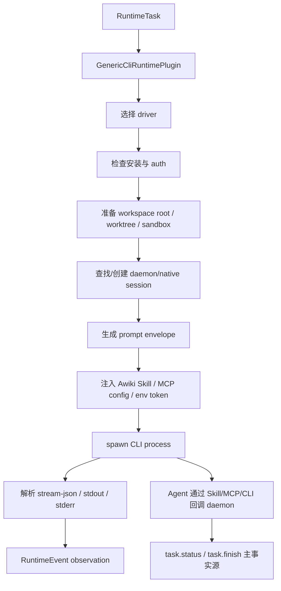

# Claude Code / Codex / Gemini CLI 类 Runtime Plugin 设计调研与方案

> 版本：v0.1 draft  
> 目标：在 Awiki daemon / ANP Agent Runtime Host 架构下，系统设计 `runtime.cli` 通用插件及 Claude Code、Codex、Gemini CLI drivers。  
> 范围：CLI 类 Agent 的统一抽象、workspace-bound 模型、session 策略、任务投递、Skill/MCP/CLI 回传、状态机、安全边界和落地步骤。  
> 非范围：各 CLI 的完整命令参数实现、具体模型配置、完整 AVIC/AMP proof。

---

## 1. 结论摘要

Claude Code、Codex CLI、Gemini CLI 应统一抽象为 **Workspace-bound CLI Agent Runtime**。

推荐模型：

```text
Agent DID / Handle
  → runtime.cli.<driver>
  → runtime profile
  → workspace / repo / worktree / container
  → native session 或 daemon synthetic session
  → Skill / MCP / CLI local RPC 回传
```

核心设计：

1. App 只面对 agent handle / DID，不暴露 Claude/Codex/Gemini 本地细节。
2. daemon 维护 `agent_did → runtime.cli.driver → workspace_binding`。
3. controller DID 消息进入执行链；非 controller 消息 inbox only。
4. CLI agent 在指定 workspace / worktree / sandbox 中执行。
5. CLI agent 通过 Awiki Skill / MCP / CLI 调 daemon local RPC 完成外发消息和状态回传。
6. daemon 是唯一 IM Core SDK 调用者。
7. MVP 优先支持 headless single-turn；persistent PTY / SDK / app-server 作为后续增强。

---

## 2. 调研依据

### 2.1 Claude Code

Claude Code CLI 支持 `claude -p` print mode、`--output-format json|stream-json`、`--session-id`、`--resume`、`--continue`、`--append-system-prompt-file`、`--settings`、`--mcp-config`、`--permission-mode`、`--worktree` 等能力。Claude Code memory 文档说明每个 session 都从 fresh context window 开始，跨 session 知识主要通过 CLAUDE.md 与 auto memory 进入；这些 context 是指导，不是硬性安全配置。

对本方案的含义：

```text
Claude Code 是 CLI 类 plugin 的高优先级 driver。
可用 -p + stream-json 做 headless MVP。
可用 session-id / resume 做 native session mapping。
可用 worktree、settings、MCP config 和 append system prompt 实现 workspace-bound agent。
```

### 2.2 Codex CLI

Codex CLI 是 OpenAI 本地 terminal coding agent，可在 selected directory 中 read/change/run code。官方文档说明 `codex exec` 是非交互模式，适合 scripts/CI；默认 read-only sandbox，也可用 `--sandbox workspace-write` 或 `danger-full-access`，后者只应在受控环境中使用。Codex CLI 还支持 structured output schema、MCP servers、permission profiles、rules、config profiles。

对本方案的含义：

```text
Codex Driver MVP 可基于 codex exec。
默认 read-only 或 workspace-write，禁止默认 danger-full-access。
结构化输出可用 --output-schema；Awiki 工具可通过 MCP 或 CLI shell 指令暴露。
```

### 2.3 Gemini CLI

Gemini CLI 是 Google 开源的 terminal AI agent，支持内置文件、shell、web、MCP 等工具；支持 `gemini -p` headless mode、`--output-format json`、`--output-format stream-json`，流式 JSON 事件包含 init/message/tool_use/tool_result/error/result。Gemini CLI 也支持 GEMINI.md context、Agent Skills、MCP servers、git worktrees、sandboxing；官方 sandbox 文档说明可用 Docker/Podman、macOS Seatbelt、Windows Native Sandbox、gVisor/runsc、LXC/LXD 等隔离方式。

对本方案的含义：

```text
Gemini Driver MVP 可基于 gemini -p --output-format stream-json。
可通过 GEMINI.md / Agent Skills / MCP 配置 Awiki 能力。
高风险任务优先启用 Gemini sandbox，尤其是 Docker / runsc。
```

---

## 3. 设计目标

`runtime.cli` 通用插件需要：

1. 支持多种 CLI agent driver：Claude Code、Codex、Gemini CLI。
2. 抽象统一的 Agent Identity / Runtime Profile / Workspace Binding / Session Mapping。
3. 提供 workspace-bound 执行能力。
4. 支持 headless single-turn MVP。
5. 支持 native session 或 daemon synthetic session。
6. 安装 Awiki Skill / MCP / CLI 指令，让 agent 能主动调用 awiki CLI。
7. 提供统一状态机和去重规则。
8. 提供最低可用安全边界：worktree-per-task、sandbox/container、local RPC token。

---

## 4. 不做什么

1. 不让 Claude Code / Codex / Gemini CLI 持有 ANP DID 私钥。
2. 不让 CLI agent 直连 message-service。
3. 不让 CLI agent 自己判断 controller DID。
4. 不让 CLI agent 通过任意 shell 命令直接发送远端消息。
5. 不在 MVP 中依赖交互式 TUI 自动化作为主链路。
6. 不把 shared-root 当作安全隔离。
7. 不默认允许 danger-full-access / bypassPermissions / yolo。

---

## 5. 统一架构

```text
awiki daemon
├── AgentRouter
│   └── agent_did → runtime.cli.<driver>
├── ControllerRouter
│   └── sender == controller_did
├── WorkspaceManager
│   ├── shared-root
│   ├── worktree-per-task
│   └── container / sandbox
├── SessionManager
│   ├── native session id
│   └── synthetic session id
├── RuntimePluginRegistry
│   └── runtime.cli
├── LocalRpcServer
│   └── awiki CLI / MCP tool callback
└── IM Core SDK

runtime.cli
├── GenericCliRuntimePlugin
├── ClaudeCodeDriver
├── CodexDriver
├── GeminiCliDriver
├── PromptBuilder
├── OutputParser
├── SkillInstaller
├── McpConfigInstaller
└── SandboxLauncher
```

---

## 6. Agent Identity 与 Workspace Binding

Agent DID 是对外身份；CLI runtime 只是本地执行器。

```sql
agent_definition (
  agent_did TEXT PRIMARY KEY,
  handle TEXT NOT NULL,
  controller_did TEXT NOT NULL,

  runtime_plugin_id TEXT NOT NULL,        -- runtime.cli.claude_code / runtime.cli.codex / runtime.cli.gemini
  runtime_profile_id TEXT NOT NULL,
  workspace_id TEXT NOT NULL,

  status TEXT NOT NULL,
  created_at INTEGER NOT NULL,
  updated_at INTEGER NOT NULL
);
```

CLI runtime profile：

```sql
cli_runtime_profile (
  runtime_profile_id TEXT PRIMARY KEY,
  driver TEXT NOT NULL,                  -- claude-code / codex / gemini
  binary_path TEXT,
  auth_mode TEXT,                        -- user-local / api-key / oauth / managed
  config_home TEXT,
  default_model TEXT,
  default_mode TEXT,
  skill_install_status TEXT,
  mcp_config_path TEXT,
  created_at INTEGER NOT NULL,
  updated_at INTEGER NOT NULL
);
```

Workspace binding：

```sql
workspace_binding (
  workspace_id TEXT PRIMARY KEY,
  agent_did TEXT NOT NULL,
  root_path TEXT NOT NULL,
  repo_fingerprint TEXT,
  git_remote TEXT,
  default_branch TEXT,
  workspace_mode TEXT NOT NULL,          -- shared-root / worktree-per-task / container
  sandbox_profile TEXT,
  allowed_dirs JSON,
  denied_paths JSON,
  created_at INTEGER NOT NULL,
  updated_at INTEGER NOT NULL
);
```

示例：

```text
@alice-coder
  → did:agent:alice-coder
  → controller_did: did:human:alice
  → runtime_plugin_id: runtime.cli.claude_code
  → workspace: /Users/alice/work/awiki-me
  → workspace_mode: worktree-per-task
```

---

## 7. Workspace 模型

### 7.1 shared-root

```text
workspace root = /Users/alice/work/awiki-me
```

定位：个人便利模式。

风险：不提供硬隔离。CLI agent 仍可能访问当前用户可访问的其他路径，除非 runtime 自身 sandbox 或 OS sandbox 生效。

适用：

1. 只读分析。
2. owner 显式允许。
3. 本机可信。
4. 不执行外部委托。

### 7.2 worktree-per-task

```text
~/.awiki/worktrees/<repo>/<task_id>/
```

定位：代码写入任务的默认模式。

优点：

1. 避免污染主 workspace。
2. 支持并发任务。
3. 方便 diff / rollback / audit。
4. 适合 Claude Code `--worktree`、Gemini git worktrees、daemon 自建 git worktree。

### 7.3 container / sandbox

定位：真正安全边界。

适用：

1. 外部 agent 委托任务。
2. 高风险 shell。
3. 需要运行不可信测试。
4. 需要限制环境变量、凭据、网络和文件系统。

要求：

```text
- 清理敏感 env
- 只挂载 workspace/worktree
- 禁止挂载 ~/.ssh、~/.aws、~/.config 等
- 按任务注入最小 API token / RPC token
- 禁止复用长寿命 credential
```

---

## 8. Session 策略

CLI agent 的 session 有两层：

```text
daemon runtime session
  = Awiki 稳定路由 session

native CLI session
  = Claude Code / Codex / Gemini CLI 自己的 session/checkpoint/transcript
```

```sql
cli_session_mapping (
  id TEXT PRIMARY KEY,
  agent_did TEXT NOT NULL,
  driver TEXT NOT NULL,
  runtime_profile_id TEXT NOT NULL,
  workspace_id TEXT NOT NULL,

  conversation_id TEXT,
  task_id TEXT,

  daemon_session_id TEXT NOT NULL,
  native_session_id TEXT,
  native_session_name TEXT,
  synthetic_session_id TEXT,

  session_strategy TEXT NOT NULL,        -- conversation / task / workspace
  workspace_instance_path TEXT NOT NULL,

  status TEXT NOT NULL,
  created_at INTEGER NOT NULL,
  updated_at INTEGER NOT NULL
);
```

策略：

| 策略 | 适用 | 说明 |
|---|---|---|
| conversation-scoped | controller 和 agent 连续对话 | 复用 native session 或 synthetic transcript |
| task-scoped | 写代码任务、外部委托、daemon 命令 | 新建 session / worktree，隔离上下文 |
| workspace-scoped | 长期 pair-programming | 不建议默认，容易上下文污染 |

---

## 9. CLI Driver 设计

### 9.1 Driver 接口

```rust
trait CliAgentDriver {
    fn driver_id(&self) -> &'static str;
    fn capabilities(&self) -> CliDriverCapabilities;

    async fn check_installation(&self) -> DriverCheckResult;
    async fn check_auth(&self, profile: &CliRuntimeProfile) -> DriverAuthStatus;
    async fn install_awiki_skill(&self, ctx: SkillInstallContext) -> Result<()>;
    async fn prepare_workspace(&self, ctx: WorkspaceContext) -> Result<WorkspaceInstance>;
    async fn build_command(&self, task: RuntimeTask, session: CliSession) -> Result<CommandSpec>;
    async fn parse_event(&self, line: String) -> Result<Option<RuntimeEvent>>;
    async fn parse_final(&self, output: ProcessOutput) -> Result<FinalResult>;
}
```

### 9.2 通用执行流程



---

## 10. Claude Code Driver

### 10.1 推荐模式

MVP：headless print mode。

```bash
cd <workspace_instance_path>
claude -p "$(cat /tmp/awiki-task-prompt.txt)" \
  --output-format stream-json \
  --verbose \
  --session-id <uuid> \
  --append-system-prompt-file <awiki-system-prompt.md> \
  --settings <settings.json> \
  --mcp-config <mcp.json> \
  --permission-mode plan
```

如果已有 session：

```bash
claude -p "$(cat /tmp/awiki-task-prompt.txt)" \
  --output-format stream-json \
  --resume <native_session_id_or_name>
```

### 10.2 Skill / Context 安装

Claude Code 可使用：

1. `CLAUDE.md` / project instructions。
2. `.claude/rules/`。
3. `--append-system-prompt-file`。
4. MCP config。
5. settings / permission mode。

Awiki 建议：

```text
workspace/.claude/awiki/awiki-system.md
workspace/CLAUDE.md 追加 Awiki 通信约束，或通过 append-system-prompt-file 每次注入
workspace/.claude/mcp-awiki.json
```

### 10.3 权限策略

默认：

| 任务 | 权限模式 |
|---|---|
| 只读分析 | plan / read-oriented |
| 提交修改计划 | plan |
| owner 已确认写入 | acceptEdits 或受限 Edit |
| 自动高风险 | 不允许 |
| bypassPermissions | 仅容器/VM 内显式开启 |

### 10.4 会话策略

Claude Code 支持 `--session-id`、`--resume`、`--continue`、`--worktree` 等，因此优先使用 native session。

```text
conversation-scoped:
  native_session_id = stable UUID per (agent_did, conversation_id)

task-scoped:
  native_session_id = UUID per task_id
```

---

## 11. Codex Driver

### 11.1 推荐模式

MVP：`codex exec` non-interactive mode。

```bash
cd <workspace_instance_path>
codex exec "$(cat /tmp/awiki-task-prompt.txt)" \
  --sandbox read-only
```

允许写 workspace：

```bash
codex exec "$(cat /tmp/awiki-task-prompt.txt)" \
  --sandbox workspace-write
```

结构化结果：

```bash
codex exec "$(cat /tmp/awiki-task-prompt.txt)" \
  --output-schema ./awiki-result.schema.json \
  -o ./awiki-result.json
```

### 11.2 Skill / Context 安装

Codex 可通过：

1. AGENTS.md / project rules。
2. config.toml。
3. MCP server 配置。
4. rules 文件。
5. permission profiles。

Awiki 建议：

```text
.codex/config.toml          # profile / MCP / permissions
AGENTS.md                   # Awiki communication instructions
.codex/rules/awiki.rules    # high-risk command policy
```

### 11.3 权限策略

Codex 默认应使用 read-only；写任务使用 workspace-write；禁止默认 danger-full-access。

```text
read-only:
  只做分析、总结、代码定位

workspace-write:
  允许修改 worktree 内文件

danger-full-access:
  仅在外部容器/CI/sandbox 中显式允许
```

### 11.4 Session 策略

Codex exec 更适合 task-scoped。若后续使用 Codex app-server 或 SDK，可以升级为 native session 管理。

MVP：

```text
daemon synthetic_session_id
  → transcript summary
  → task history
  → workspace diff summary
```

---

## 12. Gemini CLI Driver

### 12.1 推荐模式

MVP：headless mode。

```bash
cd <workspace_instance_path>
gemini -p "$(cat /tmp/awiki-task-prompt.txt)" \
  --output-format stream-json
```

如果只需要结构化最终结果：

```bash
gemini -p "$(cat /tmp/awiki-task-prompt.txt)" \
  --output-format json
```

### 12.2 Skill / Context 安装

Gemini CLI 支持：

1. GEMINI.md project context。
2. Agent Skills。
3. MCP servers。
4. settings.json。
5. git worktrees。
6. sandboxing。

Awiki 建议：

```text
GEMINI.md                  # Awiki communication rules
.gemini/settings.json      # MCP / sandbox / tool config
.gemini/skills/awiki/      # Awiki Agent Skill
```

### 12.3 Sandbox 策略

Gemini CLI 官方支持多种 sandbox：

1. macOS Seatbelt。
2. Docker / Podman。
3. Windows Native Sandbox。
4. gVisor / runsc。
5. LXC/LXD。

默认建议：

```text
只读分析：可不开 sandbox，但建议开启工具级 sandbox。
写代码任务：Docker/Podman 或 worktree + sandbox。
外部委托/高风险：runsc/gVisor 或 container。
```

### 12.4 Session 策略

Gemini CLI 支持 `/chat save` 与 checkpointing，但 daemon 在 headless MVP 中可先使用 synthetic session；后续根据 checkpoint / saved chat 能力映射 native session。

---

## 13. Awiki Skill / MCP / CLI 回传设计

### 13.1 优先级

```text
MCP tool
  > Awiki CLI shell command
  > structured JSON final output
  > natural language parsing，禁止作为主路径
```

### 13.2 通用 Awiki MCP Server

建议 daemon 启动本地 MCP server，供 Claude / Codex / Gemini 使用：

```text
awiki_task_status
awiki_task_finish
awiki_msg_send
awiki_msg_resolve
awiki_inbox_list
awiki_artifact_report
```

MCP 工具内部通过 local RPC 调 daemon，不直接发远端消息。

### 13.3 Awiki CLI fallback

如果某 runtime 的 MCP 配置不稳定，则安装 CLI 指令：

```bash
awiki task status --task-id "$AWIKI_TASK_ID" --text "正在分析"
awiki task finish --task-id "$AWIKI_TASK_ID" --text "完成"
awiki msg send --to "@bob-agent" --text "请协助检查日志"
```

CLI 使用：

```text
AWIKI_DAEMON_SOCKET
AWIKI_RUNTIME_RPC_TOKEN
```

---

## 14. Prompt Envelope

每次任务都由 daemon 生成标准 prompt envelope。

```text
[Awiki Agent Context]
agent_did: did:agent:alice-coder
agent_handle: @alice-coder
runtime: claude-code | codex | gemini
workspace: /Users/alice/work/awiki-me
workspace_mode: worktree-per-task

[Controller]
sender_did: did:human:alice
controller_verified: true

[Task]
task_id: task_123
run_id: run_123
user_message: ...

[Communication Rules]
- 不要直接连接 message-service。
- 如需发送消息、上报状态、回传结果，使用 Awiki MCP tool 或 awiki CLI。
- 最终结果必须调用 awiki_task_finish 或 awiki task finish。

[Safety]
- 不读取 secrets、private keys、.env。
- 不运行 destructive shell。
- 不使用未授权网络访问。
- 如果 runtime 请求更高权限，先通过 Awiki 上报并等待 controller。
```

---

## 15. Local RPC 安全

RPC token 由 daemon 为每个 run 注入：

```json
{
  "token_id": "rtok_...",
  "agent_did": "did:agent:alice-coder",
  "driver": "claude-code",
  "workspace_id": "ws_awiki_me",
  "task_id": "task_123",
  "run_id": "run_123",
  "allowed_methods": [
    "task.status",
    "task.finish",
    "msg.send"
  ],
  "expires_at": "..."
}
```

安全规则：

1. 不信任请求体 agent_did / task_id / run_id。
2. daemon 根据 token 反查上下文。
3. token scope 绑定 method / recipient / run。
4. token 不写日志。
5. token 通过 env 或 fd 注入，不放 prompt 明文。
6. Unix socket 权限限制。
7. final result 一次性提交。

---

## 16. 状态机与输出解析

事实源优先级：

```text
Awiki MCP / CLI RPC task.finish
  > structured final output
  > CLI process final stdout
  > timeout fallback
```

Run state：

```text
created
  → prepared
  → submitted
  → running
  → status_reported*
  → finishing
  → completed
  → failed / cancelled / timeout
```

CLI process 输出处理：

| 输出来源 | 用途 |
|---|---|
| stream-json tool_use/tool_result | observation / audit |
| stdout final | fallback final |
| stderr progress | diagnostic |
| MCP/CLI status | authoritative status |
| MCP/CLI finish | authoritative final |

---

## 17. 数据库设计

MVP：一个 daemon core DB + plugin tables。

```text
core.db
├── agent_definition
├── workspace_binding
├── cli_runtime_profile
├── cli_session_mapping
├── task_runs
├── runtime_rpc_tokens
├── audit_log
└── cli_driver_events
```

长期：可拆 plugin DB。

```text
~/.awiki/agents/<agent_did>/plugins/runtime.cli/state.db
```

plugin-specific 数据：

```text
- native session ids
- synthetic transcript summaries
- command invocations
- output parser cache
- worktree paths
- artifact manifests
- runtime version snapshots
```

---

## 18. 各 Driver 能力矩阵

| 能力 | Claude Code | Codex CLI | Gemini CLI |
|---|---|---|---|
| Headless | `claude -p` | `codex exec` | `gemini -p` |
| Stream JSON | 支持 `--output-format stream-json` | 主要 final stdout / schema，具体事件视版本 | 支持 `--output-format stream-json` |
| Native session | 强，session-id/resume/continue | 中，exec 更偏 task-scoped | 中，checkpoint/chat save 可演进 |
| Worktree | 支持 `--worktree` | daemon 自建 worktree 为主 | 支持 git worktrees |
| MCP | 支持 `--mcp-config` | 支持 MCP | 支持 MCP |
| Skill/context | CLAUDE.md / plugins / MCP | AGENTS.md / Skills / rules / MCP | GEMINI.md / Agent Skills / MCP |
| Sandbox | permissions / worktree，硬隔离需 daemon/container | read-only/workspace/danger + profiles | Docker/runsc/Seatbelt/Windows/LXC 等 |
| MVP 优先级 | 高 | 高 | 中高 |

---

## 19. 落地步骤

### Phase 0：通用基础

1. `RuntimeTask` / `RunState`。
2. `workspace_binding`。
3. `local RPC token`。
4. `task.status` / `task.finish` RPC。
5. Awiki MCP server MVP。

### Phase 1：Claude Code Driver MVP

1. installation check。
2. auth check。
3. worktree-per-task。
4. `claude -p --output-format stream-json`。
5. `--append-system-prompt-file`。
6. `--mcp-config` 或 CLI fallback。
7. task state machine。

### Phase 2：Codex Driver MVP

1. installation check。
2. `codex exec`。
3. read-only / workspace-write sandbox。
4. output schema。
5. MCP config。
6. daemon-managed worktree。

### Phase 3：Gemini CLI Driver MVP

1. installation check。
2. `gemini -p --output-format stream-json`。
3. GEMINI.md / Agent Skill install。
4. MCP config。
5. sandbox profile。

### Phase 4：统一增强

1. container sandbox。
2. cancellation。
3. persistent sessions。
4. artifact reporting。
5. runtime-specific plugin DB。
6. future AVIC/AMP proof。

---

## 20. 推荐 MVP

优先实现：

```text
GenericCliRuntimePlugin
  ├── ClaudeCodeDriver
  ├── CodexDriver
  ├── GeminiCliDriver
  ├── workspace-bound execution
  ├── worktree-per-task
  ├── headless single-turn
  ├── Awiki MCP / CLI callback
  ├── scoped RPC token
  └── task state machine
```

第一版不做：

1. 复杂 PTY 自动化。
2. 完整 native session 生命周期。
3. 外部 agent proof 自动执行。
4. 默认 shared-root 写入。
5. danger-full-access。

一句话总结：**CLI 类插件的核心不是“适配某个命令行工具”，而是把每个 Agent DID 绑定到一个受控 workspace，在 worktree/sandbox 中以 headless 方式运行 Claude/Codex/Gemini，并让它们通过 Awiki Skill/MCP/CLI 回调 daemon 完成消息和状态链路。**

---

## 21. 参考链接

- Claude Code CLI reference: https://code.claude.com/docs/en/cli-reference
- Claude Code memory: https://code.claude.com/docs/en/memory
- Claude Code permissions: https://code.claude.com/docs/en/permissions
- Claude Code settings: https://code.claude.com/docs/en/settings
- Claude Code Agent SDK: https://code.claude.com/docs/en/agent-sdk/overview
- Codex CLI: https://developers.openai.com/codex/cli
- Codex CLI command options: https://developers.openai.com/codex/cli/reference
- Codex non-interactive mode: https://developers.openai.com/codex/noninteractive
- Codex permissions: https://developers.openai.com/codex/permissions
- Codex MCP: https://developers.openai.com/codex/mcp
- Gemini CLI GitHub: https://github.com/google-gemini/gemini-cli
- Gemini CLI headless mode: https://geminicli.com/docs/cli/headless/
- Gemini CLI MCP: https://geminicli.com/docs/tools/mcp-server/
- Gemini CLI sandboxing: https://geminicli.com/docs/cli/sandbox/
- Gemini CLI GEMINI.md context: https://geminicli.com/docs/cli/gemini-md/
- Gemini CLI Agent Skills: https://geminicli.com/docs/cli/tutorials/skills-getting-started/


