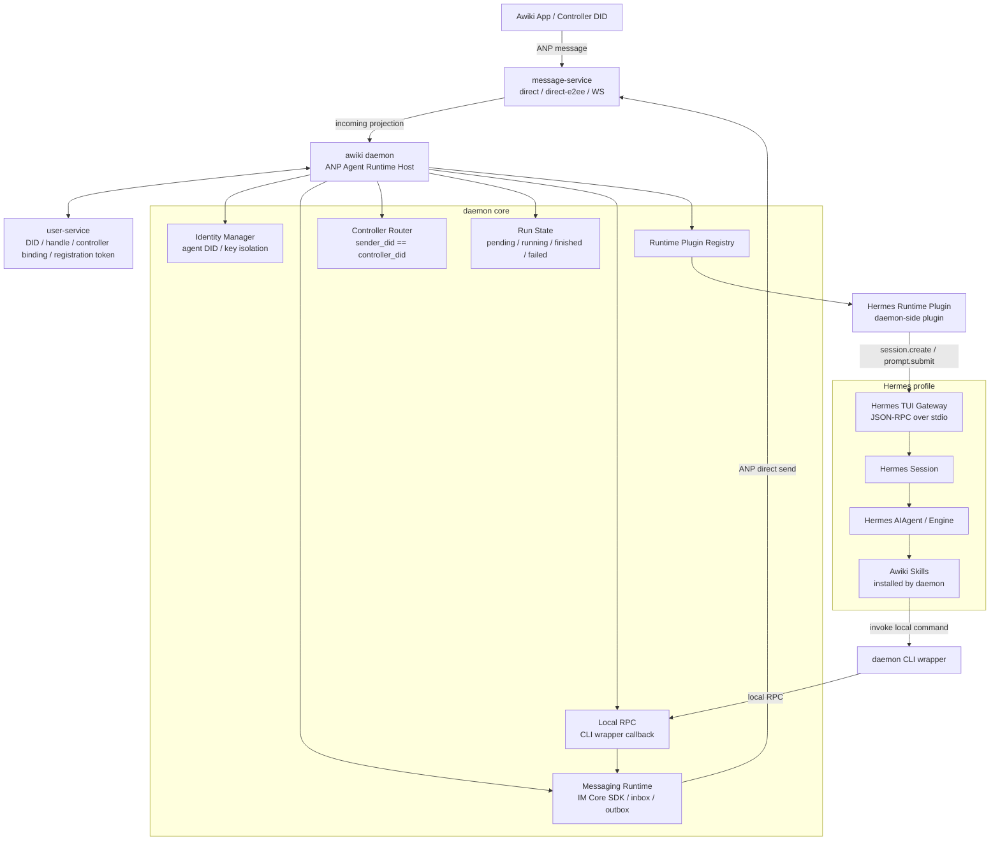
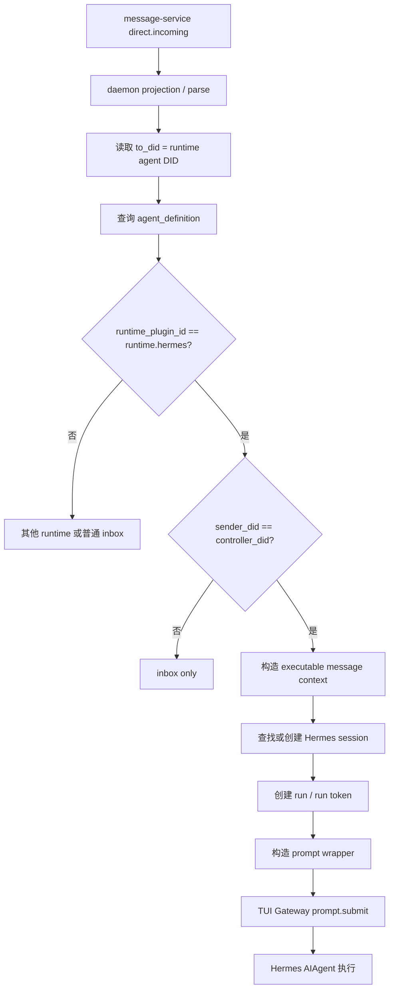
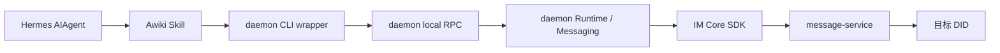
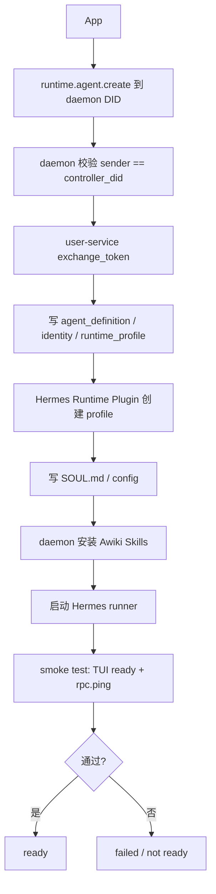
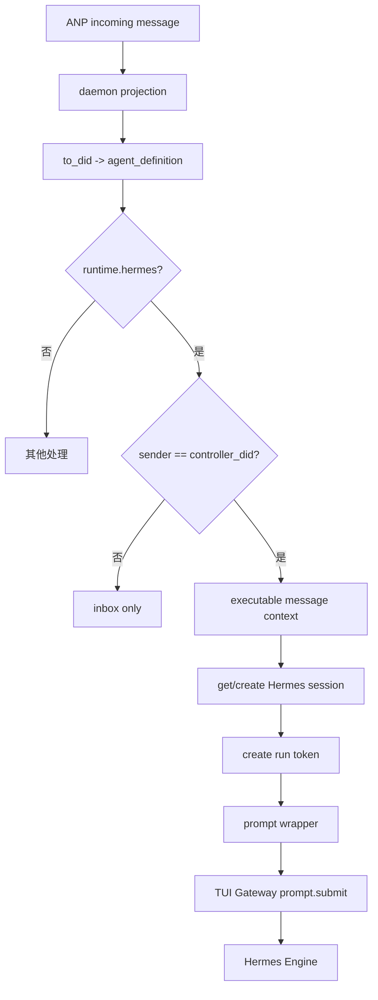
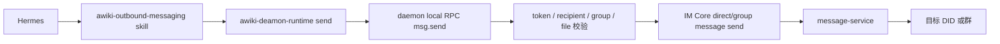
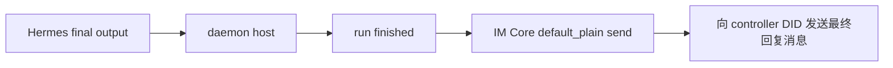

# Hermes Runtime Plugin 设计方案

版本：v0.2
日期：2026-05-31
适用范围：awiki daemon / im-core / message-service / user-service / Hermes Agent
定位：以当前 daemon 实现为基线的 Hermes native runtime 接入方案

---

## 0. 当前结论

本方案以当前 `awiki-deamon` 的实现为基线，而不是以一个理想化目标架构为基线。

Hermes 接入分成三条必须区分的链路：

```text
控制执行链路：daemon 控制 Hermes

App / message-service
  -> awiki daemon
  -> Hermes Runtime Plugin
  -> Hermes TUI Gateway JSON-RPC over stdio
  -> Hermes Session
  -> Hermes AIAgent / Engine
```

```text
controller 结果回传链路：daemon host 自动发送

Hermes final output / message.complete
  -> daemon host 读取结果
  -> daemon runtime / IM Core SDK
  -> message-service
  -> controller DID
```

```text
主动外发链路：Hermes 调 Awiki 能力

Hermes
  -> awiki-outbound-messaging Skill 指导
  -> awiki-deamon-runtime send
  -> daemon local RPC msg.send
  -> daemon runtime / IM Core SDK
  -> message-service
  -> 其他用户或群
```

核心决策：

1. **通过 Hermes TUI Gateway 对接 Hermes。** daemon 到 Hermes 的主入口是 TUI Gateway JSON-RPC over stdio，用于创建 session、提交 prompt、观察 streaming event。
2. **不做 Hermes Platform Adapter for Awiki / ANP。** Hermes 不直接成为 ANP 消息入口，不直接连接 message-service。
3. **删除 Awiki Hermes Plugin 层。** MVP 不安装 Hermes 内部 Python plugin，不维护 `plugin.yaml`，不在 Hermes 内注册 awiki tool handler。
4. **Awiki Skills 由 daemon 自动安装到 Hermes profile。** Skill 只提供行为说明和工具调用约定，不承担 daemon 安全边界。
5. **Hermes 调用 Awiki 能力时走 daemon CLI wrapper + local RPC。** 真实能力仍在 daemon 中实现。
6. **MVP 采用消息驱动，不新增产品层 task 概念。** Controller DID 发来的可执行消息进入 Hermes；结果和外发协作也以消息为主。
7. **当前代码中已有 `RuntimeTask` / `runtime_task` / `task.status` / `task.finish`。** 这些是 Generic CLI MVP 阶段的内部命名和兼容 RPC 名称。本 Hermes 方案不继续扩大 task 概念；后续代码可以把它们收敛为 message/run 语义。
8. **`msg.send` / outbound-send 的契约必须是真正发送 ANP direct/group 普通消息。** 本期 Runtime Agent 外发只支持 `default_plain`；直聊/群聊文本和“caption + 附件”都走同一个主动外发出口，不能实现成 status payload 或 controller 回传。
9. **MVP 暂不支持 approval 和 sandbox。** 相关能力不进入本版设计主链路。

---

## 1. 设计目标

### 1.1 产品目标

Hermes 作为 native runtime 接入 daemon 后，用户可以：

1. 在 App 中创建或绑定一个 Hermes Runtime Agent。
2. 通过普通 Awiki direct 消息向该 Agent 发送可执行消息。
3. Hermes 在执行过程中可以通过 daemon 主动发送真正的 ANP direct/group 普通消息给 human、其他 agent 或群，并支持同一条消息内携带附件 caption。
4. Hermes 可以通过 daemon 上报执行进度；最终回复由 daemon host 读取 Hermes final output 后自动发送给 controller。
5. daemon 统一管理 Agent DID、controller 校验、Hermes profile、Hermes session、run token、local RPC、audit 和消息投递。

### 1.2 非目标

MVP 不做：

1. Awiki Hermes Plugin / Hermes Python plugin。
2. Hermes Platform Adapter for Awiki / ANP。
3. Hermes 直接持有 DID 私钥。
4. Hermes 直接连接 message-service。
5. Approval UI / approval service。
6. Sandbox / container 执行隔离。
7. 外部非 controller 消息自动执行。
8. 完整 task workflow / task.result 协议。
9. handle/inbox/conversation read 工具。

---

## 2. 当前实现基线

当前 daemon 已有的关键能力：

| 能力 | 当前状态 | 说明 |
|---|---|---|
| Runtime Agent 注册 | 已有 | `runtime.agent.create`，schema 为 `awiki.agent.command.v1` |
| controller 校验 | 已有 | 当前主要校验是 `sender_did == controller_did` |
| RuntimePlugin v1 | 已有 | `plugin_id` / `check_install_status` / `launch_run` |
| Runtime run 状态 | 已有 | `pending` / `running` / `finished` / `failed` |
| local RPC token | 已有 | 绑定 `agent_did` / `runtime_profile_id` / `run_id` / methods / recipients / TTL |
| local RPC 方法 | 已有 | `rpc.ping` / `task.status` / `task.finish` / `msg.send` / `attachment.send` / `artifact.created` |
| `task.finish` failed final | 未实现 | 当前 `task.finish` 总是落到 `finished` |
| `msg.send` 真实外发 | 已实现 | 统一支持直聊文本、直聊附件、群聊文本、群聊附件；不是状态消息模拟 |
| runtime session 表 | 未实现 | 当前没有通用 `runtime_session_mapping` |
| Hermes native session 表 | 未实现 | 本方案建议新增 `hermes_native_sessions` |
| approval | 未实现 | 本版删除 |
| sandbox/container backend | 未实现 | 本版删除 |

注意：本方案用“消息”描述产品语义，但为了贴合当前代码，RPC 章节会标出当前实际方法名 `task.status` / `task.finish`。这两个名字在 Hermes MVP 中只视为历史兼容名称，不代表产品上要引入完整 task 概念。

---

## 3. 术语与边界

| 概念 | 所属层 | 含义 | 是否对 App 暴露 |
|---|---|---|---:|
| `agent_did` | ANP / Awiki | Runtime Agent 的对外通信身份 | 是 |
| `agent_handle` | ANP / Awiki | 指向 `agent_did` 的 handle | 是 |
| `controller_did` | daemon / user-service | 允许控制该 Agent 的 DID | 可展示 |
| `daemon_did` | ANP / Awiki | daemon 自己的管理 Agent DID | 是 |
| `runtime_plugin_id` | daemon | Runtime 类型，例如 `runtime.hermes` | 不建议直接暴露 |
| `hermes_profile` | Hermes | Hermes 本地 profile，包含 config、memory、skills、session state | 不建议暴露 |
| `hermes_session_id` | Hermes | Hermes 内部推理上下文 ID | 不建议暴露 |
| `runtime_session_id` | daemon | daemon 对 runtime session 的统一抽象 ID，是否首版引入待定 | debug 可见 |
| `run_id` | daemon | 一次消息执行过程的内部运行 ID | debug 可见 |
| `message_id` | ANP / daemon | 触发执行的消息 ID | 可见 |
| `Awiki Skill` | Hermes | daemon 自动安装到 Hermes profile 的行为说明 | 不对 App 暴露 |
| `daemon CLI wrapper` | daemon / runtime bridge | Hermes 可调用的本地命令壳，负责请求 daemon local RPC | 不对 App 暴露 |
| `local RPC` | daemon | runtime 回调 daemon 的本地接口 | 不对 App 暴露 |

本方案不再定义 `Awiki Hermes Plugin` 作为组件。

---

## 4. 总体架构



---

## 5. Hermes 接入方式

### 5.1 daemon 到 Hermes：TUI Gateway

daemon 通过 Hermes TUI Gateway 控制 Hermes：

```text
daemon
  -> Hermes Runtime Plugin
  -> Hermes TUI Gateway JSON-RPC over stdio
  -> session.create
  -> prompt.submit
  -> message.delta / message.complete observation
  -> runtime_final_outbox durable send to controller
```

选择 TUI Gateway 的原因：

1. 适合 daemon 作为本地 host 控制 Hermes。
2. 支持 Hermes native session。
3. 支持 streaming event observation。
4. 不需要把 Hermes 暴露成网络服务。
5. 不绕过 daemon 的 DID、controller、消息投递和 audit 边界。

### 5.2 Hermes 到 daemon：Skills + CLI wrapper + local RPC

MVP 不依赖 Hermes 内部 plugin 注册 tools。Hermes 侧能力来自两个部分：

1. daemon 自动安装的 Awiki Skills，告诉 Hermes 什么时候调用本地 wrapper。
2. daemon CLI wrapper，作为本地可执行命令，向 daemon local RPC 发请求。

```text
Hermes
  -> Awiki Skill 指导
  -> daemon CLI wrapper
  -> daemon local RPC
  -> daemon core
```

这样做的边界更清楚：

1. Hermes 不实现 ANP。
2. Hermes 不管理 DID 私钥。
3. Hermes 不直接连接 message-service。
4. local RPC token、recipient scope、run 归属由 daemon 校验。
5. 后续如果确实需要 Hermes plugin，可以作为优化层加入，但不是 MVP 主线。

---

## 6. daemon 侧 Hermes Runtime Plugin

### 6.1 当前 v1 接口

当前 daemon 已实现的 runtime plugin v1 是同步 `launch_run` 形态：

```rust
trait RuntimePlugin {
    fn plugin_id(&self) -> &str;
    fn check_install_status(&self) -> Result<RuntimeInstallStatus>;
    fn launch_run(&self, context: RuntimeLaunchContext) -> Result<RuntimeLaunchOutcome>;
}
```

该接口适合 Generic CLI MVP。Hermes 是 native runtime，最终需要 runner、session、streaming event 和 cancel 能力，因此不能把目标态接口写成当前已存在。

### 6.2 Hermes native 目标接口

建议后续演进出 `NativeRuntimePlugin` / `RuntimePluginV2`：

```rust
trait NativeRuntimePlugin {
    async fn check_installation(&self) -> Result<RuntimeCheckResult>;
    async fn initialize_agent(&self, agent: RuntimeAgentDefinition) -> Result<RuntimeAgentInitResult>;
    async fn start_runner(&self, agent_did: Did) -> Result<RuntimeRunnerRef>;
    async fn get_or_create_session(&self, ctx: RuntimeSessionContext) -> Result<RuntimeSessionRef>;
    async fn submit_message(&self, session: RuntimeSessionRef, message: RuntimeExecutableMessage) -> RuntimeEventStream;
    async fn cancel_run(&self, run_id: RuntimeRunId) -> Result<()>;
    async fn shutdown_runner(&self, agent_did: Did) -> Result<()>;
}
```

命名上使用 `submit_message`，不要在 Hermes 新方案中继续扩展 `submit_task`。

### 6.3 初始化职责

`initialize_agent` 应做：

```text
1. 创建或检查 Hermes profile。
2. 写入 SOUL.md / profile config。
3. 由 daemon 安装 Awiki Skills 到 Hermes profile。
4. 写 Hermes native profile mapping。
5. 写 daemon/Hermes session 所需的初始配置。
6. 配置 daemon CLI wrapper 路径、local RPC socket path、profile binding。
7. 执行不带写权限 run token 的 smoke test。
```

`initialize_agent` 不应做：

```text
1. 安装 Awiki Hermes Plugin。
2. 写 plugin.yaml。
3. 配置可用于 msg.send / finish 的长期 profile token。
4. 触发真实 ANP 外发消息。
5. 启用 approval 或 sandbox。
```

### 6.4 run token 策略

初始化阶段只能配置 wrapper 和 profile binding。用于 `msg.send`、状态上报、最终回复的 `run_capability_token` 必须在每次消息投递前由 daemon 签发。

当前实现的 token scope 已经绑定：

```text
agent_did
runtime_profile_id
run_id
allowed_methods
allowed_recipients
expires_at_ms
single_use
```

Hermes 不能从 prompt 或 CLI 参数中自报 `agent_did` / `run_id` 来获得权限。daemon 必须根据 token 和内部状态推导真实上下文。

---

## 7. Awiki Skills 设计

### 7.1 安装方式

Awiki Skills 由 daemon 自动安装到 Hermes profile，例如：

```text
<HERMES_PROFILE_HOME>/skills/
└── awiki-outbound-messaging/
    └── SKILL.md
```

安装时 daemon 会清理旧目录：

```text
skills/awiki-runtime/
skills/awiki-messaging/
skills/awiki-collaboration/
```

MVP 不需要 Hermes plugin 目录：

```text
<HERMES_PROFILE_HOME>/plugins/awiki-runtime/
```

也不需要：

```text
plugin.yaml
__init__.py
tools.py
rpc.py
hook
```

### 7.2 Skill 必须具备的核心能力

#### `awiki-outbound-messaging`

职责：当 controller 明确要求 Runtime Agent 向其他用户或群发送消息时，指导 Hermes 调用 daemon CLI wrapper 的统一 `send` 命令。它不用于回复 controller 的普通最终答案。

核心规则：

```text
- 普通 controller final output 由 daemon host 自动读取并发回 App，不调用 Skill/CLI。
- 直聊文本：awiki-deamon-runtime send --to-handle <handle> --text <text>
- 直聊附件：awiki-deamon-runtime send --to-handle <handle> --text <caption> --file <path> --display-filename <name> --mime-type <mime>
- 群聊文本：awiki-deamon-runtime send --group <group_did_or_id> --text <text>
- 群聊附件：awiki-deamon-runtime send --group <group_did_or_id> --text <caption> --file <path> --display-filename <name> --mime-type <mime>
- --to-handle 和 --group 必须二选一。
- 带附件时，--text 是同一条附件消息的 caption，不拆成两条消息。
- 只有 wrapper 返回成功后，才可以声称消息已发送。
- Hermes 不直接连接 message-service，不伪造 DID，不读取 DID 私钥。
```

当前实现匹配度：

| 需求 | 当前实现 | 结论 |
|---|---|---|
| 单 Skill 安装 | `skills/awiki-outbound-messaging/SKILL.md` | 已实现 |
| 旧 Skill 清理 | 安装时删除 `awiki-runtime` / `awiki-messaging` / `awiki-collaboration` | 已实现 |
| 统一 wrapper | `awiki-deamon-runtime send` | 已实现 |
| direct/group 外发 | `msg.send` 支持 `to` 或 `group` | 已实现 |
| 附件同条消息 | `msg.send` 支持 `file_path` + caption text | 已实现 |

### 7.3 Skills 与当前 RPC 的映射

Skill 面向 Hermes 使用 message/run 语义；daemon 当前 local RPC 方法名仍有历史 task 命名。

| Skill 能力 | MVP 语义 | 当前 daemon RPC | 备注 |
|---|---|---|---|
| `report-status` | 上报当前消息执行状态 | `task.status` | 兼容名，后续可迁移到 `message.status` |
| `outbound-send` | 主动向其他用户或群发送文本/附件消息 | `msg.send` | 必须是真实外发 |
| `artifact-created` | 上报产物 | `artifact.created` | 可选 |
| `ping` | local RPC 连通性检查 | `rpc.ping` | smoke test 首选 |

controller final output 不属于 Skill 能力：daemon host 从 Hermes Gateway outcome 读取 final text 后自动以 Runtime Agent DID 发回 controller DID。

controller final 回传的基础可靠性由 daemon host 内部的 `runtime_final_outbox` 提供：拿到非空 final text 后先持久化 pending 记录，再发送 `default_plain` 普通消息；发送成功后标记 outbox `sent` 并把 run 标记为 `Finished`。如果发送临时失败，foreground 启动和循环 flush 会继续补发。该 outbox 只覆盖 controller final reply，不覆盖 Skill/CLI 主动外发。

MVP 不提供：

```text
handle.resolve
inbox.list
conversation.read
approval.request
context.get
```

---

## 8. Runtime Agent 创建流程

App 发送 `application/json + body.payload` JSON command 给 daemon DID。当前 daemon 已实现的 schema 是：

```json
{
  "schema": "awiki.agent.command.v1",
  "command_id": "cmd_create_hermes_001",
  "command": "runtime.agent.create",
  "target_agent_kind": "runtime",
  "args": {
    "handle": "@alice-hermes-coder",
    "runtime": "hermes",
    "workspace": "~/work/awiki-me",
    "controller_did": "did:wba:example.com:user:alice:e1_xxx",
    "registration_token": "raw-secret-returned-once"
  },
  "reply_policy": {
    "progress": true,
    "final": true
  }
}
```

当前 daemon 执行步骤：

```text
1. 校验 command 来自 daemon agent 的 controller_did。
2. 校验 command schema、command name、target_agent_kind 和 payload shape。
3. 使用 registration_token 调 user-service exchange_token 创建 runtime agent DID。
4. 写 agent_definition。
5. 写 runtime_profile / workspace_binding。
6. 返回 awiki.agent.status.v1 ready / failed 状态 payload。
```

Hermes native 后续步骤：

```text
7. 创建 Hermes profile。
8. 写 SOUL.md / Hermes profile config。
9. 安装 Awiki Skills。
10. 写 Hermes profile mapping。
11. 启动 Hermes runner。
12. 执行 smoke test。
13. 发送 ready 状态。
```

不要在此流程中安装 Awiki Hermes Plugin。

---

## 9. Smoke Test

初始化 smoke test 只验证无副作用能力：

```text
- Hermes profile 可创建或加载。
- TUI Gateway 可启动并返回 ready。
- Awiki Skills 在 Hermes profile 中可见。
- daemon CLI wrapper 路径存在且可执行。
- local RPC socket / pipe 可连接。
- `rpc.ping` 可成功返回。
```

初始化 smoke test 不应做：

```text
- 使用可写 run token。
- 调用 `msg.send` 发送真实 ANP 消息。
- 调用 final 接口。
- 依赖 approval。
- 依赖 sandbox。
```

如果需要测试 `task.status` / `task.finish` / `msg.send`，必须创建专门的 test run lease，并使用 mock outbox 或明确的测试 DID。

---

## 10. 消息进入 Hermes 的流程

### 10.1 MVP 控制模型

每个 Runtime Agent DID 配置一个 `controller_did`。

当前可执行条件：

```text
sender_did == controller_did
```

当前不可执行条件：

```text
sender_did != controller_did
```

非 controller 消息默认只进入 inbox/projection，不自动进入 Hermes 执行链。

`operation_id`、TTL、nonce、更细 command scope 是后续增强项，不是当前实现已经具备的执行前置条件。

### 10.2 消息类型

MVP 推荐只支持两类输入：

| 类型 | content_type | body 字段 | 用途 |
|---|---|---|---|
| 普通可执行消息 | `text/plain` | `text` | controller 发来的自然语言消息 |
| JSON 管理命令 | `application/json` | `payload` | `runtime.agent.create` 等管理命令 |

暂不引入 JSON 结构化 task 类型，也不新增 `task.result` content type。

当前 im-core/message-service 的结构化承载规则仍然是：

```text
meta.content_type = "application/json"
body.payload = JSON object
```

不要新增 `application/vnd.awiki...` 这类专用 command/status/result content type。

### 10.3 路由流程



这里使用 executable message context，不在产品层引入 task。

---

## 11. Session 映射设计

### 11.1 为什么 Hermes 需要 native session 表

Hermes 有自己的 session 语义。daemon 收到来自 App 或其他 agent 的消息后，需要把 Awiki 的消息路由上下文映射到 Hermes 的 session：

```text
(agent_did, controller_did, conversation_id)
  -> Hermes profile
  -> Hermes session id
```

这些字段是 Hermes native runtime 独有的，因此需要 `hermes_native_sessions` 或等价表保存。

### 11.2 是否需要通用 runtime_session_mapping

这里有两个选择。

方案 A：只建 Hermes 私有表：

```text
hermes_native_sessions
```

优点：

```text
- MVP 实现最短。
- 不需要一次性定义所有 runtime 的 session 抽象。
- Hermes 需要的 native 字段可以直接落表。
```

缺点：

```text
- OpenClaw / Claude Code / Codex 等 runtime 以后可能重复设计 route_key、session_kind、status。
- daemon 无法统一做 session reset、debug、audit、resume、清理。
- 未来迁移到通用表时需要补历史数据。
```

方案 B：通用表 + runtime native 扩展表：

```text
runtime_session_mapping
  -> hermes_native_sessions
```

优点：

```text
- daemon 统一管理 route_key、runtime_session_id、agent_did、conversation_id、status。
- Hermes/OpenClaw/Claude Code 等只保存 native session id 和 native metadata。
- 后续 reset/resume/debug/audit 更统一。
```

缺点：

```text
- 首期 schema 稍复杂。
- 需要先定义足够稳定的通用 session 语义。
```

### 11.3 推荐决策

推荐采用方案 B，但允许 MVP 分两步落地：

第一步可以先实现 `hermes_native_sessions`，但表结构必须预留 `runtime_session_id` 和通用 route 字段，避免未来迁移困难。

第二步再补 daemon 通用 `runtime_session_mapping`，并把 `hermes_native_sessions.runtime_session_id` 作为外键或逻辑关联。

### 11.4 建议表结构

通用表目标态：

```sql
CREATE TABLE runtime_session_mapping (
  runtime_session_id TEXT PRIMARY KEY,
  agent_did TEXT NOT NULL,
  runtime_profile_id TEXT NOT NULL,
  runtime_plugin_id TEXT NOT NULL,
  controller_did TEXT NOT NULL,
  conversation_id TEXT,
  session_kind TEXT NOT NULL,
  route_key TEXT NOT NULL,
  status TEXT NOT NULL,
  created_at_ms INTEGER NOT NULL,
  updated_at_ms INTEGER NOT NULL,
  UNIQUE(agent_did, controller_did, conversation_id, session_kind)
);
```

Hermes native 扩展表：

```sql
CREATE TABLE hermes_native_sessions (
  id TEXT PRIMARY KEY,
  runtime_session_id TEXT NOT NULL,
  agent_did TEXT NOT NULL,
  runtime_profile_id TEXT NOT NULL,
  controller_did TEXT NOT NULL,
  conversation_id TEXT,
  hermes_profile TEXT NOT NULL,
  hermes_session_id TEXT NOT NULL,
  session_kind TEXT NOT NULL,
  status TEXT NOT NULL,
  created_at_ms INTEGER NOT NULL,
  updated_at_ms INTEGER NOT NULL,
  UNIQUE(agent_did, controller_did, conversation_id, session_kind)
);
```

如果 MVP 暂不建 `runtime_session_mapping`，`hermes_native_sessions.runtime_session_id` 仍应生成并保存，后续可直接提升为通用 session id。

---

## 12. Prompt Wrapper

每次 `prompt.submit` 不应只传用户原文，而要传 daemon 构造的 message envelope。

示例：

```text
你正在作为 Awiki Hermes Agent 处理一条由 daemon 校验后的 controller message。

【Agent】
agent_handle: @alice/hermes-coder
agent_did: did:wba:example.com:agent:alice-hermes-coder:e1_xxx
runtime: hermes
hermes_profile: awiki_alice_hermes_coder

【Controller】
controller_did: did:wba:example.com:user:alice:e1_yyy
sender_did: did:wba:example.com:user:alice:e1_yyy
controller_verified: true

【Message】
message_id: msg_01
run_id: run_01
conversation_id: conv_01
publisher_did: did:wba:example.com:user:alice:e1_yyy
content_type: text/plain

【Allowed actions】
- You may use the Awiki CLI wrapper to report status.
- You may use outbound-send only when the controller asks you to send a separate direct or group message outside the controller reply path.
- Do not directly connect to message-service.
- Do not use Skill/CLI for the ordinary final answer to the controller; daemon sends Hermes final output back automatically.
- Do not claim that an outbound message was sent unless the wrapper succeeded.

【User message】
帮我联系 Bob 的 agent，让他整理明天会议材料。
```

Prompt 不是安全机制。安全判断必须在 daemon 中完成：

```text
controller_did
run_capability_token
allowed_methods
allowed_recipients
token TTL
audit
```

---

## 13. Hermes 如何发消息和回传结果

### 13.1 主链路



### 13.2 主动发送真正 ANP 消息

```text
Hermes
  -> skill_view("awiki-outbound-messaging")
  -> daemon CLI wrapper awiki-deamon-runtime send --to-handle <handle> --text "..."
     或 awiki-deamon-runtime send --group <group> --text "..." --file <path> ...
  -> daemon local RPC msg.send
  -> daemon 校验 run token / method / recipient/group scope / file path
  -> IM Core SDK direct/group message send
  -> message-service
  -> 目标 DID 或群
```

这是 outbound-send 的必须语义。不能把 `msg.send` 实现成仅向 controller 发送 status payload。带附件时，caption 和附件必须在同一条消息里发送。

### 13.3 回传状态

```text
Hermes
  -> daemon CLI wrapper report-status --state running --text "..."
  -> daemon local RPC task.status
  -> daemon 更新 run status
  -> 可选：向 controller 发送状态消息 / status payload
```

当前方法名仍是 `task.status`，但 Hermes 方案中的语义是“当前消息执行状态”。

### 13.4 回传最终回复

```text
Hermes final output / message.complete
  -> daemon host 读取 final text
  -> daemon 标记 run finished
  -> daemon 以 Runtime Agent DID 向 controller DID 发送最终回复消息
```

不要设计 `task.result` 作为 MVP 对外协议。controller 普通最终回复不走 Skill/CLI，也不要求 Hermes 调 `task.finish`。

当前 `task.finish` 作为 local RPC 兼容方法保留，主要服务旧 generic-cli/fake callback 路径；Hermes final path 以 daemon host output 为准。失败时先使用 status 上报 failed。

---

## 14. Run 状态与去重

MVP 只采用当前 daemon 已实现的 run 状态：

```text
pending
running
finished
failed
```

不引入完整 Task State Machine。

当前缺口：

```text
- `task.finish` 不是幂等 final。
- local RPC 请求体没有 idempotency_key。
- TUI message.complete 不能和 local RPC final 同时作为可写最终结果。
- failed final 还没有独立语义。
```

MVP 规则：

```text
1. Skill 要求 Hermes 最多调用一次 final。
2. TUI message.complete 只作为 observation，不写入 authoritative final。
3. local RPC final 是主事实源。
4. failed 先走 status，不走 final。
```

后续增强再考虑：

```text
message.finish 幂等
idempotency_key
observed_final fallback
failed final
cancelled
```

---

## 15. Local RPC 安全模型

### 15.1 不可信字段

RPC 请求体里的以下字段不能被信任：

```text
agent_did
run_id
message_id
runtime_profile_id
controller_did
```

真实上下文必须由 daemon 根据 token / socket / active run lease 推导。

### 15.2 当前可用方法

当前 daemon 已实现：

```text
rpc.ping
task.status
task.finish
msg.send
attachment.send
artifact.created
```

Hermes Skill / wrapper 可以用 message 语义封装这些方法：

```text
report-status   -> task.status
outbound-send   -> msg.send
ping            -> rpc.ping
```

controller final output 由 daemon host 自动发送，不映射为 Skill 能力。`task.finish` 和 `attachment.send` 作为兼容方法保留，但不是当前 Hermes Outbound Messaging Skill 的新路径。

后续代码重构时，可以新增更准确的名称：

```text
message.status
message.finish
```

并把 `task.status` / `task.finish` 保留为兼容别名一段时间。

### 15.3 run token

每次 daemon 向 Hermes 投递可执行消息前，创建 run token：

```json
{
  "run_id": "run_01",
  "agent_did": "did:wba:example.com:agent:alice-hermes:e1_xxx",
  "runtime_profile_id": "profile_hermes_alice",
  "allowed_methods": [
    "task.status",
    "task.finish",
    "msg.send",
    "artifact.created"
  ],
  "allowed_recipients": [
    "did:wba:example.com:agent:bob:e1_xxx"
  ],
  "expires_at_ms": 1780201800000
}
```

如果后续新增 profile token，它不能授权 `task.finish` 或 `msg.send`。profile token 只能用于低风险能力，例如 runner health / ping。

---

## 16. 数据库与本地状态

### 16.1 当前 daemon 通用表

当前 daemon 已有：

```text
agent_definition
runtime_profile
workspace_binding
runtime_run
runtime_task
runtime_rpc_tokens
audit_log
agent_identity
```

其中 `runtime_task` 是当前 Generic CLI MVP 的内部命名。Hermes 新方案不应在产品层继续强化 task 概念。

### 16.2 Hermes 专用表

Hermes 仍然需要保存 native profile/session 状态。建议：

```text
hermes_profiles
hermes_native_sessions
```

`hermes_profiles` 示例：

```sql
CREATE TABLE hermes_profiles (
  agent_did TEXT PRIMARY KEY,
  runtime_profile_id TEXT NOT NULL,
  hermes_profile TEXT NOT NULL,
  hermes_home TEXT NOT NULL,
  hermes_version TEXT,
  awiki_skills_version TEXT,
  status TEXT NOT NULL,
  created_at_ms INTEGER NOT NULL,
  updated_at_ms INTEGER NOT NULL
);
```

`hermes_native_sessions` 见 Session 映射章节。

### 16.3 不要建立并行事实源

不要新增：

```text
hermes_runs
hermes_finals
hermes_task_results
```

run 状态、token、audit、最终回复事实源应留在 daemon 通用层。Hermes 私有 DB 只保存 Hermes native profile/session 映射和 observation metadata。

---

## 17. Workspace

MVP 暂不支持 sandbox/container。

当前策略：

```text
- workspace 只作为 profile/workspace binding 元数据。
- shared-root 不是安全边界。
- Hermes MVP 不自动执行高风险 shell/file write。
- 如果需要 shell/file write，应先走人工控制或后续 sandbox/container backend。
```

本版不写：

```text
container / sandbox 是安全边界
高风险任务必须使用 sandbox
approval 后执行 shell/file write
```

这些都是后续阶段能力。

---

## 18. User-service 契约

Hermes Runtime Agent 创建依赖 user-service 提供 registration token 兑换能力。当前权威契约是 JSON-RPC 2.0：

```text
POST /user-service/agent-registration/rpc
```

`issue_token` 由 App 或授权入口调用，daemon 不签发该 token。

`exchange_token` 由 daemon 调用，用于注册 runtime agent DID：

```json
{
  "jsonrpc": "2.0",
  "method": "exchange_token",
  "params": {
    "token": "raw-secret-returned-once",
    "agent_kind": "runtime",
    "controller_did": "did:wba:example.com:user:alice:e1_xxx",
    "handle": "alice-hermes-coder",
    "did_document": { "...": "..." },
    "endpoint_url": "https://example.com/anp-im/rpc",
    "key_algorithm": "JsonWebKey2020",
    "public_key": "{...}"
  },
  "id": 2
}
```

成功后 daemon 写 `agent_definition`、`agent_identity`、`runtime_profile`。

---

## 19. MVP 落地步骤

### Phase 0：文档和协议收敛

```text
1. 明确 Hermes MVP 是消息驱动，不新增产品层 task。
2. 删除 Awiki Hermes Plugin 层。
3. 明确 Skills 由 daemon 自动安装。
4. 明确当前 `task.status` / `task.finish` 是兼容 RPC 名称。
5. 明确 `msg.send` 必须是真实 ANP direct/group 普通消息发送。
```

### Phase 1：Hermes profile + Skills

```text
1. 创建 Hermes profile。
2. 写 SOUL.md / profile config。
3. 安装 awiki-outbound-messaging skill，并清理旧 awiki-runtime / awiki-messaging / awiki-collaboration 目录。
4. smoke test: TUI ready + rpc.ping。
```

### Phase 2：TUI Gateway runner

```text
1. start runner。
2. session.create。
3. prompt.submit。
4. observation streaming。
```

### Phase 3：消息执行链

```text
1. controller text/plain message 进入 Hermes。
2. daemon 构造 message prompt wrapper。
3. 每次消息创建 run token。
4. Hermes 可使用 wrapper report-status；controller final 由 daemon host 自动发送。
```

### Phase 4：真实外发消息

```text
1. wrapper awiki-deamon-runtime send。
2. local RPC msg.send。
3. daemon 校验 token allowed_recipients。
4. im-core default_plain direct/group send。
5. message-service 投递目标 DID。
```

### Phase 5：Session 持久化

```text
1. hermes_native_sessions。
2. 可选 runtime_session_mapping。
3. session resume/reset。
```

后续再考虑：

```text
message.status / message.finish 重命名
failed final
idempotency_key
handle.resolve
inbox.list
conversation.read
approval
sandbox/container
```

---

## 20. 关键流程图

### 20.1 Runtime Agent 初始化



### 20.2 Controller 消息进入 Hermes



### 20.3 Hermes 主动外发消息



### 20.4 Hermes 回传最终回复



---

## 21. 设计分析与未决问题

### 21.1 为什么删除 Awiki Hermes Plugin

删除 Awiki Hermes Plugin 后，Hermes 侧不再需要 Python plugin、`plugin.yaml`、tool registry、hook lifecycle，也不会出现“manifest 声明了 daemon 还没实现的工具”的问题。

代价是 Hermes 调用 Awiki 能力时需要通过本地 CLI wrapper，而不是 native tool UI。但这与当前 daemon local RPC 能力更贴合，MVP 更容易收敛。

### 21.2 task 概念怎么处理

用户层和 Hermes 方案层不再引入 task。第一步只支持消息：

```text
controller DID -> runtime agent DID -> Hermes 处理消息 -> Hermes 回消息
```

当前代码仍有 `RuntimeTask`、`runtime_task`、`task.status`、`task.finish`。这是实现现状，不在本次 plain 文档修改里删除。建议后续单独做一次代码重构：

```text
RuntimeTask -> RuntimeExecutableMessage
runtime_task -> runtime_message
task.status -> message.status
task.finish -> message.finish
```

为了兼容旧 Generic CLI MVP，可以保留 `task.status` / `task.finish` 作为别名一段时间。

### 21.3 Session 表怎么选

Hermes 必须有 `hermes_native_sessions`，因为 Hermes session id、profile、native session metadata 是 runtime 私有状态。

是否首版就建 `runtime_session_mapping` 取决于实现节奏：

```text
如果只接 Hermes：可以先建 hermes_native_sessions，但字段要预留 runtime_session_id。
如果同时要接 OpenClaw / Claude Code / Codex native session：应先建 runtime_session_mapping。
```

我倾向于两层模型，因为它能避免每个 runtime 重复发明 route_key/session_kind/status，也便于 daemon 统一做 debug、reset、resume、audit。

### 21.4 `msg.send` 的实现缺口

方案明确要求 `msg.send` 是真实 ANP direct/group 普通消息发送。如果当前代码路径仍把 `msg.send` 实现成向 controller 发送 status payload，那么代码需要后续修改。

这次按用户要求不改代码，只在设计中把目标契约写清楚。

### 21.5 当前安全边界

当前 MVP 的执行入口只依赖：

```text
sender_did == controller_did
```

更细的 scope、TTL、operation_id、nonce 属于后续安全增强。因为 approval 暂时删除，高风险动作在 MVP 中应默认不支持，而不是先执行再补 approval。

---

## 22. 总结

Hermes MVP 的最小闭环是：

```text
runtime.agent.create
  -> daemon 创建 Runtime Agent DID / profile
  -> daemon 创建 Hermes profile 并安装 Awiki Skills
  -> controller 发 text/plain 消息
  -> daemon 校验 controller_did
  -> daemon 通过 TUI Gateway 投递给 Hermes
  -> Hermes 通过 CLI wrapper/local RPC 回传状态和最终回复
  -> Hermes 通过 msg.send 发送真正 ANP direct/group 普通消息
```

本版方案删除了 Awiki Hermes Plugin、approval、sandbox、task.result 和完整 task state machine，把 Hermes 接入收敛为当前实现可以逐步落地的消息驱动 native runtime。
