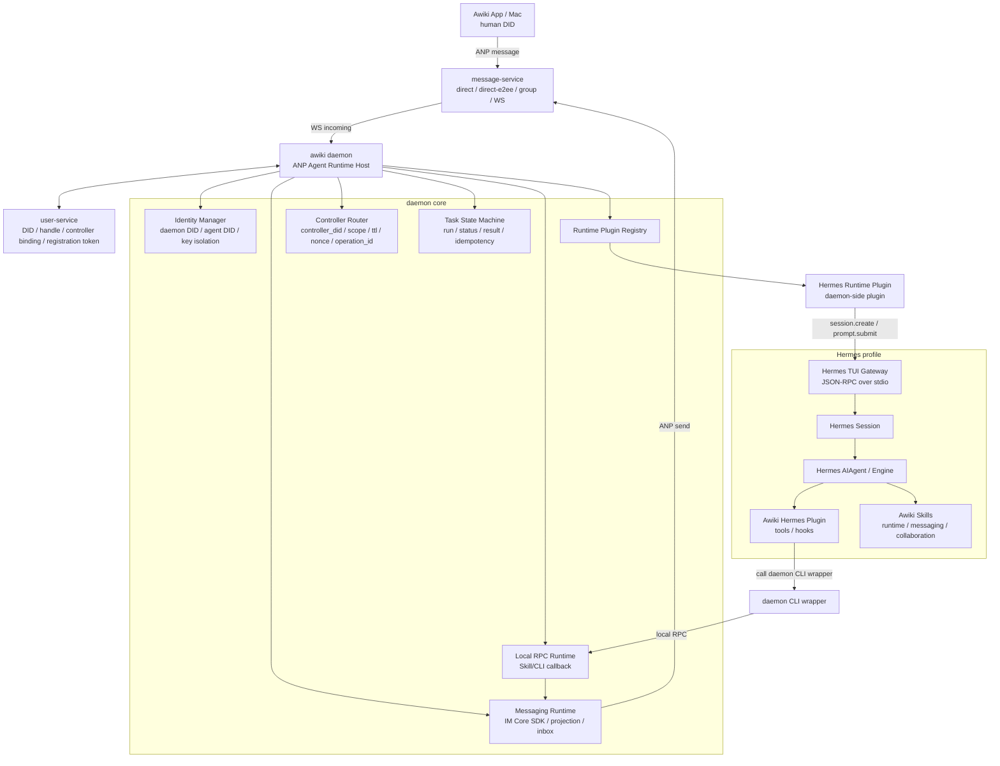
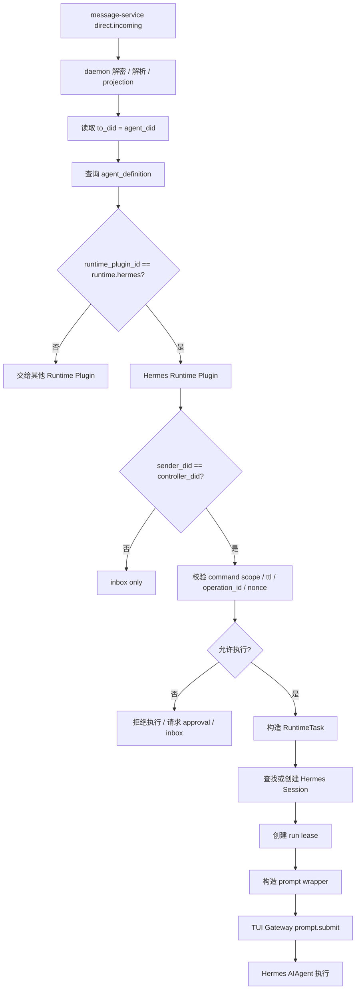
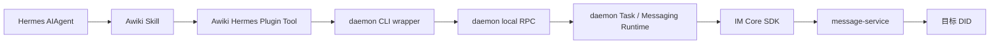
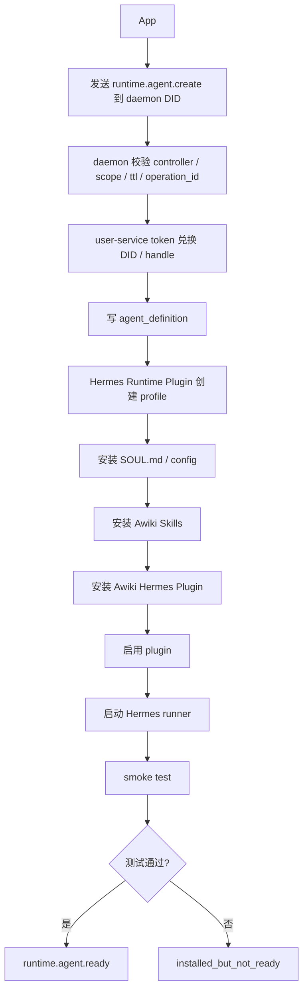
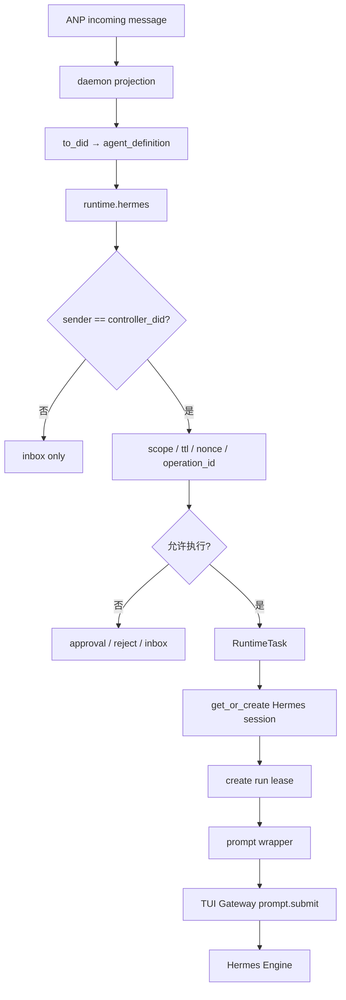
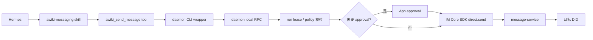
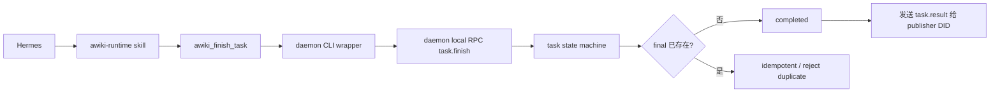
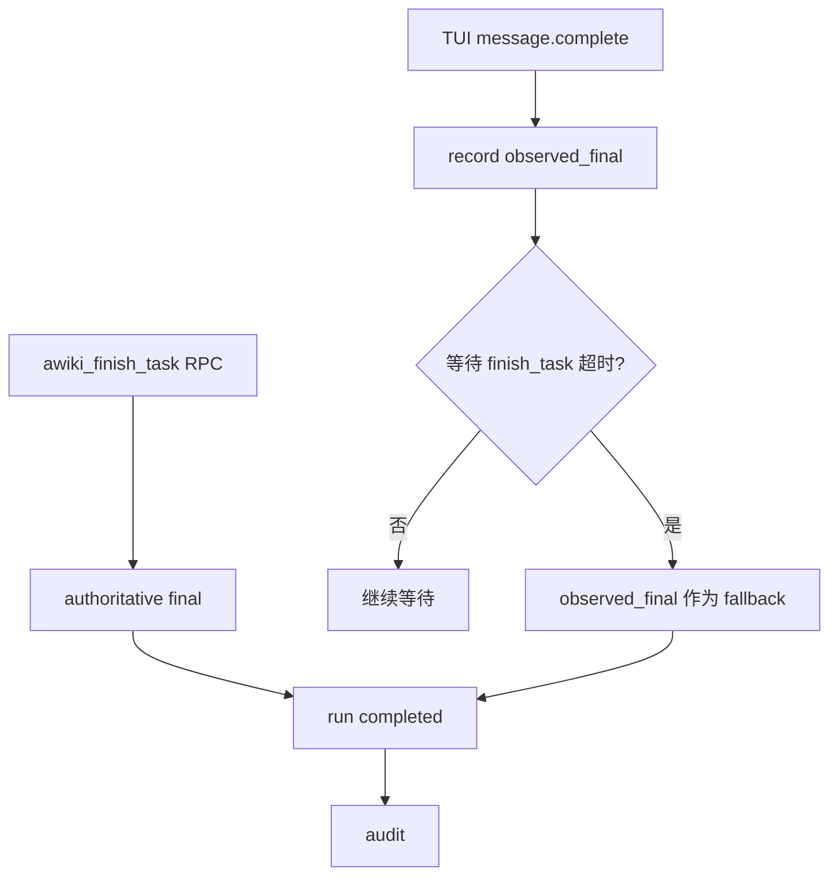

# Hermes Runtime Plugin 设计方案

版本：v0.1  
日期：2026-05-31  
适用范围：awiki daemon / awiki-cli-rs2 / im-core / message-service / user-service / Hermes Agent  
定位：通用 ANP Agent Runtime Host 架构下的 Hermes Runtime 接入方案

---

## 0. 核心结论

Hermes 接入不应该被设计成一个单独的“消息平台适配器”，而应该拆成两层：

```text
1. daemon 侧：Hermes Runtime Plugin
   负责启动 Hermes、管理 Hermes profile、创建/复用 Hermes session、投递任务、观察事件。

2. Hermes 侧：Awiki Hermes Plugin + Awiki Skills
   负责让 Hermes 在执行过程中通过 Skill / Tool / CLI / local RPC 回到 daemon：
   - 发送 ANP 消息
   - 上报任务状态
   - 提交最终结果
   - 查询 inbox / conversation
   - 请求 approval
```

完整链路是：

```text
上层任务投递链路：
App / message-service
  → awiki daemon
  → Hermes Runtime Plugin
  → Hermes TUI Gateway
  → Hermes Session
  → Hermes AIAgent / Engine

下层消息与结果回传链路：
Hermes
  → Awiki Skill / Awiki Hermes Plugin Tool
  → daemon CLI wrapper
  → daemon local RPC
  → daemon runtime / IM Core SDK
  → message-service
  → 目标 DID
```

这个方案的关键原则是：

1. **daemon 是 DID、ANP 消息、controller 校验、任务状态机、local RPC 和 audit 的唯一事实边界。**
2. **Hermes 不持有 DID 私钥，不直接连接 message-service，不直接管理 controller binding。**
3. **Hermes Runtime Plugin 是 daemon 插件；Awiki Hermes Plugin 是 Hermes 内部插件；Awiki Skill 是给 Hermes 的行为说明。**
4. **Skill + daemon CLI wrapper + local RPC 是 Hermes 对外发消息、上报状态、提交最终结果的主链路。**
5. **TUI Gateway event 是 runtime observation / fallback channel，不是业务结果的唯一事实源。**
6. **当前 MVP 不引入 AVIC / AMP proof；每个 Agent DID 配置一个 `controller_did`，只有来自 controller 的消息才可能进入执行链。**
7. **`controller_did` 只是控制者身份来源，不是完整授权边界；仍需 command scope、ttl、operation_id、nonce、approval、audit 等机制。**

---

## 1. 设计目标

### 1.1 产品目标

在通用 Agent Runtime Host 架构下，Hermes 作为一种 native runtime 接入 daemon，使用户可以：

1. 在 App 中创建或绑定 Hermes Runtime Agent。
2. 通过 ANP direct / direct-e2ee 消息向 Hermes Agent 发布任务。
3. 让 Hermes Agent 在执行任务时通过 Awiki Skill / daemon CLI wrapper 与其他 human 或 agent 通信。
4. 让 Hermes Agent 在任务过程中主动上报状态，任务结束后主动向任务发布者回传结果。
5. 通过 daemon 统一管理 Hermes profile、session、skills、plugin、local RPC、audit 和 policy。

### 1.2 架构目标

1. **不把 Hermes 做成 ANP 消息服务。**

   ANP 消息收发、DID 身份、controller 判断、message-service WebSocket、inbox projection 仍由 daemon / im-core 负责。

2. **不做 Hermes Platform Adapter 作为首发主线。**

   Hermes Platform Adapter 适合 Telegram / Discord / Slack 等消息平台接入，但不适合接管 ANP 主通信链路。

3. **采用双层对接。**

   - 上层：daemon 通过 TUI Gateway / stdio 控制 Hermes。
   - 下层：Hermes 通过 Skill / Tool / CLI / local RPC 回到 daemon。

4. **把 Hermes 适配为 Runtime Backend。**

   daemon 只认识统一 Runtime Plugin Interface，不直接在核心逻辑里依赖 Hermes 内部实现。

5. **保留 Hermes 原生优势。**

   利用 Hermes profile、session、memory、skills、plugins、approval、streaming events 等能力，但不让这些能力越过 daemon 的安全边界。

---

## 2. 术语与边界

| 概念 | 所属层 | 含义 | 是否对 App 暴露 |
|---|---|---|---:|
| `agent_did` | ANP / Awiki | Agent 的对外通信身份 | 是 |
| `agent_handle` | ANP / Awiki | 指向 `agent_did` 的 handle | 是 |
| `controller_did` | daemon / user-service | 可控制该 Agent DID 的 DID，可以是 human DID，也可以是 agent DID | 可在配置页展示 |
| `daemon_did` | ANP / Awiki | daemon 自己的管理 Agent DID | 是 |
| `runtime_plugin_id` | daemon | Runtime 类型，例如 `runtime.hermes` | 不建议直接暴露 |
| `hermes_profile` | Hermes | Hermes 本地 profile，拥有独立 config、memory、skills、session | 不建议直接暴露 |
| `hermes_session_id` | Hermes | Hermes 内部推理上下文 ID | 不建议直接暴露 |
| `runtime_session_id` | daemon | daemon 内部对 runtime session 的抽象 ID | debug 可见 |
| `run_id` | daemon | 本次任务执行 ID | 可见 |
| `task_id` | App / daemon | 用户或系统定义的任务 ID | 可见 |
| `Awiki Hermes Plugin` | Hermes | Hermes 内部 Python plugin，注册 awiki tools / hooks / skills | 不对 App 暴露 |
| `Awiki Skill` | Hermes | 教 Hermes 如何使用 awiki 能力的说明文档 | 不对 App 暴露 |
| `daemon CLI wrapper` | daemon / runtime bridge | Hermes 调用 daemon local RPC 的专用壳，不是现有用户态 `awiki-cli` 命令系统 | 不对 App 暴露 |
| `local RPC` | daemon | CLI 回调 daemon 的本地接口 | 不对 App 暴露 |

---

## 3. 总体架构



---

## 4. Hermes 接入面选择

### 4.1 推荐主链路：TUI Gateway JSON-RPC

daemon 通过 Hermes TUI Gateway 控制 Hermes：

```text
daemon
  → Hermes Runtime Plugin
  → Hermes TUI Gateway JSON-RPC over stdio
  → session.create
  → prompt.submit
  → message.delta / message.complete / tool.* / approval.* observation
```

适合原因：

1. 支持 session 创建、历史、压缩、分支、中断。
2. 支持 streaming event、tool event、approval event。
3. 适合 custom host / daemon 模式。
4. 不需要把 Hermes 暴露为远端网络服务。

### 4.2 不推荐首发使用：Hermes Platform Adapter

不建议首期做：

```text
Hermes Platform Adapter for Awiki / ANP
```

原因：

1. 会让 Hermes 直接成为 ANP 消息入口，绕过 daemon 的 controller 校验和任务状态机。
2. 会导致 inbox、session、message projection、DID 身份和权限判断分叉。
3. 与“ANP 通信统一由 daemon / im-core 处理”的原则冲突。
4. `ctx.inject_message()` 不适合作为 gateway 主入口，不能承担稳定的远端控制链。

### 4.3 Hermes Skill 与 Plugin 的分工

| 能力 | 作用 | 是否执行代码 | 主要用途 |
|---|---|---:|---|
| Hermes Skill | 教 Hermes 如何处理 Awiki 任务 | 否 | 行为说明、工具使用规则、协作规则 |
| Awiki Hermes Plugin | 注册 Hermes 工具 / hook / skill | 是 | 暴露 awiki_report_status、awiki_send_message 等工具 |
| daemon CLI wrapper | 工具 handler 调用的壳 | 是 | 通过 local RPC 调 daemon；不得依赖 `crates/awiki-cli` 内部模块 |
| daemon local RPC | 真实能力实现入口 | 是 | 发送消息、上报状态、查询 inbox、请求 approval |

---

## 5. daemon 侧：Hermes Runtime Plugin

### 5.1 定位

`runtime.hermes` 是 daemon 的 Runtime Plugin。

它负责把 Hermes 适配成 daemon 统一的 Runtime Backend：

```text
RuntimeTask
  → Hermes prompt.submit

Hermes TUI events
  → RuntimeObservation

Skill / CLI local RPC
  → RuntimeReport / MessageSend / TaskFinish
```

它不负责：

```text
- DID 私钥管理
- ANP direct/group 协议实现
- message-service WebSocket 连接
- controller binding 的最终存储
- user-service 注册 token 签发
- 外发消息实际投递
```

这些能力由 daemon core / im-core / user-service / message-service 承担。

### 5.2 插件能力声明

建议 manifest：

```json
{
  "id": "runtime.hermes",
  "name": "Hermes Runtime Plugin",
  "version": "0.1.0",
  "runtime_family": "native_agent",
  "capabilities": [
    "profile.native",
    "session.native",
    "session.resume",
    "session.history",
    "session.branch",
    "session.compress",
    "stream.events",
    "approval.native",
    "tool.plugin",
    "skill.install",
    "memory.profile_scoped",
    "cancel"
  ]
}
```

### 5.3 核心接口

当前 daemon 已实现的 runtime plugin v1 接口是 Generic CLI MVP 形态：

```rust
trait RuntimePlugin {
    fn plugin_id(&self) -> &str;
    fn check_install_status(&self) -> Result<RuntimeInstallStatus>;
    fn launch_run(&self, context: RuntimeLaunchContext) -> Result<RuntimeLaunchOutcome>;
}
```

这个接口适合一次性 CLI runtime。Hermes 是 native runtime，需要长驻 runner、native session、streaming event 和 cancel，因此不能直接把目标态接口当成当前已存在的 trait 使用。

建议新增或演进出 `NativeRuntimePlugin` / `RuntimePluginV2`，保持 Generic CLI v1 不被破坏：

```rust
trait NativeRuntimePlugin {
    async fn check_installation(&self) -> Result<RuntimeCheckResult>;

    async fn initialize_agent(
        &self,
        agent: RuntimeAgentDefinition
    ) -> Result<RuntimeAgentInitResult>;

    async fn start_runner(
        &self,
        agent_did: Did
    ) -> Result<RuntimeRunnerRef>;

    async fn get_or_create_session(
        &self,
        ctx: RuntimeSessionContext
    ) -> Result<RuntimeSessionRef>;

    async fn submit_task(
        &self,
        session: RuntimeSessionRef,
        task: RuntimeTask
    ) -> RuntimeEventStream;

    async fn cancel_run(
        &self,
        run_id: RuntimeRunId
    ) -> Result<()>;

    async fn shutdown_runner(
        &self,
        agent_did: Did
    ) -> Result<()>;
}
```

实现顺序建议：

```text
1. 保留当前 `RuntimePlugin` v1 给 generic-cli / Claude Code / Codex 等一次性 driver 使用。
2. 为 Hermes 增加 native runner trait 或 adapter layer。
3. 在 daemon host 层通过 plugin capability 判断走 v1 `launch_run` 还是 v2 `start_runner + submit_task`。
4. 共用 RuntimeTask、runtime_run、runtime_rpc_tokens 和 audit 表。
```

### 5.4 Hermes Runtime Plugin 职责

#### `initialize_agent`

```text
1. 创建或检查 Hermes profile。
2. 写入 SOUL.md / profile config。
3. 安装 Awiki Skills。
4. 安装 Awiki Hermes Plugin。
5. 启用 awiki-runtime plugin。
6. 写 Hermes Runtime Plugin DB。
7. 配置 local RPC token / profile binding。
8. 执行 smoke test。
```

#### `start_runner`

```text
1. 读取 agent_did → hermes_profile 映射。
2. 以对应 profile 启动 Hermes TUI Gateway。
3. 建立 stdio JSON-RPC client。
4. 等待 gateway.ready。
5. 注册 runner 到 daemon runner pool。
```

#### `get_or_create_session`

```text
1. 读取 runtime_session_mapping。
2. 如存在 active session，复用 hermes_session_id。
3. 如不存在，调用 TUI Gateway session.create。
4. 保存 mapping。
```

#### `submit_task`

```text
1. 创建 run lease。
2. 构造 prompt wrapper。
3. 调用 prompt.submit。
4. 观察 TUI events。
5. 等待 Skill/CLI local RPC 上报状态或最终结果。
6. 进入 task state machine。
```

---

## 6. Hermes 侧：Awiki Hermes Plugin

### 6.1 定位

Awiki Hermes Plugin 是安装到 Hermes profile 内的 Python plugin。

它的职责是：

```text
让 Hermes 在推理过程中可以调用 Awiki 能力。
```

但它不直接实现 ANP、DID、message-service 或 controller policy。

它的调用链是：

```text
Hermes tool call
  → Awiki Hermes Plugin handler
  → daemon CLI wrapper
  → daemon local RPC
  → daemon runtime / IM Core SDK
```

### 6.2 目录结构

每个 Hermes profile 下安装：

```text
<HERMES_PROFILE_HOME>/
└── plugins/
    └── awiki-runtime/
        ├── plugin.yaml
        ├── __init__.py
        ├── schemas.py
        ├── tools.py
        ├── rpc.py
        └── skills/
            ├── awiki-runtime/
            │   └── SKILL.md
            ├── awiki-messaging/
            │   └── SKILL.md
            └── awiki-collaboration/
                └── SKILL.md
```

同时也可以把核心 skills 直接安装到 profile 的 skills 目录：

```text
<HERMES_PROFILE_HOME>/skills/
├── awiki-runtime/
├── awiki-messaging/
└── awiki-collaboration/
```

推荐 MVP 使用两种方式中的一种并保持一致。更稳妥的方式是：

```text
核心 Awiki Skills 安装到 profile skills 目录；
Awiki Hermes Plugin 只注册工具和 hook。
```

这样 session start 时 skills index 更容易稳定发现 Awiki skills。

### 6.3 plugin.yaml

```yaml
name: awiki-runtime
version: "0.1.0"
description: Awiki runtime bridge for ANP messaging, task reporting, inbox access and controller approval.
provides_tools:
  - awiki_report_status
  - awiki_finish_task
  - awiki_send_message
  - awiki_resolve_handle
  - awiki_list_inbox
  - awiki_read_conversation
  - awiki_request_approval
provides_hooks:
  - pre_tool_call
  - post_tool_call
  - pre_llm_call
  - on_session_start
```

### 6.4 注册工具

建议工具列表：

| 工具 | 作用 | 当前 daemon RPC method |
|---|---|---|
| `awiki_report_status` | 上报任务进度 | `task.status` |
| `awiki_finish_task` | 提交最终结果 | `task.finish` |
| `awiki_send_message` | 发送 ANP direct/direct-e2ee 消息 | `msg.send` |
| `awiki_artifact_created` | 上报产物 | `artifact.created` |
| `awiki_ping` | smoke test / 本地连通性检查 | `rpc.ping` |
| `awiki_resolve_handle` | 解析 handle | 后续新增，当前未实现 |
| `awiki_list_inbox` | 查看当前 agent inbox | 后续新增，当前未实现 |
| `awiki_read_conversation` | 读取会话历史 | 后续新增，当前未实现 |
| `awiki_request_approval` | 请求 controller approval | 后续新增，当前未实现 |
| `awiki_get_context` | 获取当前 run context | 后续新增，当前未实现 |

MVP 必须按当前 daemon 已实现的点分方法名接入。不要在 Hermes plugin 首版里直接调用 `/runtime/...` 路径式方法；如果后续引入路径式 HTTP / JSON-RPC router，需要在 daemon 中显式提供兼容层。

### 6.5 工具 handler 原则

1. handler 不直接调用 message-service。
2. handler 不读取 DID 私钥。
3. handler 不信任 prompt 中的 `agent_did` / `run_id`。
4. handler 通过 daemon CLI wrapper 调用 daemon local RPC。
5. handler 返回 JSON 字符串。
6. handler 捕获异常，返回 error JSON，而不是抛出未捕获异常。
7. handler 不在日志中打印 local RPC token。

---

## 7. Awiki Skills 设计

### 7.1 安装时机

Awiki Skills 应在 **Runtime Agent 首次初始化时** 安装，而不是等第一条任务到来时安装。

初始化流程：

```text
App
  → daemon agent
  → runtime.agent.create
  → daemon 创建 runtime agent DID / handle
  → Hermes Runtime Plugin 创建 Hermes profile
  → 安装 Awiki Hermes Plugin
  → 安装 Awiki Skills
  → 启用 plugin
  → smoke test
  → runtime.agent.ready
```

原因：

1. 第一条任务到来时必须立即可执行。
2. Hermes skills index 通常在 session start 被加载。
3. 安装后再创建 session 更稳定。
4. smoke test 可以提前发现工具或 CLI 不可用。

### 7.2 Skill 列表

#### `awiki-runtime`

职责：任务生命周期、状态上报、最终结果提交。

核心规则：

```text
- 任务开始后，应调用 awiki_report_status。
- 关键阶段应调用 awiki_report_status。
- 任务完成后，必须调用 awiki_finish_task。
- 目标态中，任务失败时也必须调用 awiki_finish_task(status="failed")。
- 当前 daemon 的 `task.finish` 仍会落到 `finished`，失败首版应先用 `awiki_report_status(state="failed")` 上报，直到 daemon 支持 failed final。
- 不要只在自然语言中声称“完成了”；最终结果必须通过 awiki_finish_task 提交。
```

#### `awiki-messaging`

职责：发送消息、解析 handle、阅读会话。

核心规则：

```text
- 需要向 human 或 agent 发消息时，调用 awiki_send_message。
- 发送前可调用 awiki_resolve_handle。
- 需要读取当前 agent 收件箱时，调用 awiki_list_inbox。
- 不要直接连接 message-service。
- 不要伪造 DID。
- 不要把消息写进普通回答假装已经发送。
```

#### `awiki-collaboration`

职责：agent-to-agent 协作。

核心规则：

```text
- 可以根据任务需要联系其他 agent。
- 联系其他 agent 必须通过 awiki_send_message。
- 对外委托任务时，应说明 task context、预期输出、截止时间。
- 当前版本中，只有 controller_did 发来的消息会进入自动执行链。
- 来自非 controller 的外部消息默认只是 inbox 数据。
```

---

## 8. Hermes Runtime Agent 初始化流程

### 8.1 由 App 指挥 daemon agent 创建 Hermes Agent

App 发送 `application/json + body.payload` JSON command 给 daemon DID。当前 daemon 已实现的 schema 是 `awiki.agent.command.v1`：

```json
{
  "schema": "awiki.agent.command.v1",
  "command_id": "cmd_create_hermes_001",
  "command": "runtime.agent.create",
  "target_agent_kind": "runtime",
  "args": {
    "handle": "@alice-hermes-coder",
    "runtime": "hermes",
    "workspace": "~/work/awiki-me",
    "controller_did": "did:wba:example.com:user:alice:e1_xxx",
    "registration_token": "raw-secret-returned-once"
  },
  "reply_policy": {
    "progress": true,
    "final": true
  }
}
```

`profile`、Hermes 模型配置、工具权限和 message policy 可以作为后续 `args` 扩展加入，但不能替换当前 command envelope。
`operation_id`、TTL、nonce 和更细的 scope 校验仍是后续增强项；当前已实现的首要校验是 `sender_did == daemon_agent.controller_did`。

### 8.2 daemon 执行步骤

```text
1. 校验 command 来自 daemon agent 的 controller_did。
2. 校验 command schema、command name、target agent kind 和 payload shape。
3. 使用 `registration_token` 调 user-service `exchange_token` 创建 runtime agent DID。
4. 写 agent_definition：
   - agent_did
   - handle
   - controller_did
   - runtime_plugin_id = runtime.hermes
   - runtime_profile_id
   - workspace_id（可选）
5. 写 runtime_profile / workspace_binding。
6. 后续 Hermes native step 创建 Hermes profile。
7. 写 SOUL.md。
8. 安装 Awiki Skills。
9. 安装 Awiki Hermes Plugin。
10. 写 Hermes profile config，启用 awiki-runtime plugin。
11. 创建 Hermes plugin extension state。
12. 启动 Hermes runner。
13. 执行 smoke test。
14. 发送 runtime.agent.ready 给 App / daemon controller。
```

### 8.3 smoke test

至少验证：

```text
- Hermes profile 可启动。
- TUI Gateway 可连接。
- awiki-runtime plugin 已启用。
- awiki_report_status 工具存在。
- awiki_finish_task 工具存在。
- awiki_send_message 工具存在。
- awiki-runtime skill 可见。
- local RPC token 可用。
- daemon 可收到一次 test status。
```

如果失败，agent 状态应为：

```text
installed_but_not_ready
```

而不是：

```text
ready
```

---

## 9. 消息进入 Hermes 的流程

### 9.1 当前 MVP 控制模型

每个 Agent DID 配置一个：

```text
controller_did
```

controller 可以是：

```text
human DID
agent DID
```

判断规则：

```text
sender_did == controller_did
  → 可以进入控制路由
  → 仍需校验 command scope / ttl / operation_id / nonce / policy

sender_did != controller_did
  → 默认 inbox only
```

注意：

```text
controller_did 只是控制者身份来源，不是完整授权边界。
```

对于高风险命令，例如 runtime install、runtime reconfigure、shell、file write、external send，应继续受 command scope 和 approval policy 控制。

### 9.2 消息类型

建议进入 Hermes 的消息分三类：

| 类型 | content_type | body 字段 | 用途 |
|---|---|---|---|
| 普通自然语言任务 | `text/plain` | `text` | controller 发来的自然语言控制任务 |
| JSON 控制命令 | `application/json` | `payload` | `runtime.agent.create` / `runtime.session.reset` 等 |
| JSON 结构化任务 | `application/json` | `payload` | 带 task_type、deadline、expected_output 的任务 |

当前 im-core 已有 `MessageBody::Payload { payload }`，message-service direct/group 文档也要求普通结构化 JSON 使用 `meta.content_type = "application/json"` 和 `body.payload`。
Hermes 接入必须继续使用这条承载规则，不能把 JSON command 简单塞进 `text/plain`，也不能新增 `application/vnd.awiki...` 这类专用 command/status/result content type。

### 9.3 路由流程



---

## 10. Session 映射与创建

### 10.1 映射关系

daemon 内部维护：

```text
(agent_did, controller_did, conversation_id)
  → runtime_session_id
  → hermes_profile
  → hermes_session_id
```

App 不直接指定 `hermes_session_id`。

### 10.2 数据表

```sql
CREATE TABLE hermes_sessions (
  id TEXT PRIMARY KEY,
  agent_did TEXT NOT NULL,
  controller_did TEXT NOT NULL,
  conversation_id TEXT NOT NULL,
  hermes_profile TEXT NOT NULL,
  hermes_session_id TEXT NOT NULL,
  session_kind TEXT NOT NULL,
  status TEXT NOT NULL,
  created_at INTEGER NOT NULL,
  updated_at INTEGER NOT NULL,
  UNIQUE(agent_did, controller_did, conversation_id, session_kind)
);
```

### 10.3 创建逻辑

```text
1. 收到可执行 RuntimeTask。
2. 根据 agent_did 找 hermes_profile。
3. 根据 route_key 查询 hermes_sessions。
4. 如存在 active session，复用 hermes_session_id。
5. 如不存在，调用 TUI Gateway session.create。
6. 保存 mapping。
7. 首次 prompt.submit 时注入 session init context。
```

---

## 11. Prompt Wrapper 设计

每次 `prompt.submit` 不应只传用户原文，而要传 daemon 构造的任务 envelope。

示例：

```text
你正在作为 Awiki Hermes Agent 执行一个由 daemon 校验后的任务。

【Agent】
agent_handle: @alice/hermes-coder
agent_did: did:wba:example.com:agent:alice-hermes-coder:e1_xxx
runtime: hermes
hermes_profile: awiki_alice_hermes_coder

【Controller】
controller_did: did:wba:example.com:user:alice:e1_yyy
sender_did: did:wba:example.com:user:alice:e1_yyy
controller_verified: true

【Task】
task_id: task_01
run_id: run_01
conversation_id: conv_01
task_publisher_did: did:wba:example.com:user:alice:e1_yyy
content_type: text/plain

【Allowed actions】
- You may use Awiki tools to send ANP messages.
- You may report task status.
- You must call awiki_finish_task when the task is complete.
- You must use awiki_send_message for outbound messages.
- Do not directly connect to message-service.
- Do not claim that a message was sent unless awiki_send_message succeeded.

【User message】
帮我联系 Bob 的 agent，让他整理明天会议材料。
```

### 11.1 Prompt 分层

| 层级 | 内容 | 生命周期 |
|---|---|---|
| `SOUL.md` | Hermes profile 身份、长期角色、基本行为 | profile 级 |
| Awiki Skills | 如何发消息、上报状态、协作、请求 approval | profile / skill 级 |
| Session Init Context | 当前 session 类型、controller、conversation | session 级 |
| Per-turn Prompt Wrapper | 本次 task/run/message 的动态上下文 | turn 级 |

### 11.2 安全边界

Prompt 不是安全机制。

安全判断必须在 daemon 中完成：

```text
- controller_did
- command scope
- ttl
- operation_id
- nonce
- local RPC token
- approval policy
- audit
```

Prompt 只告诉 Hermes：

```text
当前任务已经被 daemon 判定为可执行，以及当前允许的工具和行为边界。
```

---

## 12. Hermes 如何发消息和上报结果

### 12.1 主链路



### 12.2 发送消息

Hermes 需要联系其他 agent 时：

```text
Hermes
  → skill_view("awiki-messaging")
  → awiki_send_message(to="@bob/agent", text="...")
  → Awiki Hermes Plugin handler
  → daemon CLI wrapper
  → daemon local RPC msg.send
  → daemon 校验 run lease / policy / recipient scope
  → IM Core SDK direct.send
  → message-service
```

### 12.3 上报任务状态

Hermes 执行过程中：

```text
Hermes
  → awiki_report_status(status="running", summary="已完成第一阶段分析")
  → daemon CLI wrapper
  → daemon local RPC task.status
  → daemon state machine
  → 可选：发状态消息给 task_publisher_did
```

### 12.4 提交最终结果

Hermes 完成任务时：

```text
Hermes
  → awiki_finish_task(status="completed", final_result="...")
  → daemon CLI wrapper
  → daemon local RPC task.finish
  → task state machine completed
  → daemon 发送 task.result 给 task_publisher_did
```

当前 daemon 只支持 successful finish 语义；failed final 是 Hermes Phase 4 前需要补齐的状态机能力。

---

## 13. Task State Machine

由于同时存在：

```text
1. Skill / CLI / local RPC 主回传链路
2. TUI Gateway observation / fallback event
```

必须定义统一状态机。

### 13.1 状态

当前 daemon 已实现的 run 状态是：

```text
pending
running
finished
failed
```

Hermes native runtime 需要更完整的目标态状态机，但它是 Phase 4 前置改造，不是当前代码已经具备的能力：

```text
created
  → dispatching
  → running
  → status_reported
  → waiting_approval
  → finishing
  → completed

created / running
  → failed

running / waiting_approval
  → cancelled

completed / failed / cancelled
  → terminal
```

### 13.2 事件优先级

| 事件来源 | 优先级 | 作用 |
|---|---:|---|
| `awiki_finish_task` | 最高 | 任务最终结果主事实源 |
| `awiki_report_status` | 高 | 状态主事实源 |
| `awiki_send_message` | 高 | 外发消息主事实源 |
| TUI `approval.request` | 中 | Hermes native approval observation |
| TUI `tool.*` | 中 | audit observation |
| TUI `message.complete` | 低 | fallback final |
| stdout / log | 低 | debug / fallback |

### 13.3 去重规则

以下规则是 Hermes native 接入前必须补齐的 daemon 能力：

1. `awiki_finish_task` 每个 `run_id` 只能接受一次。
2. 每个 RPC event 必须带 `idempotency_key`。
3. daemon 对 `idempotency_key` 做去重。
4. TUI `message.complete` 如果先到，只记录 `observed_final`。
5. 如果 turn 结束后超时仍没有 `finish_task`，可把 `observed_final` 作为 fallback result。
6. 如果 `finish_task` 和 `observed_final` 冲突，以 `finish_task` 为准，并写 audit。

在这些规则实现前，Hermes Runtime Plugin 不应把 TUI `message.complete` 和 `awiki_finish_task` 同时作为可写 final 通道；否则可能重复发送最终结果或覆盖 terminal 状态。

---

## 14. Local RPC 安全模型

### 14.1 原则

RPC 请求体里的以下字段不能被信任：

```text
agent_did
run_id
task_id
runtime_profile_id
controller_did
```

真实上下文必须由 daemon 根据 token / socket / active run lease 推导。

### 14.2 run lease

每次 daemon 向 Hermes 投递任务前，创建：

```json
{
  "run_id": "run_01",
  "agent_did": "did:wba:example.com:agent:alice-hermes:e1_xxx",
  "runtime_plugin_id": "runtime.hermes",
  "hermes_profile": "awiki_alice_hermes",
  "hermes_session_id": "hs_01",
  "task_publisher_did": "did:wba:example.com:user:alice:e1_yyy",
  "controller_did": "did:wba:example.com:user:alice:e1_yyy",
  "allowed_methods": [
    "task.status",
    "task.finish",
    "msg.send",
    "artifact.created"
  ],
  "expires_at": "2026-05-31T12:30:00Z",
  "status": "active"
}
```

### 14.3 token 设计

目标态可以区分两类 token：

```text
profile_rpc_token
  绑定 Hermes profile / runner / agent_did。
  runner 生命周期内有效，可轮换；只应用于低风险读操作或 runner health。

run_capability_token
  绑定 run_id / allowed_methods / expires_at。
  短期有效。
```

当前 daemon 已实现并应作为 Hermes MVP 主线的是：

```text
run_capability_token
```

因此 Hermes tool handler 里用于 `task.finish`、`task.status`、`msg.send` 的 token 必须由 daemon 在每次 run 投递前签发，scope 至少绑定：

```text
- agent_did
- runtime_profile_id
- run_id
- allowed_methods
- allowed_recipients
- expires_at_ms
```

如果后续新增 profile token，它不能授权 `task.finish` 或 `msg.send`，只能用于 `rpc.ping`、`context.get` 等低风险能力。无论哪种 token，都必须满足：

```text
- agent_did 不从请求体信任。
- 身份从 token 和 daemon 内部状态派生。
```

### 14.4 传输方式

推荐：

```text
Unix domain socket
Windows named pipe
```

不推荐首选：

```text
loopback HTTP
```

如果临时使用 loopback HTTP，必须有强 token、绑定本机、短 TTL、不可记录 token 原文。

### 14.5 local RPC 方法

当前 daemon 已实现：

```text
rpc.ping
task.status
task.finish
msg.send
artifact.created
```

Hermes 后续需要但当前未实现：

```text
handle.resolve
inbox.list
conversation.read
approval.request
context.get
```

不要在 Hermes plugin 中把未实现方法当作 smoke test 必需项；MVP smoke test 应先覆盖 `rpc.ping`、`task.status`、`task.finish` 和可选 `msg.send`。

---

## 15. 数据库与本地状态

### 15.1 MVP 建议

MVP 不建议一开始拆成过多 SQLite DB。

当前 daemon 实现已经使用：

```text
<state_root>/daemon.db
```

用 `agent_did` / `runtime_plugin_id` / `runtime_profile_id` / `workspace_id` 做隔离。Hermes Runtime Plugin 不应重新建立一套 run / final / audit 事实源。

### 15.2 Hermes Plugin DB 扩展点

同时保留 Hermes Runtime Plugin 私有 DB 扩展点：

```text
~/.awiki/
└── agents/
    └── <agent_did_hash>/
        └── plugins/
            └── hermes/
                ├── hermes.sqlite
                ├── config.toml
                ├── logs/
                └── cache/
```

注意：

```text
hermes.sqlite 是 daemon 的 Hermes Runtime Plugin 状态库；
Hermes 自己的 session / memory / message history 仍在 Hermes profile 的 state.db 中。
```

### 15.3 表建议

#### `hermes_profiles`

```sql
CREATE TABLE hermes_profiles (
  agent_did TEXT PRIMARY KEY,
  profile_name TEXT NOT NULL,
  hermes_home TEXT NOT NULL,
  hermes_version TEXT,
  awiki_plugin_version TEXT,
  awiki_skills_version TEXT,
  status TEXT NOT NULL,
  created_at INTEGER NOT NULL,
  updated_at INTEGER NOT NULL
);
```

#### `hermes_native_sessions`

通用 session 事实源应优先落在 daemon 的 `runtime_session_mapping` 目标表或等价通用表中；Hermes 只保存 native 映射扩展：

```sql
CREATE TABLE hermes_native_sessions (
  id TEXT PRIMARY KEY,
  runtime_session_id TEXT NOT NULL,
  agent_did TEXT NOT NULL,
  runtime_profile_id TEXT NOT NULL,
  controller_did TEXT NOT NULL,
  conversation_id TEXT NOT NULL,
  hermes_profile TEXT NOT NULL,
  hermes_session_id TEXT NOT NULL,
  session_kind TEXT NOT NULL,
  status TEXT NOT NULL,
  created_at INTEGER NOT NULL,
  updated_at INTEGER NOT NULL,
  UNIQUE(agent_did, controller_did, conversation_id, session_kind)
);
```

#### run / final / audit

不要新增 `hermes_runs` 作为并行事实源。Hermes run 状态、最终结果、authoritative result source、observed fallback 和 terminal 状态应进入 daemon 通用表：

```text
runtime_task
runtime_run
runtime_rpc_tokens
audit_log
```

如果当前通用表字段不足，应先迁移通用 schema，例如给 `runtime_run` 增加 `authoritative_result_source`、`observed_final_json`、`final_result_json`、`native_session_id`，
或增加通用 `runtime_event_log`，而不是只给 Hermes 建私有状态机。

#### `runtime_event_log` 或 `hermes_event_log`

事件日志可以先做通用表：

```sql
CREATE TABLE runtime_event_log (
  event_id TEXT PRIMARY KEY,
  run_id TEXT NOT NULL,
  runtime_plugin_id TEXT NOT NULL,
  source TEXT NOT NULL,
  -- tui_gateway | skill_rpc | cli_rpc | daemon
  event_type TEXT NOT NULL,
  payload_json TEXT NOT NULL,
  idempotency_key TEXT,
  created_at INTEGER NOT NULL
);
```

如果短期使用 `hermes_event_log`，它也只能保存 Hermes TUI native observation，不能决定 run terminal 状态。

---

## 16. Approval 设计

Hermes 相关 approval 分两类。

### 16.1 Hermes native approval

例如 Hermes 内部工具、shell、文件写入触发：

```text
TUI Gateway approval.request
  → Hermes Runtime Plugin
  → daemon approval service
  → App approval UI
  → approval.respond
```

### 16.2 Awiki message approval

例如 Hermes 想给外部 DID 发消息：

```text
awiki_send_message
  → daemon local RPC
  → daemon policy
  → 如果需要 approval
  → App approval UI
  → 用户批准
  → daemon 发送 ANP 消息
  → tool 返回 success
```

### 16.3 区分来源

```text
approval_source = hermes_native
approval_source = awiki_message_policy
```

都进入统一 audit。

---

## 17. Workspace / Sandbox

Hermes Runtime Agent 可能执行 terminal / shell / file 操作，因此必须区分便利模式和安全边界。

| 模式 | 定位 | 是否安全边界 |
|---|---|---:|
| shared-root | owner 低风险任务、个人可信环境 | 否 |
| worktree-per-task | 写代码任务隔离、避免任务互相污染 | 部分 |
| container / sandbox | 外部 controller、高风险命令、自动写代码 | 是 |

原则：

```text
shared-root 是便利模式，不提供硬隔离。
```

高风险任务建议默认：

```text
container / sandbox
只挂载 workspace / worktree
清理敏感环境变量
不透传 SSH / AWS / GitHub token 等宿主凭据
限制网络访问
记录 audit
```

---

## 18. User-service 契约

Hermes Runtime Agent 创建依赖 user-service 提供身份与 registration token 兑换能力。当前权威契约是 JSON-RPC 2.0：

```text
POST /user-service/agent-registration/rpc
```

### 18.1 issue_token

App 或受权入口使用用户 JWT 签发短期 token：

```json
{
  "jsonrpc": "2.0",
  "method": "issue_token",
  "params": {
    "agent_kind": "runtime",
    "controller_did": "did:wba:example.com:user:alice:e1_xxx",
    "handle": "alice-hermes-coder",
    "expires_in_seconds": 1800,
    "one_time": true,
    "metadata": {
      "runtime": "hermes"
    }
  },
  "id": 1
}
```

成功响应中的 `result.token` 只返回一次。daemon 不签发该 token，只消费该 token。

### 18.2 exchange_token

daemon 生成 runtime agent DID document 后，用 token 注册 DID：

```json
{
  "jsonrpc": "2.0",
  "method": "exchange_token",
  "params": {
    "token": "raw-secret-returned-once",
    "agent_kind": "runtime",
    "controller_did": "did:wba:example.com:user:alice:e1_xxx",
    "handle": "alice-hermes-coder",
    "did_document": { "...": "..." },
    "endpoint_url": "https://example.com/anp-im/rpc",
    "key_algorithm": "JsonWebKey2020",
    "public_key": "{...}"
  },
  "id": 2
}
```

返回结果至少包含：

```json
{
  "token_id": "agtok_xxx",
  "did": "did:wba:example.com:agent:runtime:alice-hermes-coder:e1_xxx",
  "agent_kind": "runtime",
  "controller_did": "did:wba:example.com:user:alice:e1_xxx",
  "handle": "alice-hermes-coder",
  "status": "registered"
}
```

### 18.3 需要支持的语义

```text
- token scope
- token TTL
- token one-time use
- idempotency key
- handle scope binding。当前接口只把 handle 作为 token scope 和请求约束，不绕过现有 Handle/WNS 体系创建 handle 行。
- controller_did binding
- revoke
- rotate controller
- recovery
- clear error codes
```

---

## 19. 不进入 MVP 的内容

当前版本不做：

```text
- Hermes Platform Adapter for ANP
- AVIC / AMP proof 自动委托执行
- 外部非 controller agent 自动执行
- 多 controller 权限矩阵
- Hermes 内部直接持有 DID 私钥
- Hermes 直接连接 message-service
- 大规模 per-agent 多 DB 强制拆分
```

这些作为后续演进。

---

## 20. MVP 落地步骤

### Phase 0：协议与安全前置

```text
1. 定义 text/plain vs application/json command schema。
2. 明确 im-core structured message / raw payload 能力需求。
3. 定义 controller_did + command_scope + ttl + operation_id + nonce。
4. 定义 local RPC token / run lease。
5. 定义 task state machine。
6. 定义 user-service registration token API。
```

### Phase 1：daemon DID online

```text
1. App 生成 daemon 安装命令。
2. daemon 安装后注册 daemon DID / handle。
3. App 能向 daemon DID 发 ping/status JSON command。
4. daemon 能通过 ANP 回 status。
```

### Phase 2：Hermes Runtime Plugin skeleton

```text
1. check_installation。
2. create Hermes profile。
3. start runner。
4. TUI Gateway ready。
5. session.create。
6. prompt.submit。
7. 观察 message.complete。
```

### Phase 3：Awiki Hermes Plugin + Skills

```text
1. 安装 awiki-runtime plugin。
2. 注册 awiki_report_status。
3. 注册 awiki_finish_task。
4. 注册 awiki_send_message。
5. 安装 awiki-runtime / awiki-messaging skills。
6. smoke test tool call。
```

### Phase 4：Skill + daemon CLI wrapper + RPC 主回传链路

```text
1. Hermes 调 awiki_report_status。
2. Hermes 调 awiki_finish_task。
3. daemon 以 Skill/CLI RPC 为 authoritative result。
4. TUI event 作为 fallback。
5. task state machine 去重。
```

### Phase 5：外发消息与 approval

```text
1. awiki_send_message。
2. handle resolve。
3. `msg.send` policy。
4. App approval UI。
5. audit。
```

### Phase 6：完善 session / memory / sandbox

```text
1. session resume。
2. session compress / branch 映射。
3. profile memory 策略。
4. workspace mode。
5. container / sandbox backend。
```

---

## 21. 关键流程图

### 21.1 Hermes Runtime Agent 初始化



### 21.2 任务投递到 Hermes



### 21.3 Hermes 发送消息



### 21.4 Hermes 提交最终结果



### 21.5 双通道事件归并



---

## 22. 关键设计原则总结

1. Hermes Runtime Plugin 是 daemon 插件，不是 Hermes 插件。
2. Awiki Hermes Plugin 是 Hermes 内部工具插件，只负责调用 daemon CLI wrapper。
3. daemon CLI wrapper 是壳，真正实现仍在 daemon runtime；它不是现有用户态 `awiki-cli` 命令系统。
4. Hermes 不持有 DID 私钥，不直连 message-service。
5. App 选择 agent DID，daemon 选择 Hermes profile。
6. Hermes session 是内部推理上下文，不能暴露成 App 路由主键。
7. controller_did 是控制者身份来源，不是完整权限边界。
8. Skill / daemon CLI wrapper / RPC 是任务状态与结果的 authoritative channel。
9. TUI Gateway event 是 observation / fallback channel。
10. Awiki Skills 在 Runtime Agent 首次初始化时安装。
11. Hermes Platform Adapter 暂不做主线。
12. 每个 Hermes Runtime Agent 有自己的 profile；plugin DB 是扩展点。
13. shared-root 不是安全边界，高风险任务必须使用 sandbox / container。
14. JSON command 使用 im-core `MessageBody::Payload`、message-service `application/json + body.payload`，不能塞进 text/plain。

---

## 23. 待确认问题

1. Hermes profile 的创建方式：由 daemon 调 CLI，还是直接写 profile 目录？
2. Hermes TUI Gateway 启动命令和 profile 参数的最终形态。
3. `session.create` 是否支持 metadata；如果不支持，metadata 完全由 daemon 保存。
4. Awiki Skills 是安装到 profile `skills/`，还是作为 plugin-bundled skill。
5. Awiki Hermes Plugin 是否走 Hermes plugin allowlist 自动启用。
6. Hermes 首期 local RPC 是否只支持 Unix socket，Windows named pipe 何时补齐。
7. `awiki_finish_task` 是否强制要求每次任务必须调用；超时 fallback 设为多久。
8. Hermes tool schema 是否需要在 MVP 纳入 `security`、`idempotency_key`、`target_type`、`reply_to` 等外发消息参数。
9. 高风险 Hermes native approval 与 Awiki message approval 是否用同一个 App UI。
10. Runtime Agent 是否允许多个 controller_did，还是 MVP 坚持单 controller。
