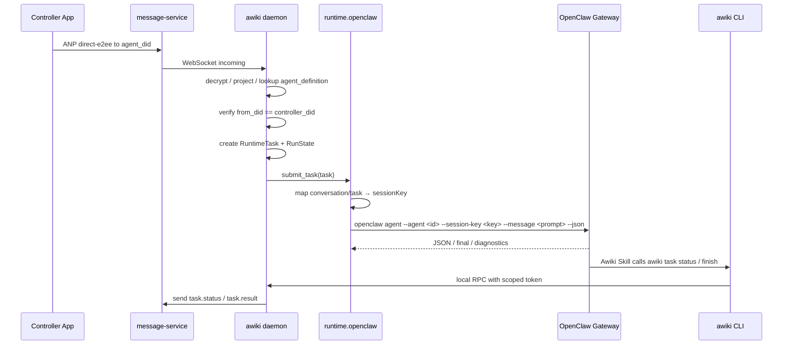

# OpenClaw Runtime Plugin 设计调研与方案

> 版本：v0.1 draft  
> 目标：在 Awiki daemon / ANP Agent Runtime Host 架构下，系统设计 `runtime.openclaw` 插件。  
> 范围：OpenClaw 的接入边界、会话映射、任务投递、Skill + CLI + RPC 回传链路、状态与安全策略。  
> 非范围：OpenClaw 内部源码改造、OpenClaw 插件 SDK 的具体代码实现、AVIC/AMP proof。

---

## 1. 结论摘要

`runtime.openclaw` 应该被设计为 **daemon 侧 Native Runtime Plugin**，而不是把 Awiki 做成 OpenClaw 的一个远端消息 channel。

推荐主链路：

```text
App / Other Agent
  → ANP direct / direct-e2ee
  → message-service
  → awiki daemon
  → runtime.openclaw
  → OpenClaw Gateway / openclaw agent CLI
  → OpenClaw Agent 执行
  → Awiki Skill
  → awiki CLI
  → daemon local RPC
  → IM Core SDK
  → ANP message-service
```

核心边界：

1. OpenClaw 不持有 Awiki / ANP DID 私钥。
2. OpenClaw 不直连 message-service。
3. OpenClaw 不直接负责 owner/controller 判断。
4. OpenClaw 的 channel delivery 不作为 Awiki 主消息通道。
5. OpenClaw 通过已安装的 Awiki Skill / CLI / local RPC 向 daemon 报告状态、发送消息、回传结果。
6. daemon 保留最终的 ANP 消息发送权、task state machine、local RPC token 校验和 audit。

---

## 2. 调研依据

### 2.1 OpenClaw Agent CLI 与会话选择

OpenClaw 的 `openclaw agent` 命令可以通过 Gateway 运行一次 agent turn，也支持 `--local` embedded 运行。它要求至少提供一个 session selector，例如 `--to`、`--session-key`、`--session-id` 或 `--agent`，并支持 `--json` 输出。OpenClaw 文档还说明 `--session-key` 可显式选择 session key，agent-prefixed key 应使用 `agent:<agent-id>:<session-key>` 形式。

对本方案的含义：

```text
awiki daemon 可以通过 openclaw agent --agent <id> --session-key <key> --message <text> --json
把 RuntimeTask 投递到指定 OpenClaw agent 与 session bucket。
```

### 2.2 OpenClaw Plugin / Skill / Tool 分层

OpenClaw 将 capability surface 分为 tools、skills、plugins。文档说明：tool 是模型可调用的 typed function；skill 是加载进 prompt 的 `SKILL.md` instruction pack；plugin 则可以添加 tools、skills、channels、model providers、speech、media、hooks、runtime capabilities 等。

对本方案的含义：

```text
Awiki 与 OpenClaw 的下层对接应优先做成 Awiki Skill + optional Awiki OpenClaw plugin/tool。
Skill 教 OpenClaw 如何调用 awiki CLI；plugin/tool 可用于更结构化地暴露 awiki_send_message / awiki_task_status。
```

### 2.3 OpenClaw Gateway 是 session 状态权威

OpenClaw session deep dive 明确说明，OpenClaw 设计为由单个 Gateway process 拥有 session state；session 持久化分为 `sessions.json` 与 transcript JSONL 两层。每个 `sessionKey` 指向当前 `sessionId`，transcript 保存真实 conversation 与 tool calls。

对本方案的含义：

```text
daemon 不应复制 OpenClaw transcript。
daemon 只保存 Awiki conversation / task 到 OpenClaw sessionKey / sessionId 的映射。
OpenClaw transcript 仍由 OpenClaw Gateway 管理。
```

### 2.4 OpenClaw plugin 安装与安全

OpenClaw plugin 文档强调 plugin 是运行代码，建议 pinned versions；还支持 plugin allow / deny / entries 配置，并指出 workspace-origin plugins 默认禁用，需要显式启用或 allowlist。插件安装、更新或卸载需要 Gateway restart 或 managed Gateway reload。

对本方案的含义：

```text
Awiki 只应安装自有、固定版本、可审计的 Awiki OpenClaw skill/plugin。
不要依赖 ClawHub 社区插件完成核心消息链路。
```

### 2.5 OpenClaw runtime 架构

OpenClaw 官方 runtime architecture 文档说明，OpenClaw owns built-in agent runtime，runtime code 包含 embedded-agent-runner、sessions、agent-core、runtime facade、agent tools/hooks 等；plugin-facing contracts 通过 `openclaw/plugin-sdk/*` 暴露；plugin harnesses 可注册 additional runtime ids。

对本方案的含义：

```text
runtime.openclaw 应按 OpenClaw 既有 runtime/gateway/session 模型适配，避免 import OpenClaw src/** internals。
```

---

## 3. 设计目标

`runtime.openclaw` 需要实现以下目标：

1. 让 daemon 可以把 ANP 控制消息转换为 OpenClaw agent turn。
2. 让 daemon 可以选择 OpenClaw agent、sessionKey、sessionId。
3. 让 OpenClaw agent 在任务中通过 Awiki Skill 调用 awiki CLI。
4. 让 awiki CLI 通过 daemon local RPC 完成状态上报、结果回传、对外发消息。
5. 保持 Awiki 的身份、授权、消息、安全边界在 daemon 内。
6. 复用 OpenClaw Gateway 的 session store 与 transcript，而不是在 daemon 中重造 OpenClaw session。
7. 为 OpenClaw plugin DB 保留 runtime-specific 状态空间。
8. 支持 Gateway-backed 模式为主，local embedded 模式为 fallback 或 debug。

---

## 4. 不做什么

`runtime.openclaw` 不应做：

1. 不把 Awiki ANP message-service 做成 OpenClaw channel 主链路。
2. 不让 OpenClaw channel delivery 直接给 Awiki 用户发送消息。
3. 不让 OpenClaw 直接保存或使用 Awiki DID 私钥。
4. 不让 OpenClaw 直接校验 controller DID。
5. 不让 OpenClaw 直接连接 user-service / message-service。
6. 不让社区 OpenClaw plugin 参与核心发送链路。

---

## 5. 组件结构

```text
awiki daemon
├── AgentRouter
│   └── agent_did → runtime.openclaw / openclaw_agent_id
├── ControllerRouter
│   └── from_did == controller_did 才进入执行链
├── TaskManager
│   └── RuntimeTask / RunState / idempotency
├── RuntimePluginRegistry
│   └── runtime.openclaw
├── LocalRpcServer
│   └── awiki CLI 调用入口
├── IM Core SDK
│   └── ANP 消息发送 / 接收 / 加密 / 投影
└── OpenClawPluginDb
    └── OpenClaw session mapping / profile / gateway status

runtime.openclaw
├── InstallationChecker
├── GatewayManager
├── AgentProfileManager
├── SkillInstaller
├── SessionMapper
├── TaskSubmitter
├── EventParser
└── FallbackLocalRunner

OpenClaw
├── Gateway
├── Agent runtime
├── session store / transcript
├── Awiki Skill
└── optional Awiki OpenClaw plugin/tool
```

---

## 6. Agent Identity 与 OpenClaw Agent 的绑定

Awiki 的 Agent Identity 是对外通信身份；OpenClaw agent id 是本地 runtime 目标。二者应通过 daemon 显式绑定。

```sql
agent_definition (
  agent_did TEXT PRIMARY KEY,
  handle TEXT NOT NULL,
  controller_did TEXT NOT NULL,

  runtime_plugin_id TEXT NOT NULL,     -- runtime.openclaw
  runtime_profile_id TEXT NOT NULL,    -- openclaw-profile-main

  status TEXT NOT NULL,
  created_at INTEGER NOT NULL,
  updated_at INTEGER NOT NULL
);
```

OpenClaw 插件自己的状态表：

```sql
openclaw_agent_binding (
  agent_did TEXT PRIMARY KEY,
  openclaw_agent_id TEXT NOT NULL,
  openclaw_gateway_mode TEXT NOT NULL,     -- gateway | local
  openclaw_config_home TEXT NOT NULL,
  default_session_strategy TEXT NOT NULL,  -- conversation | task | workspace
  skill_install_status TEXT NOT NULL,
  created_at INTEGER NOT NULL,
  updated_at INTEGER NOT NULL
);
```

示例：

```text
@alice-openclaw
  → did:agent:alice-openclaw
  → controller_did: did:human:alice
  → runtime_plugin_id: runtime.openclaw
  → openclaw_agent_id: ops
```

---

## 7. Session 映射设计

OpenClaw 使用 sessionKey / sessionId；Awiki 使用 conversation_id / task_id。daemon 应维护映射，但不接管 transcript。

推荐映射：

```text
Awiki conversation/task
  → OpenClaw sessionKey
  → OpenClaw current sessionId
```

```sql
openclaw_session_mapping (
  id TEXT PRIMARY KEY,
  agent_did TEXT NOT NULL,
  openclaw_agent_id TEXT NOT NULL,

  conversation_id TEXT,
  task_id TEXT,
  control_scope TEXT NOT NULL,       -- controller | daemon | system

  openclaw_session_key TEXT NOT NULL,
  openclaw_session_id TEXT,

  status TEXT NOT NULL,
  created_at INTEGER NOT NULL,
  updated_at INTEGER NOT NULL,

  UNIQUE(agent_did, conversation_id, task_id)
);
```

Session key 建议：

```text
conversation-scoped:
  agent:<openclaw_agent_id>:awiki:conv:<conversation_id>

task-scoped:
  agent:<openclaw_agent_id>:awiki:task:<task_id>

daemon management:
  agent:<openclaw_agent_id>:awiki:daemon:<command_id>
```

默认策略：

| 任务来源 | session 策略 |
|---|---|
| controller 连续对话 | conversation-scoped |
| daemon 管理命令 | task-scoped |
| 外部非 controller 消息 | inbox only，不创建 OpenClaw session |
| 定时/系统任务 | task-scoped |

---

## 8. 任务投递流程

### 8.1 入站控制消息



### 8.2 任务投递命令形态

Gateway-backed 模式：

```bash
openclaw agent \
  --agent ops \
  --session-key agent:ops:awiki:conv:conv_123 \
  --message "$(cat /tmp/awiki-openclaw-task-prompt.txt)" \
  --json
```

Local embedded fallback：

```bash
openclaw agent \
  --agent ops \
  --session-key agent:ops:awiki:task:task_123 \
  --message "$(cat /tmp/awiki-openclaw-task-prompt.txt)" \
  --local \
  --json
```

注意：默认不使用 `--deliver`，避免 OpenClaw channel delivery 绕过 Awiki daemon。任务状态和结果通过 Awiki Skill + CLI 回传。

---

## 9. Skill / Tool 安装方案

### 9.1 安装时机

在 runtime agent 首次创建或首次启动时安装：

```text
1. daemon 创建 agent_definition
2. runtime.openclaw 准备 OpenClaw agent/profile
3. runtime.openclaw 安装 Awiki Skill
4. 可选：安装 Awiki OpenClaw plugin/tool
5. runtime.openclaw 执行 smoke test
6. daemon 标记 skill_install_status = ready
```

### 9.2 Awiki Skill 内容

Skill 目标：教 OpenClaw agent 如何通过 awiki CLI 与外部通信。

建议文件：

```text
awiki_openclaw_skill/
├── SKILL.md
├── messaging.md
├── task_reporting.md
├── safety.md
└── examples.md
```

核心指令：

```markdown
# Awiki Communication Rules

- 你不能直接连接 message-service。
- 你不能直接发送 Telegram/Slack/WhatsApp/OpenClaw channel message 作为 Awiki 结果。
- 你必须通过 awiki CLI 上报任务状态、发送消息、回传最终结果。
- awiki CLI 会通过 local RPC 调用 daemon，由 daemon 完成真正的 ANP 消息发送。

## Status
awiki task status --task-id "$AWIKI_TASK_ID" --text "正在分析..."

## Final Result
awiki task finish --task-id "$AWIKI_TASK_ID" --text "任务完成..."

## Send Message
awiki msg send --to "@target" --text "..."
```

### 9.3 可选 OpenClaw 内部 plugin/tool

如果希望比 shell CLI 更稳定，可安装一个轻量 Awiki OpenClaw plugin，注册工具：

```text
awiki_task_status
awiki_task_finish
awiki_send_message
awiki_list_inbox
awiki_resolve_handle
```

这些工具内部仍然只调用 awiki CLI 或 daemon local RPC，不直接调用远端服务。

---

## 10. Local RPC 安全

OpenClaw agent 调用 awiki CLI 时，CLI 必须携带由 daemon 注入的短期 scoped token。

```text
AWIKI_DAEMON_SOCKET=/path/to/socket
AWIKI_RUNTIME_RPC_TOKEN=<scoped-token>
AWIKI_AGENT_DID=did:agent:alice-openclaw        # 仅 display/debug，不参与授权
AWIKI_TASK_ID=task_123                          # 仅 display/debug，不参与授权
```

RPC token 绑定：

```json
{
  "token_id": "rtok_...",
  "agent_did": "did:agent:alice-openclaw",
  "runtime_plugin_id": "runtime.openclaw",
  "run_id": "run_123",
  "task_id": "task_123",
  "allowed_methods": [
    "task.status",
    "task.finish",
    "msg.send",
    "msg.resolve"
  ],
  "expires_at": "..."
}
```

规则：

1. daemon 根据 token 反查 agent/run/task，不信任请求体中的 `agent_did`。
2. token 不写日志，只记录 token_id。
3. socket 使用 Unix domain socket / named pipe，并限制文件权限。
4. RPC method 分级；`msg.send` 可按收件人、task、scope 限制。
5. `task.finish` 只能成功一次，重复调用按 idempotency key 去重。

---

## 11. 状态机与双通道去重

OpenClaw 有两类可观测输出：

1. `openclaw agent --json` 的 CLI/Gateway 返回。
2. OpenClaw agent 通过 Skill + CLI 主动回报的 task.status / task.finish。

需要明确事实源：

```text
Skill + CLI RPC 是业务状态与最终结果的主事实源。
OpenClaw CLI/Gateway JSON 输出是观测与 fallback。
```

Run state：

```text
created → submitted → running → status_reported* → finishing → completed
                                      ↘ failed / cancelled / timeout
```

去重规则：

1. `task.finish` 只能提交一次。
2. 每个 status 使用 `event_id` 或 idempotency key。
3. 如果 OpenClaw CLI 返回 final，但没有收到 Skill final，daemon 可以在 timeout 后以 fallback 方式发送结果。
4. 如果 Skill final 和 CLI final 冲突，以 Skill final 为主，CLI final 记入 audit。

---

## 12. 数据库设计

### 12.1 daemon core DB

保存通用状态：

```text
agent_definition
controller_did
runtime_plugin_registry
task_runs
local_rpc_tokens
audit_log
```

### 12.2 OpenClaw plugin DB

保存 OpenClaw 特有状态：

```text
openclaw_agent_binding
openclaw_session_mapping
openclaw_gateway_status
openclaw_skill_installation
openclaw_task_submit_log
openclaw_cli_result_cache
```

### 12.3 不复制 OpenClaw transcripts

OpenClaw 的 `sessions.json` 和 `*.jsonl` transcript 仍由 OpenClaw Gateway 管理。daemon 只保存指针与状态摘要。

---

## 13. 安全策略

### 13.1 插件来源

只安装：

1. 自研 Awiki OpenClaw Skill。
2. 自研 Awiki OpenClaw Plugin，可选。
3. 固定版本的 OpenClaw 官方插件。

不把社区 ClawHub 插件作为核心链路依赖。

### 13.2 禁用 OpenClaw 直发 Awiki

OpenClaw 的 channel delivery 和 Agent send 能力可以保留给 OpenClaw 自己的生态，但在 Awiki runtime agent 中：

```text
Awiki 任务状态 / 结果 / 对外消息必须走 awiki CLI → daemon RPC。
```

### 13.3 controller DID 不是完整授权

当前 v0.2 采用 `controller_did`，但应叠加：

1. command scope。
2. operation_id。
3. ttl / nonce。
4. task state machine。
5. audit。
6. high-risk approval，未来开启。

---

## 14. 插件接口设计

```rust
struct OpenClawRuntimePlugin;

impl AgentRuntimePlugin for OpenClawRuntimePlugin {
    fn plugin_id(&self) -> String { "runtime.openclaw".into() }

    async fn check_installation(&self) -> RuntimeCheckResult;
    async fn prepare_profile(&self, profile: RuntimeProfile) -> Result<()>;
    async fn install_awiki_skill(&self, agent: AgentDefinition) -> Result<()>;
    async fn create_session(&self, req: CreateRuntimeSessionRequest) -> Result<RuntimeSession>;
    async fn submit_task(&self, session: RuntimeSession, task: RuntimeTask) -> RuntimeEventStream;
    async fn cancel_run(&self, run_id: String) -> Result<()>;
    async fn shutdown(&self) -> Result<()>;
}
```

关键 submit_task 输入：

```json
{
  "agent_did": "did:agent:alice-openclaw",
  "openclaw_agent_id": "ops",
  "session_key": "agent:ops:awiki:conv:conv_123",
  "task_id": "task_123",
  "controller_did": "did:human:alice",
  "prompt_file": "/tmp/awiki-openclaw-task-prompt.txt",
  "rpc_token_id": "rtok_123"
}
```

---

## 15. 落地步骤

### Phase 0：协议与安全前置

1. 定义 `RuntimeTask` / `RunState`。
2. 定义 local RPC token scope。
3. 定义 OpenClaw session key 命名。
4. 定义 Awiki Skill 内容。

### Phase 1：OpenClaw 安装检测与 Gateway 连接

1. `openclaw --version`。
2. `openclaw gateway status --deep --require-rpc`。
3. 检查 `openclaw agent --json` 是否可用。
4. 检查目标 OpenClaw agent id 是否存在。

### Phase 2：Skill 安装

1. 安装 Awiki Skill 到 OpenClaw 支持的位置。
2. 可选安装 Awiki OpenClaw plugin。
3. smoke test：让 OpenClaw agent 调用 `awiki task status --dry-run`。

### Phase 3：任务投递 MVP

1. controller DID 消息进入执行链。
2. daemon 映射 sessionKey。
3. 调 `openclaw agent --agent ... --session-key ... --message ... --json`。
4. Skill + CLI 回传 status/result。

### Phase 4：状态机与 fallback

1. 实现 task state machine。
2. 处理 CLI final 与 Skill final 双通道。
3. timeout fallback。
4. audit log。

### Phase 5：高级能力

1. cancellation。
2. OpenClaw Gateway restart / managed reload。
3. plugin runtime inspect。
4. OpenClaw hooks 作为内部 guardrail。
5. 未来 AVIC / AMP proof。

---

## 16. 推荐 MVP

MVP 不建议先做 OpenClaw channel plugin，而应做：

```text
runtime.openclaw
  ├── installation check
  ├── gateway status check
  ├── agent_did → openclaw_agent_id mapping
  ├── conversation/task → sessionKey mapping
  ├── submit_task via openclaw agent --json
  ├── Awiki Skill installation
  ├── awiki CLI local RPC reporting
  └── task state machine
```

一句话总结：**OpenClaw 插件应把 OpenClaw 当作本地 Native Runtime，不把 OpenClaw 当作 Awiki 的消息平台；任务由 daemon 投递给 OpenClaw，消息与结果由 OpenClaw 通过 Awiki Skill + CLI 回到 daemon，再由 daemon 调 IM Core SDK 发送。**

---

## 17. 参考链接

- OpenClaw `openclaw agent` CLI: https://docs.openclaw.ai/cli/agent
- OpenClaw capabilities / tools / skills / plugins overview: https://docs.openclaw.ai/tools
- OpenClaw plugins: https://docs.openclaw.ai/tools/plugin
- OpenClaw building plugins: https://docs.openclaw.ai/plugins/building-plugins
- OpenClaw agent runtime architecture: https://docs.openclaw.ai/agent-runtime-architecture
- OpenClaw session management deep dive: https://docs.openclaw.ai/reference/session-management-compaction
- OpenClaw plugin SDK overview: https://docs.openclaw.ai/plugins/sdk-overview
- OpenClaw plugin manifest: https://docs.openclaw.ai/plugins/manifest


