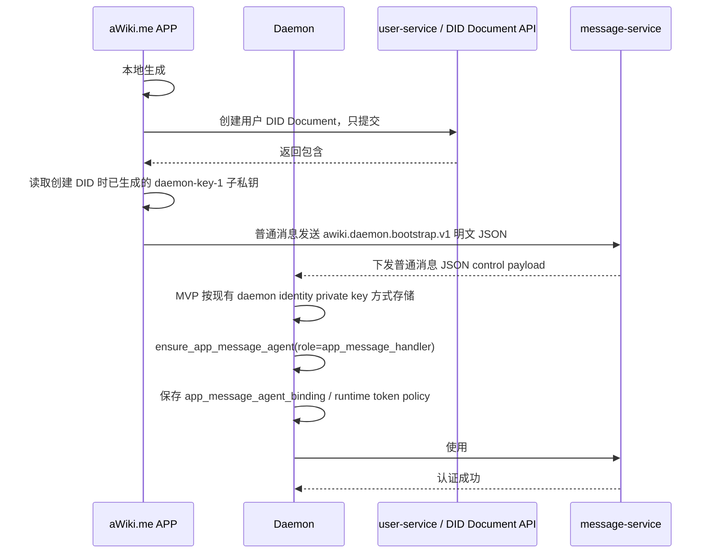
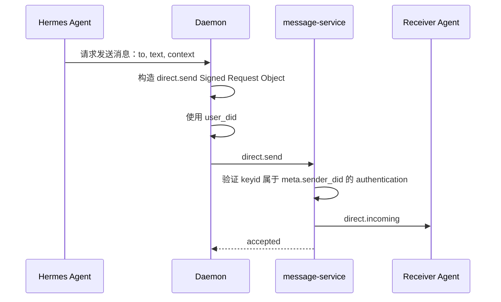
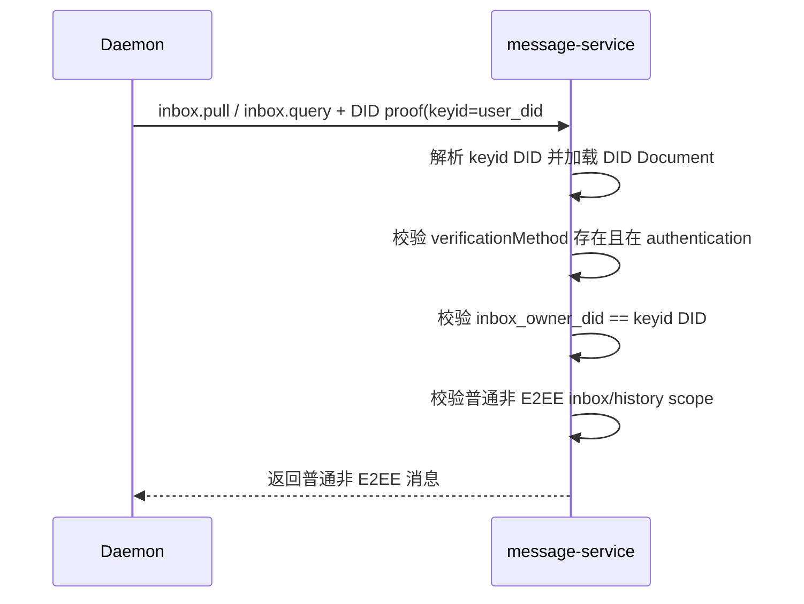
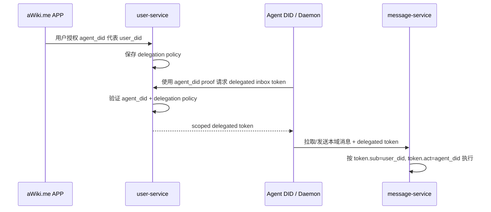
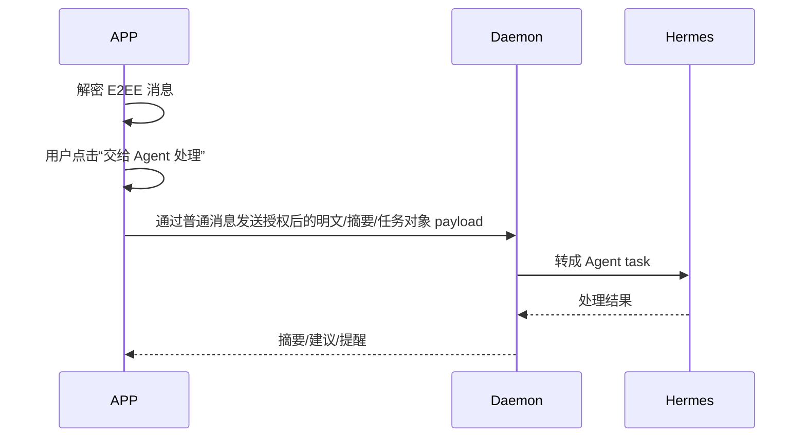

# Agent Delegated Identity and ANP Message Proof 方案

> 文件名：`agent_delegated_identity_message_proof_plan.md`  
> 版本：v0.1  
> 状态：方案确认稿  
> 目标：确认并细化两阶段方案：MVP 使用“用户 DID 子私钥”让 Daemon/Agent 代替用户收发普通消息；长期使用“独立 Agent DID + 用户授权”让 Agent DID 以可审计、可撤销、可约束的方式代表用户收发消息。

---

## 0. 核心结论

本方案分为两个层级：

1. **第一阶段 / MVP：用户 DID 子私钥方案**
   - APP / IM 在创建用户 DID Document 时，由 APP 本地生成一把新的子签名私钥，称为 **User Delegated Subkey**，MVP 固定 DID URL fragment 为 `#daemon-key-1`，完整 verification method 为 `user_did#daemon-key-1`；所有文档、实现和测试统一使用 `#daemon-key-1`。
   - 创建 DID Document 的地方必须先由 APP 本地生成 key package，并从中导出 `user_did#daemon-key-1` public verification method；再调用最新 user-service / DID API，只把这个 public verification method 交给 user-service 登记到初始 DID Document 的 `verificationMethod` 与 `authentication`；user-service 不生成、不派生、不接收、不返回 daemon subkey private material。
   - MVP 第一版先允许 APP 通过普通消息发送明文 JSON bootstrap payload 将这把子私钥传给 Daemon；这是已知安全缺口。
   - 后续版本仍通过普通消息发送，只把 bootstrap body 从明文 JSON 改为加密文本或加密 JSON envelope。
   - bootstrap 阶段不再负责追加修改 DID Document，只传递已经存在且已登记的子私钥 key package。
   - Daemon 用这把子私钥生成 ANP `auth.origin_proof`。
   - ANP 消息里仍然使用：
     - `meta.sender_did = user_did`
     - `signatureInput.keyid = user_did#daemon-key-1`
   - message-service / 远端验证方按现有 ANP proof 机制解析 `keyid`，从用户 DID Document 找到对应公钥并验签。
   - 这个方案**不需要修改 ANP 当前 `origin_proof` 结构**，也不需要改变 did:wba 核心语义。

2. **长期阶段：独立 Agent DID 授权方案**
   - Agent 拥有自己的 DID，例如 `agent_did = did:wba:example.com:agent:hermes:e1_xxx`。
   - 用户 DID 通过授权凭证、capability、VC / Data Integrity proof 或本域授权记录，授权该 Agent DID 代表自己收发消息。
   - Agent 使用自己的私钥签名，证明“实际执行者是 Agent”。
   - 授权凭证证明“用户允许这个 Agent 在指定范围内代表用户”。
   - 这个方案可以做到权限范围、有效期、撤销、审计和跨 Agent 分工更清晰。
   - 如果要让跨域接收方也标准化理解“Agent 代表用户发送”，需要扩展 ANP auth/profile，例如新增 `anp-delegated-origin-proof-v1` 或等价机制。

建议落地顺序：

```text
MVP 先走用户 DID 子私钥方案，并要求服务器支持该子 key 的普通消息发送和接收权限。
ANP SDK / im-core 只通过可选参数支持 delegated signing/inbox，不影响老调用。
中期补普通消息 body 加密、scoped inbox token、受保护密钥仓库。
长期再做 Agent DID 授权凭证与 ANP delegated proof 标准化。
```

---

## 1. 背景和目标

当前目标是让 IM 应用，例如 aWiki.me，为每个用户配置一个 Agent。用户登录 APP 后，APP 通过普通消息发送给 Daemon 完成 bootstrap；MVP 第一版先允许明文 JSON 传递用户 DID 子私钥，后续再把同一普通消息 body 升级为加密文本或加密 JSON envelope。Daemon 获得足够的身份能力后，可以：

1. 代替用户拉取普通非 E2EE 消息；
2. 代替用户发送普通非 E2EE 消息；
3. 把收到的消息交给 Hermes Agent 分析、总结、提醒；
4. 在用户授权下，由 Agent 代处理不重要消息或准备回复建议；
5. 管理 Runtime Agent，例如创建 Hermes、OpenClaw、Codex、Claude Code、Gemini 等运行时 Agent；
6. 后续允许 Agent 反向操纵 APP UI，例如弹卡片、修改通讯录、设置提醒、显示摘要等。

本方案只讨论身份、proof、授权和消息收发边界，不展开 Hermes 内部推理逻辑。

---

## 2. 术语

| 名称 | 含义 |
|---|---|
| User DID | 用户主 DID，例如 `did:wba:example.com:user:alice:e1_xxx`。 |
| User Main Key | 用户主私钥，通常对应 DID path 中 `e1_` 绑定 key 或用户主认证 key。MVP 不传给 Daemon。 |
| User Delegated Subkey / 子私钥 | APP 在创建用户 DID Document 时本地生成的一把子签名私钥，例如 `user_did#daemon-key-1`；user-service 只登记对应 public verification method，不生成、不接收、不返回私钥。MVP 第一版 APP 通过普通消息发送明文 JSON bootstrap 传给 Daemon；后续普通消息 body 改为加密文本或加密 JSON envelope。 |
| Daemon | 本地或云端 Agent Runtime Host，负责保管子私钥、拉取消息、调用 im-core/message SDK、调度 Hermes。 |
| Hermes Agent | 具体 Runtime Agent。建议 Hermes 不直接持有 DID 私钥，而是通过 Daemon local RPC 请求发送、签名、拉取等能力。 |
| Agent DID | 长期方案中 Agent 自己的 DID，例如 `did:wba:example.com:agent:hermes:e1_xxx`。 |
| ANP origin proof | ANP `auth.origin_proof`，用于证明业务消息由 `meta.sender_did` 发起。 |
| Signed Request Object | ANP proof 中被计算 `contentDigest` 的业务对象，只包含 `method`、`meta`、`body`，不包含 `auth`、`jsonrpc`、`id`。 |
| Delegation Credential | 长期方案中用户签发给 Agent DID 的授权凭证，用来表达代理范围、有效期和撤销状态。 |
| Scoped Inbox Token | MVP 后由本域服务签发给 Daemon/Agent 的 token，用于拉取 inbox/history 等非跨域业务 API；不进入 MVP 主路径。 |

命名约定：新增方案不再使用 `mailbox_*` 作为 API/SDK/Token/DB 名称。`mailbox` 容易被理解成 email/mail 系统；本文统一使用 `inbox` 表达“用户消息收件箱和历史记录访问”的授权上下文，例如 `InboxHistoryOptions`、`inbox_owner_did`、`inbox_auth_verification_method`、`ScopedInboxToken`。

---

## 3. 设计原则

### 3.1 不传用户主私钥

MVP 虽然允许“传私钥”，但传的是用户 DID 下的**子私钥**，不是用户主私钥。

```text
禁止：APP -> Daemon 传 User Main Key
允许：APP -> Daemon 传 user_did#daemon-key-1 对应的子私钥
```

这样 Daemon 被攻破时，风险从“用户主身份完全丢失”降级为“某个 Daemon 子 key 被盗”。用户可以通过移除 DID Document 中的子 key、撤销 token、关闭 Daemon session 来止损。

### 3.2 Hermes 不直接持有密钥

产品上可以说“Agent 代表用户处理消息”，但工程边界建议是：

```text
Hermes Agent 负责理解和决策。
Daemon 负责持有子私钥、签名、拉取、发送和审计。
Hermes 通过 Daemon local RPC / CLI skill 调用能力。
```

不建议把子私钥直接交给 Hermes runtime 进程。否则不同 runtime、prompt injection、tool call、插件漏洞都可能扩大密钥泄露面。

### 3.3 子私钥既用于普通消息发送，也用于普通消息接收授权

发送普通 ANP 消息：

```text
使用 ANP origin_proof。
```

拉取 inbox/history：

```text
MVP 服务器必须支持 user_did#daemon-key-1 直接证明接收权限；
也可以由该子 key 换取 scoped inbox token 作为中期优化。
```

原因是 ANP Direct Base 主要定义 direct.send / direct.incoming 的消息语义；history pull、read status、device sync、agent internal synchronization 不属于基础跨域互操作范围。MVP 的产品目标要求 Daemon 能离线代收普通消息，因此 message-service 必须能用 DID proof、DID Document `authentication`、key owner 一致性和普通非 E2EE scope 校验 `user_did#daemon-key-1`，并允许它读取普通非 E2EE inbox/history。user-service 在 MVP 中只负责 DID Document public verification method 的登记、撤销和管理侧审计记录；message-service 的 MVP 运行时授权只读取 DID Document，并以 DID Document `authentication` 作为 key 是否有效的依据。user-service 管理侧记录、audit 表、状态表或 scoped token 签发状态都不进入 message-service MVP 运行时授权输入。撤销对 message-service 的生效只通过 DID Document `authentication` 更新和 DID Document 重新解析/刷新体现。scoped inbox token 可以减少每次拉取的 DID proof 成本，但不是 MVP 接收能力的唯一表达。

### 3.4 MVP 不支持 E2EE 交给 Agent

对于 direct/group E2EE 消息，默认不把 E2EE session 私钥、ratchet state、group MLS private state 交给 Daemon 或 Agent。

MVP 策略：

```text
普通消息：Daemon 可以代收、代发。
E2EE 消息：不交给 Agent，不转发明文、摘要或任务对象。
```

这里需要区分两条接收路径：

1. **WebSocket DID fanout**：message-service 应支持同一个 user DID 同时存在 APP 连接和 Daemon 连接，并把该 DID 的下行通知 fanout 给所有在线连接。普通非 E2EE 消息和 E2EE opaque notification 都可以按同一 DID 下发给这些连接。
2. **delegated inbox/history pull**：Daemon 使用 `user_did#daemon-key-1` 主动拉取时，MVP 只返回普通非 E2EE 消息，不返回 E2EE 明文、metadata projection 或 private state。

Daemon 如果通过 WebSocket 收到 direct/group E2EE opaque notification，因为没有 E2EE private state，不处理、不解密、不转发给 Hermes，可以直接丢弃或只记录不可处理状态。这个规则不等价于支持 Agent 处理 E2EE；它只是同 DID 多连接 fanout 下的客户端侧丢弃策略。

长期可以支持“APP 显式转发”或“Agent 作为显式成员/显式接收者加入 E2EE 会话”，但那是新的隐私和群组语义，不进入 MVP。

---

## 4. 现有 DID / ANP 机制对齐

### 4.1 DID Document 天然支持多个 key

DID Document 可以包含多个 `verificationMethod`。每个 key 可以通过 verification relationship 被授权用于不同目的，例如：

```text
authentication
assertionMethod
keyAgreement
capabilityInvocation
capabilityDelegation
```

MVP 子私钥方案利用的是：

```text
user_did#daemon-key-1 被加入 user_did DID Document 的 authentication relationship。
```

验证方只要看到 `keyid = user_did#daemon-key-1`，就能解析用户 DID Document，找到该 key，并确认它是否被授权用于 authentication。

### 4.2 did:wba 不需要改变核心语义

did:wba 的 path-type `e1_` DID 通过 DID path 绑定主 Ed25519 key 的 fingerprint。只要这个绑定主 key 不变，DID Document 可以更新，例如增加新的 verification method、撤销旧 key、更新 service endpoint。

因此让初始 DID Document 带上 `#daemon-key-1`，或后续替换/轮换这个 public verification method，都不需要改变 did:wba 方法本身。MVP 不通过 fragment 表示设备或轮换序号。

需要注意的是：

```text
#daemon-key-1 不应该替代 e1_ path binding key。
它只是用户 DID 下的附属 authentication key。
```

### 4.3 ANP origin proof 可以直接使用子 key

ANP 当前 proof 模型里，`auth.origin_proof.signatureInput` 包含 `keyid`。这个 `keyid` 是完整 DID URL，例如：

```text
keyid="did:wba:example.com:user:alice:e1_xxx#daemon-key-1"
```

ANP verifier 的关键校验是：

1. 重建 Signed Request Object；
2. 用 JCS 规范化并计算 `contentDigest`；
3. 重建 `@method`；
4. 重建 `@target-uri`；
5. 按 RFC 9421 规则验证 `Signature-Input` / `Signature`；
6. 解析 `keyid` 指向的 DID Document；
7. 检查 `keyid` 对应 verification method 是否在 `authentication` relationship；
8. 检查 `keyid` 所属 DID 与 `meta.sender_did` 一致。

所以子私钥方案完全贴合现有 ANP `origin_proof`。

---

## 5. 方案一：MVP 子私钥方案

### 5.1 身份模型

MVP 中，Daemon 不是独立业务发送者，而是用户 DID 下的一个受控 delegated signing 执行上下文。

```text
业务发送者：User DID
实际运行节点：Daemon
签名 key：User DID 下的 `#daemon-key-1` User Delegated Subkey
```

消息语义：

```text
这条消息由 User DID 发出。
签名使用 User DID Document 中的 #daemon-key-1。
```

这和“同一用户 DID 下使用不同 authentication key 发消息”的模型类似。

### 5.2 DID Document 示例

用户 DID：

```text
did:wba:example.com:user:alice:e1_userfingerprint
```

新增子 key：

```text
did:wba:example.com:user:alice:e1_userfingerprint#daemon-key-1
```

DID Document 示例：

```json
{
  "@context": [
    "https://www.w3.org/ns/did/v1",
    "https://w3id.org/security/multikey/v1"
  ],
  "id": "did:wba:example.com:user:alice:e1_userfingerprint",
  "verificationMethod": [
    {
      "id": "did:wba:example.com:user:alice:e1_userfingerprint#key-1",
      "type": "Multikey",
      "controller": "did:wba:example.com:user:alice:e1_userfingerprint",
      "publicKeyMultibase": "z6MkUserMainPublicKey..."
    },
    {
      "id": "did:wba:example.com:user:alice:e1_userfingerprint#daemon-key-1",
      "type": "Multikey",
      "controller": "did:wba:example.com:user:alice:e1_userfingerprint",
      "publicKeyMultibase": "z6MkDaemonSubkeyPublicKey..."
    }
  ],
  "authentication": [
    "did:wba:example.com:user:alice:e1_userfingerprint#key-1",
    "did:wba:example.com:user:alice:e1_userfingerprint#daemon-key-1"
  ],
  "keyAgreement": [
    "did:wba:example.com:user:alice:e1_userfingerprint#key-x25519-1"
  ],
  "service": [
    {
      "id": "did:wba:example.com:user:alice:e1_userfingerprint#anp",
      "type": "ANPMessageService",
      "serviceEndpoint": "https://example.com/anp-im/rpc",
      "serviceDid": "did:wba:example.com"
    }
  ]
}
```

说明：

1. `#key-1` 是用户主 key。
2. `#daemon-key-1` 是 Daemon 子 key。
3. `#daemon-key-1` 被放入 `authentication`，所以可以用于 ANP origin proof。
4. 如果未来希望只允许某些能力，可以增加本域 policy 或扩展字段，但不要指望 DID Core 本身表达完整业务权限。

### 5.3 子私钥生成与传输流程

MVP 按当前决策采用“APP 创建用户 DID Document 时本地生成 `#daemon-key-1` 子私钥，只把由该 key package 导出的 public verification method 提交给 user-service 登记，并通过普通消息发送明文 JSON bootstrap payload 把该既有子私钥传给 Daemon”的直接方案。这里的明文传递是第一版安全缺口，后续必须在同一普通消息发送路径上把 bootstrap body 改为加密文本或加密 JSON envelope。

这个 bootstrap 不只是传 key package，也是一条一次性声明式 session：APP 把用户 delegated subkey、APP capability policy 和 `desired_message_agent` 交给 Daemon。Daemon 收到后执行 `ensure_app_message_agent`，创建或复用专门处理 APP 普通消息的 Hermes Message Agent，并把该 Agent 与 user delegated inbox/send 能力绑定。APP 不应反复发送命令式 create runtime command；重复 bootstrap 必须通过 `bootstrap_id` / `idempotency_key` 幂等处理。



### 5.4 普通消息 body 加密

APP 和 Daemon 之间不新增 local socket、loopback、局域网、QR pairing 或独立 secure channel。唯一传输方式是普通消息发送。MVP 的 bootstrap body 是明文 JSON；后续安全版本只改变普通消息 body 的内容形态：

1. 明文 JSON body：

```json
{
  "schema": "awiki.daemon.bootstrap.v1",
  "body_encoding": "plain_json",
  "user_subkey_package": {
    "...": "..."
  }
}
```

2. 后续加密文本或加密 JSON envelope：

```json
{
  "schema": "awiki.daemon.bootstrap.v1",
  "body_encoding": "encrypted_envelope",
  "encrypted_payload": "base64-or-jwe-like-text",
  "key_id": "did:wba:...daemon...#key-agreement-1",
  "alg": "后续方案固定"
}
```

后续要固定加密算法、key discovery、key rotation 和失败回退，但这些都是普通消息 body 的 schema 版本演进，不是新增 APP-Daemon 传输通道。

### 5.5 MVP bootstrap envelope 与 key package

MVP 明文 payload 结构建议如下。后续加密 body 落地后，该结构作为加密前明文。

```json
{
  "schema": "awiki.daemon.bootstrap.v1",
  "bootstrap_id": "boot_20260609_001",
  "idempotency_key": "message-agent-bootstrap:did:wba:example.com:user:alice:e1_userfingerprint:app_instance_1",
  "pairing_session_id": "pair_123",
  "app_instance_id": "app_instance_1",
  "controller_did": "did:wba:example.com:user:alice:e1_userfingerprint",
  "user_subkey_package": {
    "schema": "awiki.daemon.user_subkey_package.v1",
    "user_did": "did:wba:example.com:user:alice:e1_userfingerprint",
    "verification_method": "did:wba:example.com:user:alice:e1_userfingerprint#daemon-key-1",
    "key_type": "Multikey/Ed25519",
    "private_key_multibase": "z...",
    "public_key_multibase": "z...",
    "created_at": "2026-06-09T12:00:00Z",
    "expires_at": "2026-09-09T12:00:00Z",
    "label": "Alice App Daemon",
    "allowed_usage_hint": [
      "anp.origin_proof.sign",
      "message.send.plain",
      "message.inbox.read.plain",
      "message.history.read.plain",
      "agent.manage"
    ],
    "did_document_version_hint": "did-doc-version-or-etag",
    "one_time_install_nonce": "nonce_..."
  },
  "desired_message_agent": {
    "role": "app_message_handler",
    "runtime": "hermes",
    "display_name": "Hermes Message Agent",
    "ensure_once_key": "app-message-agent:did:wba:example.com:user:alice:e1_userfingerprint:app_instance_1",
    "auto_create": true,
    "plain_message_visible": true,
    "e2ee_visible": false,
    "allowed_actions": [
      "message.summarize_plain",
      "message.create_draft",
      "contact.read",
      "contact.update_display_name",
      "contact.update_note"
    ]
  }
}
```

注意：

1. `allowed_usage_hint` 在 MVP 中只是本域策略提示，不是 DID Core 标准强制语义。运行时真正权限由 message-service 根据 DID proof、DID Document `authentication`、key owner 一致性和普通非 E2EE scope 执行；user-service 只负责 public verification method 登记、撤销和管理侧审计记录，这些管理侧记录不进入 message-service MVP 运行时授权输入；scoped token scope 是后续优化路径。
2. `desired_message_agent` 表示期望状态，不是命令式创建请求。Daemon 应以 `ensure_once_key` 幂等创建或复用 `role=app_message_handler` 的 Runtime Agent。
3. Hermes Message Agent 不直接持有子私钥；Daemon 只把 inbox/send 能力通过 local RPC、runtime token 和 policy 暴露给它。

### 5.6 Daemon 存储要求

MVP 第一版先沿用现有 daemon identity private key 的本地存储方式保存子私钥，这是已知安全债。后续安全版本不应把子私钥明文落盘，推荐：

```text
macOS: Keychain
Windows: DPAPI / Credential Manager
Linux: libsecret / gnome-keyring / KWallet；无可用密钥环时使用 passphrase-encrypted local store
Server: KMS / Vault / sealed box / hardware-backed secret store
```

后续安全版本本地数据库只存 metadata：

```sql
CREATE TABLE user_delegated_subkeys (
  user_did TEXT NOT NULL,
  verification_method TEXT PRIMARY KEY,
  key_label TEXT,
  public_key_multibase TEXT NOT NULL,
  private_key_material TEXT,
  private_key_ref TEXT,
  status TEXT NOT NULL DEFAULT 'active',
  created_at_ms INTEGER NOT NULL,
  expires_at_ms INTEGER,
  revoked_at_ms INTEGER,
  last_used_at_ms INTEGER,
  allowed_usage_hint_json TEXT
);
```

`private_key_ref` 指向系统安全存储中的 key，不直接存私钥。MVP 如果暂时直接保存 private key material，必须禁止进入日志、audit payload、Hermes prompt、runtime temp，并在后续 migration 中迁移为 `private_key_ref`。

### 5.7 发送 ANP 消息流程



ANP request 示例：

```json
{
  "jsonrpc": "2.0",
  "id": "req-10001",
  "method": "direct.send",
  "params": {
    "meta": {
      "profile": "anp.direct.base.v1",
      "security_profile": "transport-protected",
      "sender_did": "did:wba:example.com:user:alice:e1_userfingerprint",
      "target": {
        "kind": "agent",
        "did": "did:wba:example.com:user:bob:e1_bobfingerprint"
      },
      "operation_id": "msg-10001",
      "message_id": "msg-10001",
      "created_at": "2026-06-09T12:00:00Z",
      "content_type": "text/plain"
    },
    "auth": {
      "scheme": "anp-rfc9421-origin-proof-v1",
      "origin_proof": {
        "contentDigest": "sha-256=:BASE64_SHA256_OF_SIGNED_REQUEST_OBJECT:",
        "signatureInput": "sig1=(\"@method\" \"@target-uri\" \"content-digest\");created=1781006400;expires=1781006460;nonce=\"n-1\";keyid=\"did:wba:example.com:user:alice:e1_userfingerprint#daemon-key-1\"",
        "signature": "sig1=:BASE64_SIGNATURE:"
      }
    },
    "body": {
      "text": "我稍后回复你。"
    }
  }
}
```

### 5.8 拉取消息流程

MVP 要求服务器支持 `user_did#daemon-key-1` 对普通非 E2EE inbox/history 的接收权限。这里讨论的是 Daemon 主动拉取的 delegated inbox/history pull，不是 WebSocket DID fanout。MVP 主路径只有一种：

1. Daemon 每次用该子 key 做 DID/RFC9421 proof。
2. message-service 解析 `keyid` 指向的用户 DID Document，校验 verification method 存在且在 `authentication` 中，校验 `inbox_owner_did == keyid DID`，并只允许普通非 E2EE inbox/history scope。
3. message-service 运行时只读取 DID Document，撤销实时性依赖 DID Document `authentication` 更新和 message-service 对 DID Document 的重新解析/刷新。

Daemon 用该子 key 向 user-service 换取 `ScopedInboxToken` 再拉取，是 MVP 后的性能和撤销传播优化，不是 MVP 主路径。

流程：



Token claim 建议：

```json
{
  "iss": "did:wba:example.com",
  "sub": "did:wba:example.com:user:alice:e1_userfingerprint",
  "act": {
    "verification_method": "did:wba:example.com:user:alice:e1_userfingerprint#daemon-key-1",
    "kind": "daemon_delegated_subkey"
  },
  "aud": "message-service",
  "scope": [
    "message.inbox.read.plain",
    "message.history.read.plain",
    "message.send.plain",
    "agent.manage"
  ],
  "iat": 1781000000,
  "exp": 1781086400,
  "jti": "tok_..."
}
```

### 5.9 message-service 验证策略

对于发送消息：

```text
1. 验证 ANP origin_proof。
2. 检查 keyid DID == meta.sender_did。
3. 检查 keyid 存在于 meta.sender_did DID Document。
4. 检查 keyid 被 authentication relationship 授权。
5. 如果 key fragment 是 #daemon-key-1：
   - 检查是否允许 message.send.plain；
   - 检查 rate limit / content policy / audit policy。
   - key 是否有效以 DID Document `authentication` 和 message-service 对 DID Document 的重新解析/刷新结果为准。
```

对于拉取消息：

```text
1. 验证 user_did#daemon-key-1 的 DID/RFC9421 proof。
2. 检查 keyid DID == inbox_owner_did。
3. 检查 keyid 存在于 inbox_owner_did DID Document。
4. 检查 keyid 被 authentication relationship 授权。
5. 检查请求只包含 message.inbox.read.plain / message.history.read.plain。
6. 只返回普通非 E2EE 消息类型。
7. 默认不返回 E2EE 明文、E2EE metadata projection 和 E2EE private state。
8. `ScopedInboxToken` 是 MVP 后可选优化，届时再校验 token.sub / token.act / token scope。
```

对于 WebSocket 下行通知：

```text
1. message-service 支持同一个 user DID 的多个在线连接。
2. APP 连接和 Daemon 连接可以同时绑定同一个 user DID。
3. message-service 对该 DID 的普通非 E2EE 消息和 E2EE opaque notification 做 fanout。
4. Daemon 收到普通非 E2EE notification 后可以进入 Agent processing pipeline。
5. Daemon 收到 E2EE opaque notification 后必须不解密、不转发给 Agent、不写入可处理消息事件；可以直接丢弃或标记 ignored_e2ee_opaque。
```

### 5.10 撤销与轮换

MVP 撤销必须包含两层：

1. DID Document 层：
   - 从 `authentication` 中移除 `#daemon-key-1`；
   - 可进一步从 `verificationMethod` 中移除该 key；
   - 发布新 DID Document。

2. 服务端本域层：
   - user-service 只在 DID Document 管理侧记录 public verification method 撤销/审计，并确保 DID Document `authentication` 不再包含该 key；
   - message-service 通过 DID Document 重新解析/刷新感知撤销；
   - MVP 后如果启用 scoped inbox token，message-service 还需要撤销相关 token；
   - Daemon 下次请求收到 `unauthorized` 后删除本地 key。

轮换流程：

```text
1. MVP 一个 APP 只有一个 daemon key，固定使用 #daemon-key-1，不通过 fragment 表示设备或轮换序号。
2. APP 本地生成新的 #daemon-key-1 replacement private/public key package。
3. APP 调用最新 DID key management API，用新的 public verification method 替换或重登记 #daemon-key-1。
4. MVP 通过普通消息明文 JSON bootstrap 重新发送 #daemon-key-1 replacement private key 给 Daemon；后续版本改为加密文本或加密 JSON envelope。
5. Daemon 确认可用。
6. DID Document 中旧的 #daemon-key-1 public key 不再有效。
7. 撤销旧 token。
```

### 5.11 MVP 风险

子私钥方案虽然简单，但有一个重要风险：

```text
所有接受 user_did authentication key 的验证方，都可能把 #daemon-key-1 视为完整用户认证能力。
```

因此必须通过本域 policy 限制：

1. MVP 固定使用 `#daemon-key-1`；fragment 不包含设备名、设备型号、时间戳或硬件/用户可识别信息；所有文档、实现和测试统一使用 `#daemon-key-1`；
2. user-service 只接收 APP 本地生成 key package 导出的 public verification method，并只把它登记到 DID Document `verificationMethod` 与 `authentication`；撤销和审计也仅针对 public verification method，不生成 daemon private key；
3. message-service MVP 只校验 DID proof、DID Document `authentication`、key owner 一致性和普通非 E2EE scope；
4. 不允许 daemon subkey 更新 DID Document；
5. 不允许 daemon subkey 导出用户主私钥；
6. 不允许 daemon subkey 获得 direct/group E2EE private state；
7. 默认设置短有效期，例如 30 天或 90 天；
8. 所有使用 daemon subkey 的发送、拉取、Agent 管理行为写 audit log。

---

## 6. 方案二：长期 Agent DID 授权方案

### 6.1 身份模型

长期方案中，Agent 不再伪装成用户 DID 下的一个子 key，而是拥有独立 DID。

```text
用户 DID：did:wba:example.com:user:alice:e1_user
Agent DID：did:wba:example.com:agent:hermes:e1_agent
```

语义变为：

```text
实际签名者：Agent DID
授权者：User DID
业务效果：Agent 在授权范围内代表 User DID 收发消息
```

这个模型更适合长期产品，因为它能清晰表达：

1. 谁真正执行了动作；
2. 谁授权了执行；
3. 授权范围是什么；
4. 授权什么时候过期；
5. 哪个 Agent 做了什么；
6. 撤销和审计怎么做。

### 6.2 为什么长期方案不能直接复用当前 ANP origin proof

当前 ANP `origin_proof` 的基础语义是：

```text
keyid 所属 DID 必须与业务主体 DID 一致。
```

也就是说，如果：

```text
meta.sender_did = user_did
signatureInput.keyid = agent_did#key-1
```

按当前 ANP proof 规则，这会失败，因为 keyid 所属 DID 是 Agent DID，而不是 User DID。

因此长期方案有两条路径：

1. **本域实现路径**：message-service 内部支持 Agent DID 授权，不要求跨域接收方理解代理语义。
2. **标准扩展路径**：扩展 ANP auth/profile，让跨域接收方也能验证“Agent DID 代表 User DID”。

### 6.3 长期方案 A：本域 Agent DID 授权

这适合先落地，不需要马上改 ANP 标准。

流程：



Token 示例：

```json
{
  "iss": "did:wba:example.com",
  "sub": "did:wba:example.com:user:alice:e1_user",
  "act": {
    "did": "did:wba:example.com:agent:hermes:e1_agent",
    "kind": "agent_did"
  },
  "scope": [
    "message.inbox.read.plain",
    "message.send.plain",
    "agent.manage",
    "app.ui.request"
  ],
  "aud": "message-service",
  "iat": 1781000000,
  "exp": 1781086400,
  "jti": "tok_..."
}
```

这种方式对本域非常实用，但跨域转发时，远端看到的仍然要符合现有 ANP proof。可以选择：

```text
方式 1：message-service 作为用户 home service，用 user_did 的合法 key 生成 origin_proof 后转发。
方式 2：仍由 user_did 子 key 签 origin_proof，Agent DID 只作为本域 actor 出现在 audit/token 中。
方式 3：等 ANP delegated proof 成熟后，直接跨域携带 Agent DID 代理证明。
```

短期建议：本域 Agent DID 授权只用于拉取、整理、内部执行和本域发送控制；跨域用户身份发送仍沿用方案一的子 key。

### 6.4 长期方案 B：ANP Delegated Origin Proof

如果要让远端也能验证“这是 Agent 代表用户发出的消息”，需要扩展 ANP auth。

建议新增：

```text
anp-delegated-origin-proof-v1
```

新的 auth 结构示意：

```json
{
  "auth": {
    "scheme": "anp-delegated-origin-proof-v1",
    "origin_proof": {
      "subject_did": "did:wba:example.com:user:alice:e1_user",
      "actor_did": "did:wba:example.com:agent:hermes:e1_agent",
      "contentDigest": "sha-256=:...:",
      "signatureInput": "sig1=(\"@method\" \"@target-uri\" \"content-digest\");created=1781006400;expires=1781006460;nonce=\"n-1\";keyid=\"did:wba:example.com:agent:hermes:e1_agent#key-1\"",
      "signature": "sig1=:...:"
    },
    "delegation": {
      "credential_type": "AwikiAgentDelegationCredential",
      "credential": {
        "...": "..."
      }
    }
  }
}
```

验证方逻辑：

```text
1. 重建 Signed Request Object。
2. 验证 origin_proof 是 agent_did#key-1 签的。
3. 检查 actor_did == keyid 所属 DID。
4. 检查 subject_did == meta.sender_did，或者 profile 明确指定 subject 字段。
5. 验证 delegation credential 是 user_did 签发给 agent_did 的。
6. 检查 delegation scope 覆盖当前 method/profile/security_profile/content_type/target。
7. 检查 credential 未过期、未撤销。
8. 通过后，视为 agent_did 在授权范围内代表 user_did 执行。
```

### 6.5 Delegation Credential 示例

可以使用 W3C VC，也可以先使用简化 Data Integrity object。

建议结构：

```json
{
  "@context": [
    "https://www.w3.org/ns/credentials/v2",
    "https://w3id.org/security/data-integrity/v2"
  ],
  "id": "urn:uuid:delegation-001",
  "type": [
    "VerifiableCredential",
    "AwikiAgentDelegationCredential"
  ],
  "issuer": "did:wba:example.com:user:alice:e1_user",
  "validFrom": "2026-06-09T00:00:00Z",
  "validUntil": "2026-09-09T00:00:00Z",
  "credentialSubject": {
    "id": "did:wba:example.com:agent:hermes:e1_agent",
    "controller": "did:wba:example.com:user:alice:e1_user",
    "scopes": [
      "message.inbox.read.plain",
      "message.history.read.plain",
      "message.send.plain",
      "agent.manage",
      "app.ui.request"
    ],
    "constraints": {
      "e2ee": "not_allowed_by_default",
      "max_send_per_hour": "100",
      "allowed_content_types": [
        "text/plain",
        "application/json"
      ],
      "allowed_security_profiles": [
        "transport-protected"
      ]
    }
  },
  "proof": {
    "type": "DataIntegrityProof",
    "cryptosuite": "eddsa-jcs-2022",
    "created": "2026-06-09T00:00:00Z",
    "verificationMethod": "did:wba:example.com:user:alice:e1_user#key-1",
    "proofPurpose": "assertionMethod",
    "proofValue": "z..."
  }
}
```

### 6.6 授权范围建议

建议先定义以下 scope：

| Scope | 含义 |
|---|---|
| `message.inbox.read.plain` | 拉取非 E2EE 普通消息。 |
| `message.history.read.plain` | 拉取非 E2EE 历史消息。 |
| `message.send.plain` | 发送 transport-protected 普通消息。 |
| `message.send.agent_suggested` | 生成草稿或建议，但不自动发送。 |
| `message.send.requires_user_confirm` | 高风险消息必须用户确认。 |
| `agent.manage` | 创建、启停、配置 runtime agents。 |
| `app.ui.request` | 请求 APP 弹卡片、提醒、修改 UI 状态。 |
| `contact.read` | 读取通讯录。 |
| `contact.write.requires_user_confirm` | 修改通讯录需用户确认。 |
| `e2ee.forward.user_selected` | 只处理用户显式转发的 E2EE 内容。 |

默认不授予：

```text
message.e2ee.private_state.read
did.document.update
user.main_key.export
payment.send
security.policy.update
```

---

## 7. 两个方案的关系

### 7.1 MVP 子私钥方案适合快速上线

优点：

1. 和当前 ANP `origin_proof` 天然兼容；
2. 不需要改 ANP 标准；
3. 不需要远端支持新 auth scheme；
4. 对 message-service 发送链路改动小；
5. 用户体验简单：扫码/确认后 Agent 就能代收代发普通消息。

缺点：

1. 子 key 在 DID authentication 中，外部验证方可能把它视为完整用户 authentication key；
2. 业务权限需要本域 policy 额外约束；
3. 如果子私钥泄露，攻击者可在撤销前冒充用户发送普通 ANP 消息；
4. “谁实际执行”不如独立 Agent DID 清晰。

### 7.2 长期 Agent DID 授权方案适合标准化和生态化

优点：

1. Agent 有独立身份，审计清晰；
2. 用户授权可表达 scope、过期、撤销；
3. 适合多个 Agent、多个设备、多个 runtime 分工；
4. 可发展为 ANP Agent Delegation 标准；
5. 对跨平台 Agent 生态更友好。

缺点：

1. 当前 ANP origin proof 不直接支持 `keyid DID != meta.sender_did`；
2. 需要新增 auth scheme/profile 或本域 policy；
3. 远端要理解代理语义，需要协议升级；
4. 实现复杂度高于子私钥方案。

### 7.3 推荐路线

阶段 1 是 MVP 范围；阶段 2 及之后都属于 MVP 后版本路线，不纳入 MVP 交付。

```text
阶段 1：MVP 子私钥
- APP 创建用户 DID Document 时本地生成 user_did#daemon-key-1 private/public key package，并调用最新 DID API 只提交由该 key package 导出的 public verification method。
- 创建后返回的 DID Document 必须已经包含 user_did#daemon-key-1 authentication relationship。
- MVP 通过普通消息发送明文 JSON bootstrap，把既有子私钥传给 Daemon，记录后续普通消息 body 加密为安全债。
- Daemon 使用该 key 签 ANP origin_proof。
- user-service 负责 DID Document public verification method registration / revoke，管理侧 audit 只用于 user-service 自身排障和追溯；message-service MVP 只校验 DID proof、DID Document authentication、key owner 一致性和普通消息 scope，不接入 user-service 管理侧状态。
- Daemon 使用该 key 发送和接收普通非 E2EE 消息。

阶段 2：MVP 后安全与性能增强
- bootstrap 普通消息 body 加密：仍走普通消息发送，只把 body 从明文 JSON 改为加密文本或加密 JSON envelope。
- 子私钥迁移到 OS keychain / secure enclave / KMS。
- Daemon 可使用子 key 换取短期 scoped inbox token，减少每次拉取 DID proof。
- message-service 通过 token scope 控制 inbox/history/send。

阶段 3：MVP 后 Agent DID 本域授权
- Hermes/Daemon 拥有 agent_did。
- user-service 保存 user_did -> agent_did delegation。
- agent_did 获取 delegated inbox token。
- 本域审计 actor/sub 分离。

阶段 4：MVP 后 ANP Delegated Origin Proof
- 设计并实现 anp-delegated-origin-proof-v1。
- auth 中同时携带 agent origin proof 和 user delegation proof。
- 跨域接收方可直接验证“Agent 代表用户”。
```

---

## 8. E2EE 消息处理策略

### 8.1 MVP 默认策略

MVP 不把 E2EE 私钥或 session state 交给 Daemon/Agent。

```text
Daemon 可拉取：普通 transport-protected 消息。
Daemon 不可拉取：E2EE 明文、direct/group 私有会话状态。
Daemon/Hermes 不接收 APP 转发的 E2EE plaintext/summary。
```

但 WebSocket 在线下行采用 DID 级 fanout：同一个 user DID 的 APP 连接和 Daemon 连接可以同时收到普通消息与 E2EE opaque notification。Daemon 对 E2EE opaque notification 的 MVP 行为是丢弃或记录不可处理状态，不进入 Agent pipeline、Hermes prompt、普通 message_event 明文存储或 action 触发链路。

如果未来用户希望 Agent 处理某条 E2EE 消息，需要单独功能设计和安全评审，候选流程：



未来转发对象示例：

```json
{
  "schema": "awiki.agent.e2ee_forward.v1",
  "source": {
    "message_id": "msg_123",
    "conversation_id": "conv_abc",
    "security_profile": "direct-e2ee",
    "forwarded_by_user": true
  },
  "content": {
    "content_type": "text/plain",
    "text": "用户显式允许 Agent 处理的明文"
  },
  "policy": {
    "allow_reply_suggestion": true,
    "allow_auto_reply": false,
    "retention": "ephemeral"
  }
}
```

### 8.2 长期 E2EE 方向

长期可选：

1. **显式转发**：仍由 APP 解密后转发给 Agent。最安全、最容易解释。
2. **Agent 作为 E2EE 会话成员**：Agent DID 被显式加入群组或成为 direct E2EE recipient。这表示用户明确接受 Agent 能看到该会话内容。
3. **选择性披露摘要**：APP 只转发摘要、任务字段或结构化 extract，不转发全文。
4. **短期会话密钥委托**：只对某个 conversation、某个时间窗口、某批 message 授予解密能力。复杂度高，暂不建议作为 MVP。

---

## 9. APP 反向操纵与授权结合

Agent 反向操纵 APP 应该作为一种独立 scope，不应和“可发消息”混在一起。

MVP 建议 JSON 协议：

```json
{
  "schema": "awiki.app.control.request.v1",
  "command_id": "cmd_123",
  "actor": {
    "agent_did": "did:wba:example.com:agent:hermes:e1_agent",
    "on_behalf_of": "did:wba:example.com:user:alice:e1_user"
  },
  "command": "message.summarize_plain",
  "args": {
    "conversation_id": "conv_abc",
    "max_messages": 20,
    "output": "bullet_summary"
  },
  "policy": {
    "requires_user_confirm": false,
    "ttl_seconds": 3600
  }
}
```

Scope 对应关系：

| APP 控制能力 | Scope |
|---|---|
| 总结普通消息 | `message.summarize_plain` |
| 生成回复草稿 | `message.create_draft` |
| 读取联系人 | `contact.read` |
| 修改联系人显示名 | `contact.update_display_name.requires_user_confirm` |
| 修改联系人备注 | `contact.update_note.requires_user_confirm` |
| 弹出提醒卡片 | 后续 `app.ui.request` |
| 设置提醒 | 后续 `reminder.create` |
| 删除或修改历史消息 | 默认不允许，或必须用户确认 |

---

## 10. 需要修改的模块

### 10.1 awiki-me / APP

新增或修改：

1. `DaemonBootstrapService`
   - 通过普通消息发送向 Daemon Agent DID 投递 `awiki.daemon.bootstrap.v1`；
   - MVP 发送明文 JSON 子私钥 key package；
   - 后续同一普通消息发送路径改为加密文本或加密 JSON envelope。

2. `UserDidKeyService`
   - 在用户创建 DID Document 前由 APP 本地生成 `#daemon-key-1` private/public key package；调用最新 user-service / DID API 时，只把由该 key package 导出的 public verification method 交给 user-service 登记；
   - 不在 Daemon pairing 时追加修改 DID Document；
   - 撤销/轮换 `#daemon-key-1` public verification method。

3. `AgentControlService`
   - 当前已有 daemon/runtime agent 管理 payload；
   - 需要新增 `installUserSubkeyToDaemon` / `revokeDaemonKey` / `rotateDaemonKey`；
   - MVP 子私钥 bootstrap 先走普通消息明文 JSON payload，并记录 body 加密缺失；
   - 后续再对发送到 Daemon 的控制 payload 默认使用加密文本或加密 JSON envelope。

4. `E2eeForwardService`
   - MVP 不实现；
   - 后续用于用户显式选择 E2EE 消息交给 Agent；
   - 后续生成 `awiki.agent.e2ee_forward.v1` JSON；
   - 后续控制 retention 和是否允许自动回复。

5. `AppControlCommandHandler`
   - 接收 Agent 反向操纵 APP 的 JSON command；
   - 根据 scope 和用户确认策略执行 UI 操作。

### 10.2 awiki-cli-rs2 / awiki-deamon

新增或修改：

1. `pairing` 模块
   - pairing session；
   - MVP 接收明文 bootstrap envelope，其中包含 key package 和 `desired_message_agent`；
   - 后续增加 ephemeral key agreement；
   - 后续解密普通消息 body 中的 encrypted bootstrap envelope；
   - bootstrap audit。

2. `delegated_identity` 模块
   - 保存 user DID delegated subkey metadata；
   - MVP 可沿用现有 daemon identity private key 存储方式；
   - 后续安全存储 private key ref；
   - 提供 sign origin proof 能力；
   - 提供 ordinary inbox/history receive proof 能力；
   - 支持 revoke / rotate / status。

3. `message_agent` 模块
   - 解析 `desired_message_agent`；
   - 执行 `ensure_app_message_agent`；
   - 用 `ensure_once_key` / `idempotency_key` 保证同一用户和 APP 只创建一个 active `app_message_handler`；
   - 创建或复用 Hermes Runtime Agent；
   - 持久化 `app_message_agent_bindings`；
   - 把 runtime_agent_did、user delegated subkey、APP capability policy 和 runtime token scope 绑定起来；
   - Daemon 重启后恢复 binding，不要求 APP 再次发送 create command。

4. `im_core_adapter`
   - 可以增加 `client_for_user_delegated_identity` 这类便捷封装，但底层 ANP SDK / `im-core` 公共 API 应优先采用 optional 参数扩展；
   - 支持用 `user_did#daemon-key-1` 作为 signing method；
   - 支持直接 DID proof 拉取普通 inbox/history；
   - 老的 send / inbox / history 调用不传 delegated 参数时，继续使用当前 identity 默认 key 和现有 auth 行为；
   - 新增 delegated 参数时，显式传入 logical sender、verification method 和本地 key ref；
   - 后续支持 scoped inbox token。

5. `foreground` / inbox loop
   - 当前以 agent identity 轮询 agent inbox；
   - 新增 user delegated inbox poller；
   - 将普通消息投递给 `app_message_agent_bindings` 中 active 的 message handler agent；
   - 普通消息进入 Agent processing pipeline；
   - MVP 不把 E2EE 消息交给 Agent；服务器不应通过 delegated inbox/history pull 向 Daemon 返回 E2EE metadata projection、明文或 private state；
   - 如果 Daemon 通过同 DID WebSocket fanout 收到 E2EE opaque notification，直接丢弃或记录不可处理状态，不进入 Agent processing pipeline。

6. `outbox`
   - 增加 user delegated sender；
   - 发送时区分：runtime agent 自己发 / user delegated 发 / daemon agent 发；
   - 增加 audit fields：`logical_sender_did`、`actor_agent_did`、`verification_method`。

7. `local_rpc`
   - Hermes 不直接拿私钥；
   - Hermes 调 `msg.send` 时由 Daemon 按 policy 决定是否使用 user delegated sender。

8. `state`
   - MVP 新增表：`user_delegated_subkeys`、`pairing_sessions`、`app_message_agent_bindings`；
   - 后续再增加 `delegated_inbox_tokens`、`agent_delegations`。

### 10.3 message-service

新增或修改：

1. ANP proof verifier
   - 确认支持 `keyid = user_did#daemon-key-1`；
   - 校验 keyid 在 DID Document `authentication` 中；
   - 增加 message-service 本地普通消息 scope / rate limit / audit policy hook；该 hook 的输入仍来自请求 proof、DID Document 和消息 scope。

2. Message/history API
   - 支持 `user_did#daemon-key-1` 直接证明普通 inbox/history 接收权限；
   - 后续支持 scoped inbox token；
   - token 中区分 `sub=user_did` 与 `act=daemon_key/agent_did`；
   - 默认只返回普通非 E2EE 消息。

3. WebSocket DID fanout
   - 支持同一个 user DID 同时存在 APP 连接和 Daemon 连接；
   - 对该 DID 的普通消息和 E2EE opaque notification 做 fanout；
   - 不因其中一个连接是 Daemon 就在服务端过滤 E2EE opaque notification。

4. Agent delegation policy
   - MVP 不实现 Agent DID delegation；
   - 后续记录 user_did -> agent_did 的授权、scope / expires / revoked 和 audit log。

5. E2EE boundary
   - 不返回 E2EE 明文；
   - 不向 Agent 暴露 E2EE private state；
   - Daemon 收到 E2EE opaque notification 后只能丢弃或标记不可处理；
   - MVP 不支持用户显式 forward 的 Agent processing flow；后续单独设计。

### 10.4 user-service

新增或修改：

1. DID Document key management API
   - 创建用户 DID Document 时接收 APP 提交的 `#daemon-key-1` public verification method；该 public verification method 由 APP 本地 key package 导出，并只登记到 DID Document `verificationMethod` 与 `authentication`；
   - user-service 不生成、不接收、不返回 daemon subkey private material；
   - 撤销 `#daemon-key-1` public verification method；
   - 从 DID Document 查询当前有效的 daemon public verification method。

2. 管理侧 audit API（可选，不是 message-service MVP 授权依赖）
   - 可记录 `user_did#daemon-key-1` public verification method 的登记、撤销、轮换和审计信息；
   - 该 audit 状态只服务 user-service 自身查询、撤销、排障和追溯；
   - message-service MVP 请求授权只直接校验 DID proof、DID Document `authentication`、key owner 一致性和普通非 E2EE scope，不查询该 audit 状态；
   - 后续根据 `user_did#daemon-key-1` 签发 scoped inbox token；
   - MVP 后再根据 Agent DID delegation 签发 delegated inbox token。

3. Agent DID delegation credential / policy record
   - MVP 不实现；
   - 后续保存用户授权给 Agent DID 的 credential / policy，并支持撤销、过期、轮换、审计。

### 10.5 AgentNetworkProtocol 规范

MVP 子私钥方案：

```text
不需要修改 ANP Core Binding / Direct Base。
只需要实现方确认 verifier 接受 DID Document authentication 中的任意合法 keyid。
```

### 10.5.1 ANP SDK / im-core 可选参数扩展

MVP 不改 ANP 协议结构，但需要 ANP SDK / `im-core` 支持 Daemon 用用户 DID 子 key 生成发送 proof 和接收 proof。扩展必须是向后兼容的可选参数：调用方不传任何 delegated 参数时，旧的 CLI、APP、SDK 发送、收件箱和历史拉取行为保持不变。

建议 API 形态如下，命名可按现有 Rust/Dart SDK 风格调整：

```text
SendOptions / DirectSendOptions:
  logical_sender_did: Option<String>
  signing_verification_method: Option<String>
  signing_key_ref: Option<String>
  actor_agent_did: Option<String>

InboxHistoryOptions:
  inbox_owner_did: Option<String>
  inbox_auth_verification_method: Option<String>
  inbox_auth_key_ref: Option<String>
  inbox_auth: Option<DidProof | ScopedInboxToken>
```

字段语义：

1. `logical_sender_did` / `inbox_owner_did` 默认为当前 identity DID；user delegated 场景传 `user_did`。
2. `signing_verification_method` / `inbox_auth_verification_method` 可传 `user_did#daemon-key-1`。
3. `signing_key_ref` / `inbox_auth_key_ref` 指向 Daemon 本地保存的子私钥；SDK 不要求调用方直接传私钥明文。
4. `actor_agent_did` 只用于本地 policy、日志、action result 和后续审计；MVP 不序列化为 ANP delegated origin proof。
5. `inbox_auth` 默认为空，表示沿用 DID proof；后续可传 scoped inbox token，但它不是 MVP 接收能力的唯一主路径。

兼容和校验要求：

1. optional 参数为空时，`meta.sender_did`、`signatureInput.keyid`、`contentDigest`、消息接收/历史拉取认证方式均保持旧行为。
2. optional 参数存在时，SDK 必须校验 verification method 属于 logical sender / inbox owner，且本地 key ref 可用。
3. SDK 不应允许 delegated 参数请求 E2EE plaintext、E2EE metadata projection 或 private state。
4. 服务端 MVP 以 DID proof、DID Document `authentication`、key owner 一致性和 message-service 普通非 E2EE scope / rate limit / audit policy 为最终授权来源；`ScopedInboxToken` 属于后续增强。

长期 Agent DID 授权方案：

```text
需要新增或扩展 ANP delegated origin proof。
```

建议新增内容：

1. `anp-delegated-origin-proof-v1` auth scheme；
2. `subject_did` / `actor_did` 语义；
3. delegation credential 格式；
4. delegation scope 校验规则；
5. 与 `direct.send`、`group.send`、`direct.incoming` 转发的关系；
6. 兼容策略：不支持 delegated proof 的接收方必须明确拒绝，而不是降级为普通 proof。

---

## 11. 数据库草案

### 11.1 Daemon 本地表

```sql
CREATE TABLE pairing_sessions (
  pairing_session_id TEXT PRIMARY KEY,
  daemon_instance_id TEXT NOT NULL,
  public_key TEXT NOT NULL,
  status TEXT NOT NULL,
  created_at_ms INTEGER NOT NULL,
  expires_at_ms INTEGER NOT NULL,
  completed_at_ms INTEGER
);

CREATE TABLE user_delegated_subkeys (
  user_did TEXT NOT NULL,
  verification_method TEXT PRIMARY KEY,
  key_label TEXT,
  public_key_multibase TEXT NOT NULL,
  private_key_material TEXT,
  private_key_ref TEXT,
  status TEXT NOT NULL,
  created_at_ms INTEGER NOT NULL,
  expires_at_ms INTEGER,
  revoked_at_ms INTEGER,
  last_used_at_ms INTEGER,
  allowed_usage_hint_json TEXT
);

CREATE TABLE app_message_agent_bindings (
  binding_id TEXT PRIMARY KEY,
  ensure_once_key TEXT NOT NULL UNIQUE,
  pairing_session_id TEXT NOT NULL,
  app_instance_id TEXT NOT NULL,
  user_did TEXT NOT NULL,
  verification_method TEXT NOT NULL,
  daemon_agent_did TEXT NOT NULL,
  runtime_agent_did TEXT NOT NULL,
  runtime_kind TEXT NOT NULL,
  role TEXT NOT NULL,
  status TEXT NOT NULL,
  desired_config_json TEXT NOT NULL,
  capability_policy_json TEXT NOT NULL,
  created_at_ms INTEGER NOT NULL,
  updated_at_ms INTEGER NOT NULL,
  revoked_at_ms INTEGER
);

-- MVP 后：scoped inbox token 草案，不进入 MVP 必需表。
CREATE TABLE delegated_inbox_tokens (
  token_id TEXT PRIMARY KEY,
  user_did TEXT NOT NULL,
  actor_ref TEXT NOT NULL,
  scope_json TEXT NOT NULL,
  expires_at_ms INTEGER NOT NULL,
  revoked_at_ms INTEGER,
  created_at_ms INTEGER NOT NULL
);

-- MVP 后：Agent DID delegation 草案，不进入 MVP 必需表。
CREATE TABLE agent_delegations (
  delegation_id TEXT PRIMARY KEY,
  user_did TEXT NOT NULL,
  agent_did TEXT NOT NULL,
  credential_json TEXT,
  scope_json TEXT NOT NULL,
  status TEXT NOT NULL,
  valid_from_ms INTEGER NOT NULL,
  valid_until_ms INTEGER,
  revoked_at_ms INTEGER,
  created_at_ms INTEGER NOT NULL,
  updated_at_ms INTEGER NOT NULL
);
```

MVP 可先使用 `private_key_material` 沿用现有 daemon identity private key 存储方式；后续安全版本迁移到 `private_key_ref`，并清除明文私钥字段。

### 11.2 user-service public audit 表草案

下面的表只是 user-service 管理侧可选草案，不是 message-service MVP 必需依赖。它只属于 public verification method 撤销和审计状态，用于 DID Document 管理侧查询、撤销和审计。message-service MVP 的运行时授权只读取 DID Document，并基于 DID proof、DID Document `authentication`、key owner 一致性和普通非 E2EE scope 判定请求；不得要求在 Step 07 或 message-service 中查询这个表。

```sql
CREATE TABLE user_delegated_key_audit (
  user_did TEXT NOT NULL,
  verification_method TEXT PRIMARY KEY,
  key_kind TEXT NOT NULL,
  label TEXT,
  scope_json TEXT NOT NULL,
  status TEXT NOT NULL,
  created_at_ms BIGINT NOT NULL,
  expires_at_ms BIGINT,
  revoked_at_ms BIGINT
);

-- MVP 后：Agent DID delegation 草案，不进入 MVP 必需表。
CREATE TABLE user_agent_delegations (
  delegation_id TEXT PRIMARY KEY,
  user_did TEXT NOT NULL,
  agent_did TEXT NOT NULL,
  credential_json JSONB,
  scope_json JSONB NOT NULL,
  status TEXT NOT NULL,
  valid_from_ms BIGINT NOT NULL,
  valid_until_ms BIGINT,
  revoked_at_ms BIGINT,
  created_at_ms BIGINT NOT NULL,
  updated_at_ms BIGINT NOT NULL
);
```

---

## 12. 测试计划

### 12.1 MVP 子私钥测试

1. APP 创建用户 DID Document 前本地生成 `#daemon-key-1` private/public key package；调用最新 DID API 时 user-service 只接收并登记由该 key package 导出的 public verification method。
2. APP 一次性 bootstrap envelope 包含 `#daemon-key-1` key package、APP capabilities 和 `desired_message_agent`。
3. Daemon 执行 `ensure_app_message_agent` 后创建或复用 `role=app_message_handler` 的 Hermes Message Agent。
4. `app_message_agent_bindings` 写入 user DID、verification method、app_instance、pairing_session、runtime_agent_did 和 capability policy。
5. 同一个 `bootstrap_id` / `idempotency_key` 重放时，不创建第二个 active message handler agent。
6. Daemon 重启后恢复 `app_message_agent_bindings`，不要求 APP 再发 create runtime command。
7. Daemon 使用 `#daemon-key-1` 签 `direct.send`。
8. message-service 验证通过。
9. 移除 `#daemon-key-1` 后，旧签名请求验证失败。
10. Daemon 使用 `#daemon-key-1` 能拉取普通非 E2EE inbox/history，并投递给绑定的 message handler agent。
11. user-service 撤销 `#daemon-key-1` 并从 DID Document `authentication` 移除后，message-service 在 DID Document 重新解析/刷新后拒绝 Daemon 拉取用户普通消息。
12. 请求非普通消息发送 scope 或本域普通消息 policy 拒绝时，Daemon 不能发送。
13. 请求非普通 inbox/history scope 或本域普通消息 policy 拒绝时，Daemon 不能拉取。
14. Daemon 本地私钥不能从 Hermes runtime 直接读取。
15. Hermes 只能通过 local RPC 请求发送。
16. ANP SDK / `im-core` 老 send / inbox / history 调用不传 optional 参数时行为不变。
17. ANP SDK / `im-core` 传入 delegated signing optional 参数时，`direct.send` proof 使用 `user_did#daemon-key-1`。
18. ANP SDK / `im-core` 传入 delegated inbox optional 参数时，普通 inbox/history proof 使用 `user_did#daemon-key-1`。
19. optional 参数请求 E2EE plaintext、metadata projection 或 private state 时被拒绝。
20. E2EE 消息不会被 delegated inbox/history pull 返回明文。
21. message-service 支持同一个 user DID 的 APP 连接和 Daemon 连接同时在线，并 fanout 普通消息与 E2EE opaque notification。
22. Daemon 收到 E2EE opaque notification 后不进入 Agent pipeline，可以直接丢弃或标记不可处理。
23. daemon 重启后 durable cursor / processed_message 不重复处理消息。
24. 新 JSON schema 不进入 APP 普通聊天展示。

### 12.2 长期 Agent DID 测试

1. 用户授权 agent_did。
2. agent_did 使用自身 proof 获取 delegated token。
3. token 中 `sub=user_did`、`act=agent_did`。
4. Agent 可拉取 scope 允许的普通消息。
5. Agent 不可拉取未授权会话。
6. Agent 不可处理 E2EE，除非后续功能显式支持并通过安全评审。
7. delegation 过期后 token 签发失败。
8. delegation revoked 后 token 失效。
9. delegated proof 中 agent signature 有效但 delegation 无效时，请求失败。
10. delegated proof 中 delegation 有效但 action 超出 scope 时，请求失败。

---

## 13. 需要确认的问题

### 13.1 子 key 的命名

MVP 统一固定：

```text
#daemon-key-1
```

固定使用 `#daemon-key-1`，不要包含设备名、设备型号、时间戳、硬件编号、APP 安装环境或其他可识别设备/用户隐私的信息。一个 APP 在 MVP 中默认只有一个 active daemon key；已有用户补齐或轮换时仍围绕 `#daemon-key-1` 做 revoke/replace，不通过 fragment 表达设备或版本。

### 13.2 子私钥是否由 APP 生成还是 Daemon 生成

本方案按要求采用：

```text
APP 生成子私钥，然后 MVP 先通过明文 bootstrap 传给 Daemon。
```

但后续必须把普通消息 body 升级为加密文本或加密 JSON envelope；长期更安全的变体是：

```text
Daemon 本地生成私钥，只把公钥发给 APP；APP 更新 DID Document。
```

MVP 可以先用 APP 生成并传输，后续平滑升级为 Daemon 本地生成。

### 13.3 子 key 放在哪个 relationship

当前 ANP `direct.send` proof 要求 `keyid` 在 `authentication` 中，所以 MVP 必须放入：

```text
authentication
```

长期如果要区分“普通登录认证”和“能力调用”，可以增加：

```text
capabilityInvocation
capabilityDelegation
```

但这需要 ANP proof / message-service policy 明确支持，否则只放 `capabilityInvocation` 可能导致当前 `direct.send` 验证失败。

### 13.4 是否把 allowed scopes 放进 DID Document

MVP 不建议依赖 DID Document 表达完整 scope。可以放 hint，但运行时强制执行应在 message-service：

```text
DID Document: key 是否存在、是否可认证。
message-service: 只基于 DID proof、DID Document `authentication`、key owner 一致性和普通非 E2EE scope 判定普通 send / inbox / history 请求。
user-service: 只登记和撤销 APP 本地生成的 public verification method；管理侧审计可选。运行时请求授权只通过 DID Document `authentication` 体现，user-service 管理侧记录、audit 表或状态表不进入 message-service MVP 运行时授权输入。
```

### 13.5 Agent DID 长期授权是否进入 ANP 标准

建议进入，但不要阻塞 MVP。

```text
MVP：子私钥，不改 ANP。
长期：ANP delegated origin proof，进入规范。
```

---

## 14. 最终建议

第一阶段落地方案：

```text
1. APP 创建用户 DID Document 时本地生成 user_did#daemon-key-1 private/public key package，并调用最新 DID API 只提交由该 key package 导出的 public verification method。
2. 创建后返回的 DID Document 必须已经将 #daemon-key-1 加入 authentication。
3. APP 通过 MVP 普通消息明文 JSON bootstrap 把既有子私钥发给 Daemon，并记录普通消息 body 加密缺失。
4. Daemon 先按现有 daemon identity private key 方式保存子私钥，后续迁移到受保护密钥仓库。
5. Daemon 使用 #daemon-key-1 签 ANP origin_proof。
6. message-service 使用现有 ANP proof 验证逻辑验签。
7. message-service 额外用 DID proof、DID Document `authentication`、key owner 一致性和普通非 E2EE scope 限制 daemon-key 的收发范围。
8. 拉取普通消息可直接使用 #daemon-key-1 证明接收权限；scoped inbox token 作为中期优化。
9. E2EE 默认不交给 Agent，MVP 不支持 E2EE forward。
10. message-service 对同一个 user DID 的 APP 连接和 Daemon 连接做 WebSocket fanout；Daemon 收到 E2EE opaque notification 后直接丢弃或标记不可处理。
```

长期演进方案：

```text
1. 每个 Hermes / Runtime Agent 拥有独立 Agent DID。
2. 用户通过 Delegation Credential 授权 Agent DID。
3. MVP 后由 user-service 或 message-service 保存 Agent DID delegation credential / policy record。
4. Agent DID 用自己的 key 获取 delegated inbox token。
5. 本域审计中区分 sub=user_did 与 act=agent_did。
6. ANP 规范新增 delegated origin proof，让跨域接收方也能验证 Agent 代表用户发送。
```

一句话总结：

```text
MVP 用“用户 DID 子私钥”解决普通消息代收发；后续补普通消息 body 加密、安全密钥仓库、scoped inbox token；长期用“Agent DID + 用户授权凭证”解决清晰代理、权限边界和生态互操作。
```
