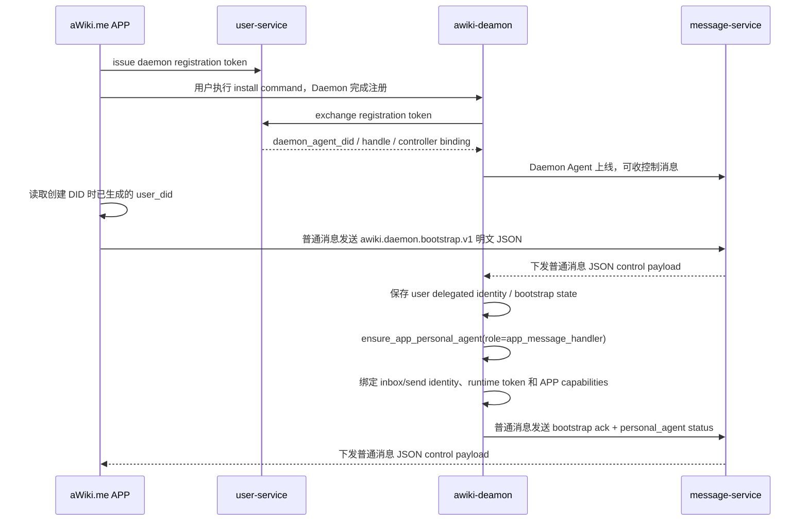
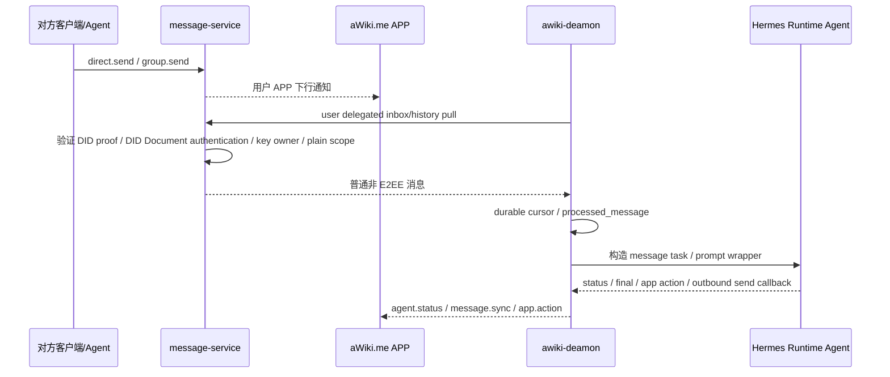
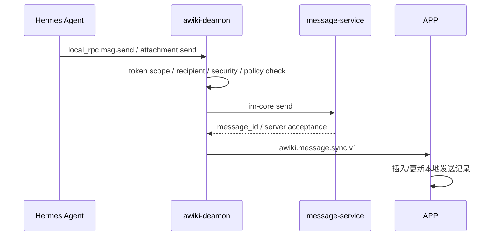
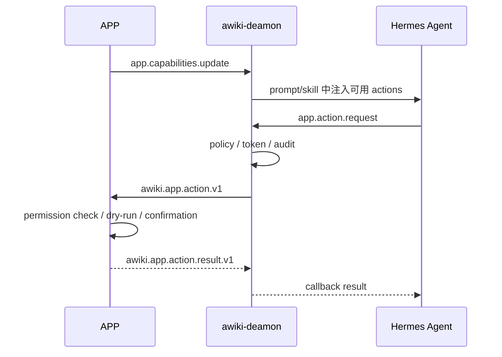
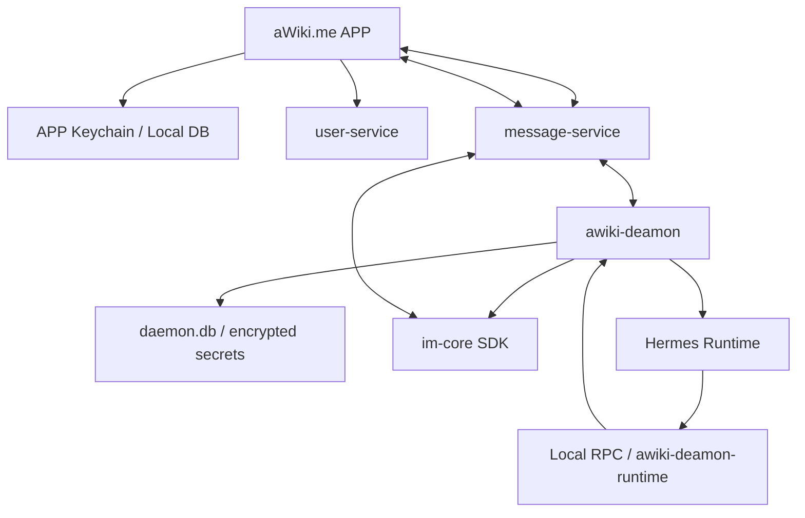

# Agent IM Hutong Core Design

> 历史文档说明：本文件记录的是 2026-06-14 前后的 Agent IM Hutong
> 方案和验证记录，其中关于明文 `awiki.daemon.bootstrap.v1`、默认
> `message.send.plain` scope、普通 payload 传递 private package 的描述已经不是当前
> Personal Agent MVP 契约。当前权威方案以
> `awiki-me-personal-agent/docs/personal-agent/personal-agent-design.md`
> 以及本仓库代码中的 secure bootstrap / no-send 实现为准。
>
> 2026-06-22 实现备注：daemon 的 Personal Agent delegated inbox 会忽略
> 已绑定 daemon/runtime 自己发给 App 的状态、sync、action 控制消息，不再把它们
> 当作用户消息二次同步；轮询页大小提升到 100，用于降低控制消息积压时真实
> 用户消息被挤出首屏的风险。macOS 本地 RPC socket 默认使用 `run/d.sock`，
> 避免深层 E2E state root 下触发 Unix domain socket 路径长度限制。

> 目标分支：`feature/release-0526/agent-im-hutong`  
> 相关仓库：`awiki-cli-rs2`、`awiki-me`、`user-service`、`message-service`、ANP SDK / `im-core` 兼容扩展；长期再涉及 `AgentNetworkProtocol` delegated proof  
> 输出目的：把“每个 IM 应用配置一个 Agent，由 Agent 处理消息并管理智能体；Agent 能反向操纵 APP”的产品需求、设计评审和技术落地方案收敛成一份可执行核心文档。

---

## 0.0 当前 E2E 验证状态（2026-06-14）

核心 P0 链路已经通过 `awiki-me` 的真实桌面 E2E 在 `awiki.info`
环境验证：runId `20260614T024413341Z`、messageId
`msg_agent_im_20260614T024413341Z`。

已验证内容：

1. App 通过真实 IM payload path 发送 `awiki.daemon.bootstrap.v1`；
2. Daemon 收到 bootstrap 并导入 `#daemon-key-1` delegated key；
3. Daemon 创建/复用 Hermes personal agent；
4. `awiki-cli-rs2` 的 `awiki-cli` 作为 peer 向 App 用户发送普通消息；
5. Daemon/Hermes 完成消息处理并生成 runtime status/final；
6. Daemon 将 `awiki.message.sync.v1` 回传给 App；
7. App 侧收到 hidden、non-renderable 的 `runtime_final` payload，不进入普通聊天气泡。

远端 evidence gate 需要同时观测到：
`daemon_bootstrap_received`、`delegated_key_imported`、
`hermes_agent_ready`、`cli_message_received`、`hermes_runtime_finished`、
`summary_return_sent`。本次 run 六项均通过。

仍未声明为本轮完成的 P1/P2 后续项：daemon restart/cursor 恢复、E2EE
opaque 边界专项、delegated DID revoke 行为、unknown payload negative
injection。它们可以继续以 skipped/follow-up 形式存在，但不能影响上述 P0
核心链路通过结论。

---

## 0. 本次仓库读取结论

### 0.1 已读到的关键实现

1. `awiki-cli-rs2` 的目标分支已经把 `awiki-deamon` 建成了一个相对完整的 Agent Runtime Host：它包含 `agent`、`commands`、`foreground`、`im_core_adapter`、`local_rpc`、`outbox`、`plugins/hermes`、`runtime`、`runtime_inbox`、`security`、`state` 等模块。
2. `awiki-deamon` 当前已经支持：
   - 创建 Daemon Agent DID / Runtime Agent DID；
   - 通过 user-service registration token 完成 agent 注册；
   - 将 agent identity 同步到 `im-core` identity registry；
   - 轮询 Agent inbox；
   - 处理 `awiki.agent.command.v1` JSON 控制消息；
   - 创建 Hermes Runtime Agent；
   - 启动 Hermes gateway；
   - 通过 Skill + `awiki-deamon-runtime` CLI wrapper + local RPC 让 Hermes 回调 daemon；
   - 通过 `RuntimeRpcToken` 对 runtime 的发送、附件、状态回传能力做 scoped authorization。
3. `awiki-me` 的目标分支已经有 Agent 管理 UI 和控制服务雏形：
   - `AgentControlService` 能创建 daemon 安装命令、刷新 daemon 状态、创建 Hermes runtime、查询 runtime inbox、重置 session、重试 run、升级 daemon；
   - `AgentInventoryPort` / `UserServiceAgentInventoryAdapter` 能从 user-service 领取 daemon/runtime registration token；
   - `MessagingService.sendPayload` 和 `AwikiImCoreMessageAdapter.sendPayload` 已经能通过消息层发送 JSON payload；
   - `ChatMessage` 已经会隐藏 Agent control payload，不把控制 JSON 当普通聊天内容渲染。
4. `message-service` 目标分支重点强化了 Direct E2EE、Group E2EE、附件和 opaque storage 边界：
   - Direct E2EE 服务侧只负责 prekey、公有 sidecar、opaque init/cipher body、metadata validation、idempotency、replay guard、routing/history；
   - Group E2EE 服务侧作为 Group Host / opaque router/store，不持有 MLS private state、KeyPackage private material，也不解密群消息 plaintext；
   - Direct / Group E2EE 的 public discovery 仍处于禁用或 hidden/test-only 阶段，需要额外安全评审后再公开。
5. `AgentNetworkProtocol` 仓库本身存在，但本次没有找到 `feature/release-0526/agent-im-hutong` 分支。因此本文对 ANP 的分支级实现不做断言，只基于：
   - `awiki-cli-rs2` 中实际使用的 `anp` crate / DID WBA / message service profile；
   - `AgentNetworkProtocol/main` 中公开描述的 DID、安全通信、元协议、应用协议三层定位；
   - `message-service` 中 ANP client/server API 文档。

### 0.2 当前方案的核心缺口

现有代码已经很好地完成了“Daemon Agent / Runtime Agent / Hermes Runtime Host”的第一层骨架，但距离你描述的“每个 IM 应用都配置一个 Agent，并让 Agent 成为消息处理核心”还有四个缺口：

1. **APP ↔ Daemon 的 bootstrap 缺口**  
   现有 `awiki-deamon` 主要管理 agent identity，还没有 APP 通过普通消息发送向 Daemon bootstrap 的明确协议，也没有把 `user_did#daemon-key-1` 子私钥导入 daemon 的明确协议。APP 和 Daemon 之间只有一个传输方式：普通消息发送。MVP 先通过普通消息发送明文 JSON system/control payload 传递子私钥，这是安全缺口；后续仍是普通消息发送，只是把消息内容从明文 JSON 文本改为加密文本或加密 JSON envelope。

2. **用户 delegated inbox 接收缺口**  
   当前 daemon 主要轮询 agent 自己的 inbox。MVP 需要新增 user delegated identity profile，让 daemon 使用 `user_did#daemon-key-1` 作为用户 DID 下的受控子 key，既能代发普通消息，也能向 message-service 证明自己有权拉取用户普通 inbox/history。

3. **E2EE 消息给 Agent 处理是后续设计，不进入本次 MVP**  
   message-service 明确不解密 direct/group E2EE；daemon/Hermes 也被当前 Hermes profile 明确限制为不持有 DID 私钥、不直连 message-service。因此本次 MVP 不同步 E2EE 消息给 Agent，不同步 metadata，不转发明文/摘要，只在本文记录未来设计边界。

4. **Agent 反向操纵 APP 的协议与权限缺口**  
   当前已有 Agent command/status JSON，但还没有 APP action capability registry、action request/result、权限确认、UI reducer、审计和回滚模型。

---

## 1. 产品需求与功能设计

## 1.1 核心目标

为每个 IM 应用实例配置一个专属 Agent。以 aWiki.me 为例，该 Agent 可以称为 Hermes Agent。它不是附属功能，而是用户消息处理链路的核心执行者：

```text
用户消息 / 群消息 / 系统消息
        │
        ├── APP 端：展示、交互、用户确认、E2EE 本地隐私守门
        │
        └── Hermes Agent：筛选、摘要、提醒、代发、反向操纵 APP
```

最终产品体验应是：

1. 用户登录 aWiki.me 后，APP 通过普通消息发送完成 Daemon bootstrap；MVP 先发送明文 JSON control payload 传递子私钥，后续同样通过普通消息发送加密文本或加密 JSON envelope。
2. Daemon 获得用户 DID 下的 User Delegated Subkey / 子私钥，不获得用户主私钥，并用该子私钥接入普通消息同步链路。
3. 新消息到达时，消息进入 APP 展示链路，也进入 Agent 处理链路。
4. Agent 在用户未及时查看消息时，可以先做重要性判断、提醒、摘要、草拟回复或代发低风险回复。
5. 用户打开 APP 时，Agent 已经把重要事项、待处理任务、摘要和建议动作准备好。
6. Agent 还可以反向操纵 APP：弹卡片、弹确认框、修改联系人备注、标记消息、创建提醒、插入摘要、打开某个会话、生成草稿等。

## 1.2 设计原则

### 1.2.1 Agent 为主，APP 为辅

APP 不再只是消息消费端；它也是 Agent 的可视化外设、用户确认面板和本地隐私守门人。Agent 负责梳理、判断、自动化；APP 负责展示、交互、授权、端侧解密和本地执行。

### 1.2.2 Daemon 是 Runtime Host，不是某个 Runtime 的附属进程

这与现有 `awiki-deamon` 架构方向一致。Daemon 应该是：

```text
ANP / Awiki 通信宿主
+ Daemon Agent 宿主
+ Runtime Agent DID 管理器
+ IM Core SDK 调用边界
+ Hermes / Generic CLI / 未来 runtime plugin host
+ Local RPC / CLI wrapper 能力入口
+ 本地审计、策略、会话和状态数据库
```

Hermes 只是其中一个 Runtime Backend。

### 1.2.3 JSON 消息通道是统一控制面

Agent 与 APP、APP 与 Daemon、Daemon 与 Runtime、Agent 与 Agent 之间的结构化控制都应统一收敛到消息层 JSON payload，而不是另起一套私有 API。当前已有 `awiki.agent.command.v1` / `awiki.agent.status.v1`，后续应补充：

- `awiki.daemon.bootstrap.v1`
- `awiki.agent.message.forward.v1`
- `awiki.message.sync.v1`
- `awiki.app.capabilities.v1`
- `awiki.app.action.v1`
- `awiki.app.action.result.v1`
- `awiki.agent.notification.v1`

### 1.2.4 E2EE 明文不得进入 message-service

Direct / Group E2EE 的服务边界已经很清楚：message-service 只存 opaque cipher/init/group_cipher_object 和必要 metadata，不持有 plaintext、session private state、KeyPackage private material 或解密能力。MVP 不支持把 E2EE 明文转发给 Agent，也不支持 Agent 直接解密 E2EE；后续如果要做，只能作为单独功能设计，例如 APP 显式转发摘要/明文，或 Agent 作为显式 E2EE participant。

### 1.2.5 最小权限与可撤销授权

Agent 可以很强，但必须可控。所有自动化能力都要可配置、可撤销、可审计。尤其是：

- 用户主私钥不交给 daemon；MVP 只传用户 DID 子私钥；
- Agent 代发消息需要有策略边界；
- Agent 操纵 APP 的动作要分级；
- 影响用户资产、身份、联系人、消息内容、外发消息的动作默认应走确认或预览。

注意：本节是长期产品原则说明，不是 MVP 完整实现清单。MVP 只实现最小 APP action allowlist、联系人写操作确认、runtime token scope 拒绝，以及 APP 本地生成 `user_did#daemon-key-1` key package、user-service 只登记 APP 提交的 public verification method 到 DID Document `verificationMethod` / `authentication` 等必要边界；完整自动化能力配置面板、策略撤销 UI、审计查询/报表和复杂策略引擎放到 MVP 后版本。

---

## 2. 对当前功能设计的 Review

## 2.1 设计亮点

### 2.1.1 “Agent 为主，APP 为辅”的方向是对的

传统 IM 的智能助手往往是 APP 内部功能，只有当用户打开 APP 时才运行。你的设计把 Agent 放到消息处理中心，让 APP 变成可被 Agent 调度的界面和授权端，这个方向有明显优势：

1. **异步能力更强**：用户不在线时，Agent 仍能筛选重要消息、准备摘要。
2. **跨端一致性更好**：Agent 的判断和动作可以作为系统状态同步到多端 APP。
3. **更符合智能体网络**：Agent 不是一个 UI 插件，而是拥有 DID、Handle、Runtime 和通信能力的网络节点。
4. **更容易扩展到多 runtime**：Hermes、OpenClaw、Codex、Claude Code、Gemini CLI 都可以挂在同一 daemon 架构下。

### 2.1.2 以 JSON 消息通道作为统一协议非常关键

当前 `awiki-me` 已经能发 JSON payload，`awiki-deamon` 已经能处理 `awiki.agent.command.v1`，这是正确基础。它让控制面天然具备：

- 可历史记录；
- 可跨设备同步；
- 可审计；
- 可复用现有 message-service、ANP、im-core 传输；
- 可被 Agent 直接理解和调用。

### 2.1.3 Hermes 不直接持有私钥、不直连 message-service 是正确安全边界

当前 Hermes profile / SOUL 对 Hermes 的边界限制很清楚：Hermes 通过 daemon wrapper/local RPC 获得能力，不直接连接 message-service，不持有 DID 私钥，不持久化 run capability token。这是正确的分层。后续 APP 反向操纵、E2EE 转发、代发消息都应继续保留这个边界。

Daemon 启动 Hermes TUI gateway 时还必须把工具面收窄到 AWiki 消息 Agent 所需的最小集合。默认注入 `HERMES_TUI_TOOLSETS=terminal,skills`，避免继承 Hermes 默认 `hermes-cli` 全量工具集后在冷启动阶段安装 browser / Chromium 依赖，导致首条消息返回 `agent initialization timed out`。如果运维确实需要扩展 Hermes 工具面，应通过 `AWIKI_HERMES_TUI_TOOLSETS` 显式覆盖并承担冷启动依赖成本。

## 2.2 需要调整的点

### 2.2.1 MVP 明确使用用户 DID 子私钥，不导入用户主私钥

MVP 的身份构建结论改为：

1. APP / IM 在创建用户 DID Document 时，由 APP 本地生成一把 User Delegated Subkey private/public key package，MVP 固定 DID URL 为 `user_did#daemon-key-1`，fragment 固定为 `#daemon-key-1`，不包含设备名、设备型号、时间戳或其他可识别设备信息；所有文档、实现和测试统一使用 `#daemon-key-1`。
2. APP 创建用户 DID Document 的代码路径必须先在 APP 本地生成该 key package，并从中导出 `user_did#daemon-key-1` public verification method；随后调用最新 user-service / DID API 时只提交这个 public verification method。user-service 的职责只是把 APP 提交的 public verification method 登记到初始 DID Document 的 `verificationMethod` 与 `authentication`，再返回包含 `#daemon-key-1` 的 DID Document。本文后续提到“初始 DID Document 带 `#daemon-key-1`”时，含义固定为：APP 本地生成 private/public key package，user-service 只登记 public verification method，不接触 private material。bootstrap 阶段也不再追加修改 DID Document。
3. APP 把这把已存在的子私钥传给 Daemon。MVP 先允许通过普通消息发送明文 JSON system/control payload bootstrap，这是已知安全缺口；后续仍通过普通消息发送，只把 private package 改为加密文本或加密 JSON envelope。
4. Daemon 用该子私钥代表用户处理普通非 E2EE 消息的发送、接收、同步和 Agent 管理。
5. Daemon 不持有用户主私钥，不持有 direct/group E2EE 私有会话状态。

命名和所有权约束必须保持一致：MVP 只允许 `#daemon-key-1`，不得出现任何包含设备、安装环境、时间戳或用户可识别信息的 daemon key fragment；不得再使用设备化、环境化、通配形式或设备占位符形式的 daemon key 示例。涉及 daemon key 所有权的表述必须统一写成“APP 本地生成 private/public key package，user-service 只登记 APP 提交的 public verification method”。message-service MVP 授权来源只固定为请求 proof 和当前解析到的 DID Document；只校验 verification method 是否存在并位于 DID Document `authentication`、key owner 一致性和普通非 E2EE scope。运行时 key 有效性只以当前 DID Document `authentication` 为准。

这个方案仍有风险：`user_did#daemon-key-1` 在 DID Document 的 `authentication` 中，远端验证方会把它当作用户 DID 的合法认证 key。第一个版本接受这个风险，但必须把 key 命名、审计、撤销、过期、message-service 本地普通消息 scope / rate limit / audit policy 和 E2EE 禁止边界写进 MVP gate。

### 2.2.2 E2EE 消息不进入 MVP Agent 处理链路

MVP 不支持 Agent 处理 E2EE 明文，也不支持 APP 把 E2EE 明文/摘要/metadata 转发给 Agent。Daemon 使用用户 DID 子私钥主动拉取 inbox/history 时只能拉取普通非 E2EE 消息；E2EE 消息仍在 APP 和 message-service 的 opaque 路由/存储边界内存在，不进入 Hermes prompt、daemon message_event 明文存储或普通 Agent task。

需要区分两条接收路径：

1. **WebSocket DID fanout**：message-service 应支持同一个 user DID 同时存在 APP 连接和 Daemon 连接，并把该 DID 的下行通知 fanout 给所有在线连接。普通非 E2EE 消息和 E2EE opaque 消息都可以按同一 DID 下发给这些连接。
2. **delegated inbox/history pull**：Daemon 使用 `user_did#daemon-key-1` 主动拉取时，MVP 只返回普通非 E2EE 消息，不返回 E2EE 明文、metadata projection 或 private state。

因此，“E2EE 消息不进入 Agent”不等于 message-service 必须在同 DID 多连接 fanout 时过滤掉 Daemon 连接。Daemon 如果通过 WebSocket 收到 direct/group E2EE opaque notification，因为没有 E2EE private state，不处理、不解密、不转发给 Hermes，可以直接丢弃或只记录不可处理状态。

未来可以单独评审以下模式：

| 模式 | 描述 | 推荐级别 | 适用场景 |
|---|---|---:|---|
| Metadata Only | APP 只把 sender、thread、时间、加密状态、重要性 hint 转给 Agent，不给明文 | 高 | 后续功能 |
| User-approved Forward | APP 解密后，用户按会话/联系人/单条消息授权转发明文或摘要给 Agent | 中 | 后续功能，需单独存储和 prompt 安全设计 |
| Agent Shadow Recipient | 用户把 Hermes/Daemon Agent 显式加入某个 E2EE direct/group session，让 Agent 成为合法参与方 | 中 | 团队协作、Agent 明确作为群成员 |
| User Private Key Delegation | APP 把用户主私钥或完整解密能力交给 Daemon | 低 | 不进入产品路径 |

MVP 主路径：普通消息由 daemon delegated identity 代收发；E2EE 消息不交给 Agent。

### 2.2.3 APP 反向操纵必须有 capability 与 permission 边界

“Agent 反向操纵 APP”是最有创新性的能力，但也是风险最大的能力。建议不要把它设计成“Agent 可以直接调用任何 APP API”，而是：

```text
APP 发布 capability registry
        │
Agent 只看到被授权 capability
        │
Agent 发 app.action.request
        │
APP 做权限、上下文、用户确认、dry-run
        │
APP 执行动作并回传 app.action.result
```

动作分级建议：

| 级别 | 例子 | 默认策略 |
|---|---|---|
| L0 只读 | 查询会话摘要、读取已授权消息投影、读取联系人公开字段 | 可自动 |
| L1 本地展示 | 弹卡片、插入摘要、打开会话、设置本地提醒 | 可自动，但可关闭 |
| L2 可撤销修改 | 修改联系人备注、标星消息、标记待办、创建草稿 | 需用户一次性授权或策略授权 |
| L3 外部影响 | 代发消息、修改公开资料、邀请/移除成员 | 默认确认 |
| L4 高风险 | 导出数据、批量删除、转发 E2EE 明文、修改密钥/身份 | 必须逐次确认 |

MVP 版本不做完整分级，但不能默认所有能力都可执行。第一版只开放最小 APP action allowlist：

1. `message.summarize_plain`：AI 总结普通非 E2EE 消息或会话摘要。
2. `message.create_draft`：生成回复草稿，不直接发送。
3. `contact.read`：读取联系人公开字段、当前昵称和备注。
4. `contact.update_display_name`：修改本地联系人显示名，需 APP 侧确认或策略授权。
5. `contact.update_note`：修改联系人备注，需 APP 侧确认或策略授权。

`message.send`、E2EE 转发、删除/导出/身份密钥变更不进入 MVP allowlist。

另外，App 对外提供的是 JSON（基于消息的 JSON），而对 Agent 提供的是 CLI，由 CLI 转换到 JSON

---

## 3. 补齐后的完整业务流程

## 3.1 安装与配对流程

### 3.1.1 当前已有流程

当前 `awiki-me` 已经能向 user-service 领取 daemon registration token，并生成安装命令：

```text
APP
 └─ issueDaemonToken(controllerDid, clientPlatform)
     └─ 生成 curl/install 或 awiki-deamon install 命令
         └─ Daemon 使用 token 注册 Daemon Agent DID
```

`awiki-deamon` 侧当前也已有：

```text
awiki-deamon install --token <token>
awiki-deamon setup-daemon-agent --handle <handle> --controller-did <did> --registration-token <token>
awiki-deamon foreground
```

### 3.1.2 需要新增的普通消息 bootstrap 流程

安装完成后，需要补一个 APP -> Daemon 的普通消息 bootstrap 流程。它的前置条件是：APP 在创建用户 DID Document 时已经本地生成 `user_did#daemon-key-1` 子私钥，并通过最新 user-service / DID API 只提交由该 key package 导出的 public verification method。user-service 只把该 public verification method 登记到 DID Document 的 `verificationMethod` 与 `authentication`，不接触 private material。因此 bootstrap 不再创建或追加 DID key，只负责把这把既有用户 DID 子私钥交给 Daemon。

这个流程同时承担“一次性创建 APP 消息处理智能体”的职责。APP 不应该反复发送 `create runtime` 这类命令式消息；APP 只发送一次 bootstrap/session payload，把用户 delegated subkey、APP 能力和期望的消息处理 Agent 形态声明给 Daemon。Daemon 收到后执行 `ensure_app_personal_agent`：如果这个用户和 APP 已经有 active message handler agent，就复用并刷新配置；如果不存在，Daemon 自己创建一个专门处理 APP 普通消息的 Runtime Agent。重复收到同一个 bootstrap 不得创建多个 Agent。

APP 和 Daemon 之间不新增本地 RPC、局域网、QR pairing channel 或第二条传输链路。唯一通道是 message-service 的普通消息发送。MVP 为了快速跑通，普通消息内容是明文 JSON system/control payload；后续安全升级仍然使用普通消息发送，只把内容改为加密文本或加密 JSON envelope。这里的“加密文本”只是普通消息 body 的编码方式变化，不表示 E2EE 用户消息进入 Agent 处理链路。



`awiki.daemon.bootstrap.v1` 不修改 DID Document，不创建新的 `#daemon-key-1`，只把 APP 在用户创建 DID Document 时已经本地生成、且对应 public verification method 已由 user-service 写入 DID Document `authentication` 的用户 DID 子私钥、最小授权策略和期望的消息处理 Agent 配置传给 Daemon。MVP 明文 JSON 示例：

```json
{
  "schema": "awiki.daemon.bootstrap.v1",
  "bootstrap_id": "boot_...",
  "idempotency_key": "personal-agent-bootstrap:did:wba:...user...:app_...",
  "app_instance_id": "app_...",
  "controller_did": "did:wba:...",
  "user_handle": "@alice",
  "user_subkey_package": {
    "schema": "awiki.daemon.user_subkey_package.v2",
    "user_did": "did:wba:...user...",
    "verification_method": "did:wba:...user...#daemon-key-1",
    "key_type": "Multikey/Ed25519",
    "key_algorithm": "Ed25519",
    "public_key_multibase": "z...",
    "private_key_encoding": "pem",
    "private_key_pem": "<omitted daemon-key-1 private key PEM>",
    "expires_at": "2026-09-09T00:00:00Z",
    "allowed_scopes": [
      "message.inbox.read.plain",
      "message.history.read.plain",
      "message.send.plain",
      "message.summarize_plain",
      "contact.read",
      "contact.update_display_name",
      "contact.update_note",
      "agent.manage",
      "app.action.request"
    ]
  },
  "desired_personal_agent": {
    "role": "app_message_handler",
    "runtime": "hermes",
    "display_name": "Hermes Personal Agent",
    "ensure_once_key": "app-personal-agent:did:wba:...user...:app_...",
    "runtime_registration_token": "tok_runtime_...",
    "auto_create": true,
    "plain_message_visible": true,
    "e2ee_visible": false,
    "allowed_actions": [
      "message.summarize_plain",
      "message.create_draft",
      "contact.read",
      "contact.update_display_name",
      "contact.update_note"
    ]
  },
  "capability_policy": {
    "schema": "awiki.app.capabilities.v1",
    "capabilities": [
      "message.summarize_plain",
      "message.create_draft",
      "contact.read",
      "contact.update_display_name",
      "contact.update_note"
    ],
    "require_confirmation_for_write_actions": true
  },
  "sync_policy": {
    "e2ee_default": "not_supported_in_mvp",
    "plain_default": "agent_visible",
    "require_confirmation_for_external_send": true
  }
}
```

要求：

1. 不允许传用户主私钥或 E2EE session state。
2. APP / im-core 新写的 `user_subkey_package` 必须使用 `awiki.daemon.user_subkey_package.v2`、`private_key_encoding: "pem"` 和 `private_key_pem`；Daemon 只为兼容旧数据读取 v1 的 `private_key_multibase`。
3. 后续不新增传输通道，只把普通消息 body 从明文 JSON 改为加密文本或加密 JSON envelope，并优先接入 OS keychain / secure enclave。
4. 永不写入日志、audit detail、Hermes profile、prompt、runtime temp。
5. 可以从 APP 远程撤销。
6. Runtime 不可读取，只能通过 daemon 授权调用有限能力。
7. `bootstrap_id` / `idempotency_key` 必须幂等；同一个用户、APP 和 `role=app_message_handler` 只能有一个 active 绑定。
8. Daemon 创建消息处理 Agent 是 bootstrap 的后置效果，不是 APP 反复下发的命令；失败后重试应恢复同一条 binding，不创建重复 Agent。
9. `runtime_registration_token` 只用于首次创建 Runtime Agent；已有 active binding 时不需要。该 token 与旧 `runtime.agent.create` 命令里的 registration token 语义一致，但随一次性 bootstrap desired state 传递，不持久化到 binding、audit detail、Hermes prompt 或 runtime temp。
10. 新建 binding 必须带显式 `capability_policy.schema = "awiki.app.capabilities.v1"`；空 `capabilities` 表示不允许执行 APP action。`desired_personal_agent.allowed_actions` 只作为旧 binding 兼容/展示提示，不能作为新授权主路径。

### 3.1.3 Daemon 一次性创建并绑定消息处理 Agent

Daemon 从普通消息 JSON dispatch 收到 `awiki.daemon.bootstrap.v1` 后，必须把它当成声明式 desired state，而不是命令队列。核心状态机建议如下：

```text
unpaired
  -> paired_key_received
  -> personal_agent_ensuring
  -> personal_agent_ready
  -> personal_agent_active
```

处理规则：

1. **接收用户 session / 子私钥**：Daemon 校验 `controller_did`、`pairing_id`、`idempotency_key` 和 `user_did#daemon-key-1`，保存 user delegated identity。这里的“私钥交给 Daemon”只指用户 DID 子私钥，不包括用户主私钥或 E2EE session state。
2. **创建或复用智能体**：Daemon 按 `ensure_once_key` 查询本地 `app_personal_agent_binding`。不存在时创建专用 Runtime Agent，例如 Hermes Personal Agent；已存在且 active 时复用，不再创建第二个。
3. **配置身份**：消息处理 Agent 自己可以有 Runtime Agent DID，但它不持有用户子私钥。Daemon 把 `user_delegated_identity` 绑定为该 Agent 的 inbox/send 授权上下文，Hermes 只能通过 local RPC / runtime token 请求 `msg.send`、摘要、联系人 action 等能力。
4. **接入消息链路**：Daemon 启动或恢复 user delegated inbox poller，把普通非 E2EE 消息投递给这个 message handler agent；Agent 的 status/final/action/result 通过 `message.sync`、`app.action`、`app.action.result` 与 APP 打通。
5. **一次性和可恢复**：APP 重启或 Daemon 重启时只恢复 bootstrap state 和 `app_personal_agent_binding`，不重新创建 Agent。只有用户撤销、换设备或显式重建时，才进入新的 bootstrap。

这个 Agent 的角色应固定为 `app_message_handler`。它和用户手动创建的通用 Runtime Agent 不同：它是 APP 消息处理链路的一部分，默认由 Daemon 在 bootstrap 后自动 ensure，并受用户 delegated inbox/send policy、APP capability allowlist 和 runtime token scope 共同约束。

## 3.2 消息接收与 Agent 处理流程

### 3.2.1 非 E2EE / default plain 消息

MVP 主流程：daemon 作为用户 DID 下的 user delegated identity，使用 `user_did#daemon-key-1` 向 message-service 证明权限，拉取普通非 E2EE inbox/history，并将普通消息交给 Hermes 处理。message-service MVP 授权只基于 DID proof、DID Document `authentication`、key owner 一致性和普通非 E2EE scope。



落地要求：

1. `user-service` 必须支持创建 DID Document 时接收 APP 提交的 `user_did#daemon-key-1` public verification method；该 public verification method 由 APP 本地生成的 key package 导出，user-service 只把 public verification method 登记到 DID Document `verificationMethod` 与 `authentication`。后续撤销、轮换也以 DID Document 中该 public verification method 的替换或移除为准。user-service 不接触 daemon subkey private material。
2. `message-service` 必须支持该子 key 对普通 inbox/history 的接收权限校验；MVP 直接校验 DID proof、DID Document `authentication`、key owner 一致性和普通非 E2EE scope。MVP 运行时授权输入只有请求 proof 和当前解析到的 DID Document；key 是否有效只以 DID Document `authentication` 为准。
3. daemon 必须新增 user delegated inbox poller，而不是只轮询 Agent DID inbox。
4. APP-side forward 不作为普通消息 MVP 主路径，只保留给未来 E2EE 或特殊场景。

### 3.2.2 E2EE 消息

MVP 不支持 E2EE 消息给 Agent 处理。Direct / Group E2EE 消息仍由 APP 本地解密和展示，Daemon/Hermes 不接收 E2EE 明文、摘要、metadata projection 或任务对象。服务器不得通过 daemon delegated inbox 返回 E2EE 明文、metadata projection 或 private state。

message-service 的 WebSocket 下行是 DID 级 fanout：同一个 user DID 可以同时有 APP 连接和 Daemon 连接，服务端应把该 DID 可见的普通消息和 E2EE opaque notification 都发送给这些连接。Daemon 收到 E2EE opaque notification 后不进入 Agent pipeline，不写入 Hermes prompt，不保存为可处理消息事件，可以直接丢弃或记录为 `ignored_e2ee_opaque` 这类不可处理状态。

本文只记录未来设计边界：

1. 未来如果支持 E2EE Agent processing，必须单独设计 `awiki.agent.message.forward.v1` 或等价协议。
2. 未来功能必须区分 metadata-only、summary、plaintext-once、Agent 作为显式 E2EE participant 等模式。
3. 未来功能必须单独定义存储保留、prompt 注入、审计脱敏、用户授权和撤销策略。
4. 上述能力不进入 MVP，不进入 Phase 0-3，也不作为本次实现验收项。

## 3.3 Agent 代发消息与双向同步流程

### 3.3.1 Agent 发送消息

当前 `awiki-deamon` 已有 `msg.send` / `attachment.send` local RPC 与 `awiki-deamon-runtime send` wrapper。后续需要在发送后产生统一 `message.sync`：



`message.sync` 示例：

```json
{
  "schema": "awiki.message.sync.v1",
  "event_id": "sync_...",
  "origin": "agent",
  "actor_agent_did": "did:wba:...hermes...",
  "controller_did": "did:wba:...user...",
  "thread": {
    "kind": "direct",
    "peer_did": "did:wba:...bob..."
  },
  "message": {
    "client_message_id": "agent_send_...",
    "server_message_id": "msg_...",
    "direction": "outgoing",
    "body_kind": "text",
    "preview": "已发送内容的安全预览",
    "security": "default_plain",
    "created_at": "2026-06-07T10:05:00Z"
  },
  "delivery": {
    "state": "accepted",
    "idempotency_key": "agent-send:..."
  }
}
```

### 3.3.2 APP 发送消息

APP 直接发送时，也应该把发送记录同步给 Agent，使 Agent 具备完整上下文：

```text
APP sendText / sendPayload / sendAttachment
    → im-core send
    → APP 本地消息落库
    → message.sync(origin=app)
    → Daemon/Hermes 更新上下文，不重复回复
```

关键字段：

- `origin`: `app` / `agent` / `daemon`
- `actor_did` / `actor_agent_did`
- `thread_id` / `conversation_id`
- `client_message_id`
- `server_message_id`
- `idempotency_key`
- `security`
- `body_hash` / `content_redaction`
- `sync_state`

### 3.3.3 冲突与幂等

必须统一做幂等与冲突处理：

1. APP 与 Agent 同时回复时，不要互相覆盖；都作为独立 outgoing message。
2. Agent 草拟回复和 Agent 直接代发要区分。
3. 所有发送都必须有 `client_message_id` 或 `idempotency_key`。
4. 对同一 `message_id` 的 summary、importance、annotation 可以采用 last-write-wins + version，也可以采用 operation log。
5. APP 本地记录、Daemon outbox、message-service server id 之间要建立 canonical mapping。

---

## 4. Agent 反向操纵 APP 设计

## 4.1 总体模型

Agent 不能直接调用 APP 内部任意函数。APP 需要显式暴露 capability registry，并通过 JSON 通道接收 action request：



## 4.2 Capability Registry

APP 登录或配对后发布：

```json
{
  "schema": "awiki.app.capabilities.v1",
  "app_instance_id": "app_ios_...",
	  "controller_did": "did:wba:...user...",
	  "capabilities": [
	    {
	      "name": "message.summarize_plain",
	      "version": "1.0",
	      "risk_level": "L1",
	      "requires_confirmation": false
	    },
    {
      "name": "message.create_draft",
      "version": "1.0",
      "risk_level": "L2",
      "requires_confirmation": false
	    },
	    {
	      "name": "contact.read",
	      "version": "1.0",
	      "risk_level": "L0",
	      "requires_confirmation": false
	    },
	    {
	      "name": "contact.update_display_name",
	      "version": "1.0",
	      "risk_level": "L2",
	      "requires_confirmation": "policy"
	    },
	    {
	      "name": "contact.update_note",
	      "version": "1.0",
	      "risk_level": "L2",
	      "requires_confirmation": "policy"
	    }
	  ]
	}
```

## 4.3 Action Request

```json
{
  "schema": "awiki.app.action.v1",
  "action_id": "act_...",
  "requested_by_agent_did": "did:wba:...hermes...",
  "controller_did": "did:wba:...user...",
  "conversation_id": "conv_...",
  "message_id": "msg_...",
  "action": "message.summarize_plain",
  "args": {
    "scope": "conversation",
    "max_messages": 20,
    "output": "bullet_summary"
  },
  "policy": {
    "risk_level": "L1",
    "requires_confirmation": false,
    "ttl_seconds": 3600
  },
  "idempotency_key": "app-action:conv_...:summary"
}
```

## 4.4 Action Result

```json
{
  "schema": "awiki.app.action.result.v1",
  "action_id": "act_...",
  "status": "applied",
  "app_instance_id": "app_ios_...",
  "result": {
    "summary": "Bob 提到今晚会议，需要确认参会时间。",
    "source_message_count": 12
  },
  "created_at": "2026-06-07T10:10:00Z"
}
```

## 4.5 第一版建议支持的 APP Actions

| Action | 说明 | 风险级别 | MVP |
|---|---|---:|---:|
| `message.summarize_plain` | 总结普通非 E2EE 消息或会话 | L1 | 是 |
| `message.create_draft` | 生成回复草稿 | L2 | 是 |
| `contact.read` | 读取联系人公开字段、当前昵称和备注 | L0 | 是 |
| `contact.update_display_name` | 修改本地联系人显示名 | L2 | 是，需确认或策略授权 |
| `contact.update_note` | 修改联系人备注 | L2 | 是，需确认或策略授权 |
| `ui.show_card` | 首页/会话页展示 Agent 卡片 | L1 | 否，后续功能 |
| `reminder.create` | 创建提醒/闹钟 | L1-L2 | 否，后续功能 |
| `message.send` | 代发消息 | L3 | 否，后续功能 |
| `e2ee.forward.request` | 请求用户授权转发某条 E2EE 消息给 Agent | L4 | 否，后续功能 |

---

## 5. 技术实现方案

## 5.1 总体架构



### 5.1.1 通道划分

| 通道 | 承载内容 | 当前状态 | 后续动作 |
|---|---|---|---|
| APP ↔ message-service ↔ Daemon 普通消息 | APP 和 Daemon 之间唯一通道；普通消息文本、明文 JSON control payload、后续加密文本/加密 JSON envelope | 已有普通消息能力，需补 schema dispatch 和过滤 | MVP 用明文 `awiki.daemon.bootstrap.v1`；后续同一普通消息发送中改为加密 body |
| Daemon ↔ message-service | Daemon/Runtime Agent inbox/outbox、user delegated inbox/send | 已有雏形 | 增加 user delegated identity、durable cursor、message sync |
| Daemon ↔ Hermes | Prompt、session、runtime callbacks | 已有 | 增加 app-action/message-summary/contact skills |
| Hermes ↔ Daemon local RPC | `msg.send`、`attachment.send`、status、final | 已有 | 增加 app action、message context read、draft 等 scoped RPC |

## 5.2 `awiki-me` 改造方案

### 5.2.1 新增模块

#### `lib/src/application/daemon/daemon_bootstrap_service.dart`

职责：

1. 生成一次性 `awiki.daemon.bootstrap.v1`。
2. 通过普通消息发送把 bootstrap payload 发给 `daemon_agent_did`。
3. 管理 bootstrap 状态、capability 和重试幂等。
4. 触发 secret/delegation import。
5. 处理 daemon capabilities、ack 和 heartbeat control payload。

接口建议：

```dart
abstract interface class DaemonBootstrapService {
  Future<DaemonBootstrapSession> startBootstrap({
    required String daemonAgentDid,
    required String controllerDid,
  });

  Future<void> sendBootstrap({
    required String bootstrapId,
    required DaemonBootstrapGrant grant,
  });

  Future<void> revokeBootstrap(String bootstrapId);

  Stream<DaemonBootstrapState> watchBootstrap(String bootstrapId);
}
```

#### `lib/src/domain/entities/daemon/daemon_bootstrap.dart`

数据模型：

- `DaemonBootstrapSession`
- `DaemonBootstrapGrant`
- `DaemonDelegationCredential`
- `DaemonSecretImportPolicy`
- `DaemonBootstrapState`

#### `lib/src/data/daemon/daemon_control_message_channel.dart`

职责：

1. 基于现有 `sendPayload` / 普通消息发送能力投递 APP -> Daemon system/control payload。
2. 过滤和解析 Daemon -> APP 的 system/control payload。
3. 支持明文 JSON 文本和后续加密文本 / 加密 JSON envelope 两种 body 形态。
4. 防重放 `bootstrap_id`、`idempotency_key` 和过期控制。

#### `lib/src/application/agent/app_action_service.dart`

职责：

1. 发布 APP capability registry。
2. 接收并验证 `awiki.app.action.v1`。
3. 依据风险等级调用 UI / message / contact / reminder service。
4. 返回 `awiki.app.action.result.v1`。
5. 审计 action。

#### `lib/src/application/agent/agent_message_forwarder.dart`

职责：

MVP 不实现该模块。这里只作为未来 E2EE Agent processing 设计占位：

1. 监听 APP 侧消息流。
2. 根据用户策略决定是否 forward 给 Agent。
3. 后续功能再支持 metadata_only、summary、plaintext_once 转发。
4. 对未来 forward payload 加 idempotency。

### 5.2.2 修改模块

#### `AgentControlService`

当前它已能通过 `_sendDaemonPayload` 给 daemon agent DID 发送 `awiki.agent.command.v1`。后续新增：

- `bootstrapDaemon(...)`
- `sendDaemonBootstrap(...)`
- `publishAppCapabilities(...)`
- `forwardMessageToAgent(...)`
- `sendAppActionResult(...)`

并调整：

1. `_sendDaemonPayload(... secure: false)` 是 MVP 的主路径：普通消息发送明文 JSON control payload。
2. 后续 `secure` 不代表新增 APP-Daemon 通道，而是普通消息 body 采用加密文本或加密 JSON envelope。
3. daemon install command 创建后，应进入 bootstrap 状态，而不只是展示安装命令。
4. 创建 Hermes Runtime 成功后，应自动建立 APP capability sync。

#### `AwikiImCoreMessageAdapter`

当前 `sendPayload` 已支持 `secure ? secureDirect : defaultPlain`。后续需要：

1. 暴露消息事件流：`watchMessages()` / `watchThread()` / `watchPayloads(schema)`。
2. 在 mapper 中保留 `security`、`payloadJson`、`message_id`、`client_message_id`、`conversation_id`。
3. 对 `awiki.message.sync.v1`、`awiki.app.action.v1`、`awiki.app.action.result.v1`、`awiki.agent.status.v1`、`awiki.agent.notification.v1` 做 schema dispatch。
4. MVP 不支持 `awiki.agent.message.forward.v1`；如收到该 schema，应隐藏并拒绝或标记为未来功能 pending，不得进入普通聊天可见内容。

#### `ChatMessage` / `ConversationService` / `ChatProvider`

当前 `ChatMessage.hasRenderableContent` 已隐藏 agent control payload。后续扩展：

1. 隐藏所有 system/control payload：`agent.command`、`agent.status`、`message.sync`、`app.action`、`app.action.result`、`agent.notification`、未来的 `agent.message.forward`。
2. 将 Agent 生成的摘要/重要性/提醒以 projection 形式呈现。
3. 支持 Agent 插入本地 annotation，不改变原消息原文。
4. 支持“Agent 草稿回复”与“用户发送”分离。

#### `presentation/agents/*`

当前已有 Agent 页和 Agent inbox panel。后续扩展：

1. 显示 Daemon pairing 状态。
2. 显示 Hermes 授权范围和 E2EE 策略。
3. 增加 App Action permission 面板。
4. 增加 Agent activity / audit timeline。
5. 增加“允许 Agent 自动处理此会话”设置入口。

## 5.3 `awiki-cli-rs2 / awiki-deamon` 改造方案

### 5.3.1 新增模块

#### `crates/awiki-deamon/src/app_bridge/`

建议目录：

```text
app_bridge/
  mod.rs
  pairing.rs
  channel.rs
  capabilities.rs
  action.rs
  message_forward.rs
  message_sync.rs
  user_delegated_identity.rs
  secret_store.rs
```

职责：

1. 管理 APP -> Daemon 普通消息 bootstrap。
2. 接收 MVP 明文 JSON bootstrap；后续接收同一普通消息发送中的 encrypted bootstrap body。
3. 保存 user delegated identity / secret policy。
4. 接收 APP capabilities。
5. 向 APP 发送 action request。
6. 接收 action result。
7. MVP 不接收 E2EE forwarded metadata/plaintext/summary；未来才接收 APP forwarded message。
8. 维护 message sync outbox。

#### `crates/awiki-deamon/src/app_bridge/pairing.rs`

能力：

- 生成 daemon pairing key。
- 校验 APP controller DID proof。
- 建立加密会话。
- 防重放和过期控制。
- pairing revoke。

#### `crates/awiki-deamon/src/app_bridge/secret_store.rs`

能力：

- 加密存储 delegation / wrapped key。
- 和 OS keychain 集成。
- Secret versioning。
- wipe / revoke。
- 禁止 secret 进入 Debug、日志、audit payload、Hermes prompt。

MVP 临时策略：user delegated subkey 可以沿用现有 daemon identity private key 存储方式，但必须明确标记为临时安全债。后续安全版本要迁移到 OS keychain / secure enclave / KMS，并把本地数据库中的私钥字段改为 `private_key_ref`。

#### `crates/awiki-deamon/src/app_bridge/user_delegated_identity.rs`

能力：

- 保存 `user_did`、`verification_method`、public key、private key material、allowed scopes、过期时间和状态。
- 提供 `client_for_user_delegated_identity` 所需的 identity profile 同步。
- 区分 daemon agent identity、runtime agent identity、user delegated identity。
- 发送时使用 `meta.sender_did = user_did` 与 `keyid = user_did#daemon-key-1`。
- 接收时使用该子 key 向 message-service 证明普通 inbox/history 读取权限；message-service MVP 直接校验 DID proof、DID Document `authentication`、key owner 一致性和普通非 E2EE scope。
- 所有使用记录 audit fields：`logical_user_did`、`verification_method`、`actor_daemon_agent_did`、`runtime_agent_did`。

#### `crates/awiki-deamon/src/app_bridge/personal_agent.rs`

能力：

- 接收 `desired_personal_agent`，执行 `ensure_app_personal_agent`。
- 使用 `ensure_once_key` / `idempotency_key` 做幂等保护，避免重复创建消息处理 Agent。
- 创建或复用 Hermes Runtime Agent，并把角色标记为 `app_message_handler`。
- 把 `runtime_agent_did`、`user_did`、`verification_method`、`app_instance_id`、`pairing_id` 和 APP capability policy 绑定到同一条记录。
- 配置 runtime token scope：只允许普通消息摘要、草稿、联系人读取/备注修改请求、受控发送回调和 app action request。
- Daemon 重启后从 binding 恢复，不通过 APP 再次下发 create command。

#### `crates/awiki-deamon/src/app_bridge/message_forward.rs`（后续功能）

MVP 不实现 E2EE metadata/plaintext/summary forward。本模块只作为后续功能预留，未来能力包括：

- 解析 `awiki.agent.message.forward.v1`。
- 验证 controller DID 和 grant。
- 使用专门的加密/短保留存储，不落普通 `message_event.body_json`。
- 构造 runtime task 给 Hermes。
- 支持 metadata_only / summary / plaintext_once。

#### `crates/awiki-deamon/src/app_bridge/action.rs`

能力：

- 接收 Hermes local RPC 或 runtime callback 产生的 app action request。
- 校验 runtime token scope。
- 查 APP capabilities 和 permission policy。
- 进入 `app_action_outbox`。
- 通过普通消息发送投递给 APP。
- 接收 result 并回传给 runtime。

### 5.3.2 修改模块

#### `state/mod.rs`

新增表：

```sql
app_pairing(
  pairing_id TEXT PRIMARY KEY,
  app_instance_id TEXT NOT NULL,
  controller_did TEXT NOT NULL,
  daemon_agent_did TEXT NOT NULL,
  app_public_key TEXT NOT NULL,
  daemon_key_id TEXT NOT NULL,
  status TEXT NOT NULL,
  created_at_ms INTEGER NOT NULL,
  updated_at_ms INTEGER NOT NULL,
  revoked_at_ms INTEGER
);

app_delegation(
  delegation_id TEXT PRIMARY KEY,
  pairing_id TEXT NOT NULL,
  controller_did TEXT NOT NULL,
  scopes_json TEXT NOT NULL,
  expires_at_ms INTEGER,
  status TEXT NOT NULL,
  created_at_ms INTEGER NOT NULL
);

user_delegated_identity(
  verification_method TEXT PRIMARY KEY,
  user_did TEXT NOT NULL,
  controller_did TEXT NOT NULL,
  daemon_agent_did TEXT NOT NULL,
  public_key_multibase TEXT NOT NULL,
  private_key_material TEXT NOT NULL,
  scopes_json TEXT NOT NULL,
  status TEXT NOT NULL,
  expires_at_ms INTEGER,
  revoked_at_ms INTEGER,
  created_at_ms INTEGER NOT NULL,
  updated_at_ms INTEGER NOT NULL
);

app_personal_agent_binding(
  binding_id TEXT PRIMARY KEY,
  ensure_once_key TEXT NOT NULL UNIQUE,
  pairing_id TEXT NOT NULL,
  app_instance_id TEXT NOT NULL,
  user_did TEXT NOT NULL,
  verification_method TEXT NOT NULL,
  daemon_agent_did TEXT NOT NULL,
  runtime_agent_did TEXT NOT NULL,
  runtime_kind TEXT NOT NULL,
  role TEXT NOT NULL,
  status TEXT NOT NULL,
  desired_config_json TEXT NOT NULL,
  capability_policy_json TEXT NOT NULL,
  created_at_ms INTEGER NOT NULL,
  updated_at_ms INTEGER NOT NULL,
  revoked_at_ms INTEGER
);

secret_blob(
  secret_id TEXT PRIMARY KEY,
  pairing_id TEXT NOT NULL,
  secret_kind TEXT NOT NULL,
  encrypted_blob BLOB NOT NULL,
  key_version INTEGER NOT NULL,
  expires_at_ms INTEGER,
  revoked_at_ms INTEGER,
  created_at_ms INTEGER NOT NULL
);

message_event(
  event_id TEXT PRIMARY KEY,
  origin TEXT NOT NULL,
  source_message_id TEXT,
  conversation_id TEXT,
  thread_kind TEXT NOT NULL,
  sender_did TEXT,
  target_agent_did TEXT,
  security TEXT NOT NULL,
  body_kind TEXT NOT NULL,
  body_json TEXT NOT NULL,
  grant_json TEXT,
  idempotency_key TEXT UNIQUE,
  created_at_ms INTEGER NOT NULL
);

message_sync_outbox(
  sync_id TEXT PRIMARY KEY,
  target_app_instance_id TEXT,
  payload_json TEXT NOT NULL,
  status TEXT NOT NULL,
  attempt_count INTEGER NOT NULL DEFAULT 0,
  next_attempt_at_ms INTEGER NOT NULL,
  created_at_ms INTEGER NOT NULL,
  updated_at_ms INTEGER NOT NULL
);

app_action_outbox(
  action_id TEXT PRIMARY KEY,
  requested_by_agent_did TEXT NOT NULL,
  controller_did TEXT NOT NULL,
  action TEXT NOT NULL,
  args_json TEXT NOT NULL,
  policy_json TEXT NOT NULL,
  status TEXT NOT NULL,
  idempotency_key TEXT UNIQUE,
  created_at_ms INTEGER NOT NULL,
  updated_at_ms INTEGER NOT NULL
);

app_action_result(
  action_id TEXT PRIMARY KEY,
  status TEXT NOT NULL,
  result_json TEXT,
  error_json TEXT,
  app_instance_id TEXT,
  created_at_ms INTEGER NOT NULL
);
```

同时把当前 `processed` HashSet 进程内去重升级为 durable inbox cursor：

```sql
inbox_cursor(
  owner_did TEXT NOT NULL,
  inbox_scope TEXT NOT NULL,
  cursor TEXT,
  last_message_id TEXT,
  updated_at_ms INTEGER NOT NULL,
  PRIMARY KEY(owner_did, inbox_scope)
);
```

另外新增 processed message 表，避免只靠 cursor 无法覆盖历史回看、重试和 schema fanout：

```sql
processed_message(
  owner_did TEXT NOT NULL,
  message_id TEXT NOT NULL,
  schema TEXT,
  processor TEXT NOT NULL,
  processed_at_ms INTEGER NOT NULL,
  PRIMARY KEY(owner_did, message_id, processor)
);
```

#### `foreground.rs`

当前 `run_foreground` 主循环已包含 inbox polling、retry queue、heartbeat、final outbox flush。建议拆分为更明确的 processors：

```text
ForegroundRuntime
  ├── AgentInboxPoller
  ├── AppForwardedMessageProcessor
  ├── RuntimeRetryProcessor
  ├── RuntimeFinalOutboxFlusher
  ├── AgentHeartbeatProcessor
  ├── MessageSyncOutboxFlusher
  └── AppActionOutboxFlusher
```

关键修改：

1. `process_inbox_once` 改成 durable cursor + processed_message，不再只用内存 HashSet。
2. 新增 `process_user_delegated_inbox_once`，按 `user_delegated_identity` 拉取普通非 E2EE inbox/history。
3. inbox query 支持 direct/group、default_plain、agent command/status/sync/app action schema dispatch；E2EE 明文不进入 MVP。
4. 新增 schema router，至少识别 `awiki.agent.command.v1`、`awiki.agent.status.v1`、`awiki.message.sync.v1`、`awiki.app.action.v1`、`awiki.app.action.result.v1`、`awiki.agent.notification.v1`。
5. 新增 `flush_app_action_outbox`，向 APP 投递 action request。
6. 新增 `flush_message_sync_outbox`，同步 Agent 发送记录和状态。

#### `commands/mod.rs`

现有 command schema 很好，保留 `awiki.agent.command.v1`。新增 handler：

- `app.capabilities.update`
- `app.action.result`
- `message.forward` 作为未来功能保留，MVP 收到后拒绝或 pending
- `message.sync.ack`
- `daemon.bootstrap`
- `daemon.pairing.revoke`

建议把 command 继续分层：

```text
agent management commands: runtime.agent.create / agent.status.query / daemon.upgrade
runtime commands: runtime.task.submit
app bridge commands: app.capabilities.update / app.action.result
message bridge commands: message.forward / message.sync.ack
```

#### `local_rpc/mod.rs` 与 `security/runtime_token.rs`

当前 RPC methods：`rpc.ping`、`task.status`、`task.finish`、`msg.send`、`attachment.send`、`artifact.created`。

新增：

- `app.action.request`
- `message.context.query`
- `message.summarize_plain`
- `message.create_draft`
- `contact.read`
- `contact.update_display_name`
- `contact.update_note`

`RuntimeTokenScope` 新增最小 APP action scope：

```rust
pub struct RuntimeTokenScope {
    ...
    pub allowed_app_actions: Option<Vec<String>>,
    pub allowed_message_context: Option<Vec<String>>,
    pub allowed_data_classes: Option<Vec<String>>,
}
```

并继续保持：

1. token per run 生成；
2. 不持久化给 Hermes；
3. Debug/Display redacted；
4. recipient/security/action scope 全部校验；
5. MVP 默认 allowlist 只包括 `message.summarize_plain`、`message.create_draft`、`contact.read`、`contact.update_display_name`、`contact.update_note`。
6. 高风险 action 必须由 APP 确认后才算成功。

#### `outbox/mod.rs`

当前 `RuntimeMessageSecurity` 只支持 `DefaultPlain`，并显式拒绝 `direct_e2ee` / `group_e2ee`。后续分两步：

1. MVP：Agent 代发只允许普通非 E2EE `default_plain`，使用 user delegated sender；APP 仍可自己发送 secureDirect，但这不作为 Agent 代发能力。
2. 二期：支持 Agent 作为合法 E2EE participant 时的 secure send；或由 APP 执行 `message.send` action 完成 E2EE 发送。

新增 outbox：

- `AppActionOutbox`
- `MessageSyncOutbox`
- `ForwardedMessageRuntimeOutbox`

#### `plugins/hermes`

当前 Hermes profile 只安装 outbound messaging skill。需要新增：

```text
skills/
  awiki-outbound-messaging/
  awiki-app-control/
  awiki-message-triage/
  awiki-e2ee-forwarded-context/
  awiki-reminder/
```

`HermesPromptWrapper.allowed_actions` 从当前：

```text
report-status
outbound-send
```

扩展为按 token scope 注入：

```text
report-status
outbound-send
app-action-request
message-summarize-plain
message-create-draft
contact-lookup
contact-read
contact-update-display-name
contact-update-note
```

注意：prompt 中只能注入 capability 名和边界，不要注入 secret、token、socket path、私钥、JWT、本地路径。

## 5.4 `message-service` 改造方案

### 5.4.1 保持 E2EE 服务边界

Direct / Group E2EE 服务侧继续只处理 opaque cipher 和 metadata，不解密，不存 plaintext。Agent 相关能力不得破坏这一点。

### 5.4.2 增加 user delegated inbox 能力

MVP 需要 message-service 支持 daemon 使用 `user_did#daemon-key-1` 拉取和发送普通非 E2EE 消息。MVP 授权来源固定为请求内 DID proof 和解析出的 DID Document；校验点固定为 verification method 是否存在并位于 DID Document `authentication`、key owner 一致性和普通非 E2EE scope。key 是否有效只以 DID Document `authentication` 为准，撤销对 message-service 的生效通过 DID Document `authentication` 更新和 DID Document 刷新体现。MVP 运行时授权边界到此为止；后续如需更细的本域用户级策略，可以单独设计，例如：

```text
agent_message_visibility_policy
  - disabled
  - default_plain_visible
  - app_forward_only_future
  - agent_shadow_recipient_future
```

message-service 可以在不破坏 E2EE 的前提下提供：

1. MVP 使用 `user_did#daemon-key-1` DID proof 拉取用户 default_plain inbox/history；scoped inbox token 是 MVP 后优化；
2. 使用同一个子 key 发送普通 `direct.send` / 后续普通 group send；
3. 同一个 user DID 的多 WebSocket 连接 fanout；APP 连接和 Daemon 连接可以同时收到普通消息与 E2EE opaque notification；
4. `message.sync` 下行；
5. APP action payload 的普通 JSON 投递；
6. idempotency / client_message_id 的全局唯一映射。
7. MVP delegated inbox 不向 daemon 返回 E2EE 消息、metadata projection、明文或 private state。
8. Daemon 对 WebSocket 收到的 E2EE opaque notification 不处理、不解密、不进入 Agent pipeline，可以直接丢弃。

### 5.4.3 JSON payload schema dispatch

message-service 不需要理解所有 Agent action 语义，但需要保证：

1. JSON payload 可被发送、存储、下行。
2. payload content type / schema 可被客户端过滤。
3. 控制 payload 不进入普通消息展示。
4. `client` 本地扩展字段不进入 origin proof，不跨域转发。

对当前 daemon/app 已知缺口，MVP 必须先在端侧补 schema router 和隐藏规则，否则新 schema 会被 daemon 忽略或在 APP 普通聊天中显示。

### 5.4.4 多端同步

后续需要支持：

- APP 多设备看到同一 Agent action / result；
- Agent 代发消息在所有 APP 端出现；
- 用户在 APP 上读/回复后，Agent 上下文同步；
- idempotency 避免重复 action 和重复发送。

## 5.5 `AgentNetworkProtocol` 改造建议

由于目标分支未找到，本文只给协议层建议。

MVP 不修改 ANP，不支持 Agent DID delegation / ANP delegated origin proof。MVP 只依赖现有 origin proof：`meta.sender_did = user_did`，`signatureInput.keyid = user_did#daemon-key-1`。

### 5.5.1 ANP SDK / im-core 兼容扩展

MVP 不改变 ANP wire schema、`origin_proof` 结构或 Direct Base 语义，但 ANP SDK / `im-core` 调用层需要支持 user delegated identity 场景。这个扩展必须通过可选参数完成：老调用不传参数时继续使用当前 identity 的默认 authentication key，`meta.sender_did`、`signatureInput.keyid`、`contentDigest` 和 inbox/history auth 行为都保持不变。

命名约定：新增 API/SDK/Token/DB 草案不再使用 `mailbox_*`。`mailbox` 容易被理解成 email/mail 系统；本文统一使用 `inbox` 表达“用户消息收件箱和历史记录访问”的授权上下文，例如 `InboxHistoryOptions`、`inbox_owner_did`、`inbox_auth_verification_method`、`ScopedInboxToken`。

建议 API 形态如下，具体命名可以按现有 SDK 风格调整：

```text
DID WBA creation:
  Python create_did_wba_document(
    additional_verification_methods: Optional[List[Dict]] = None,
    additional_authentication: Optional[List[str | Dict]] = None,
  )
  Rust create_did_wba_document_with_creation_options(
    DidDocumentCreationOptions {
      document_options: DidDocumentOptions,
      additional_verification_methods: Vec<Value>,
      additional_authentication: Vec<Value>,
    },
  )

SendOptions / DirectSendOptions:
  logical_sender_did: Option<String>
  signing_verification_method: Option<String>
  signing_key_ref: Option<String>
  actor_agent_did: Option<String>

InboxHistoryOptions:
  inbox_owner_did: Option<String>
  inbox_auth_verification_method: Option<String>
  inbox_auth_key_ref: Option<String>
  inbox_auth: Option<DidProof | ScopedInboxToken>
```

约束：

1. DID WBA creation 的 additional verification/authentication 是 generic DID Document 扩展；SDK 必须在 proof 生成前插入，支持 `#daemon-key-1` fragment 自动按最终 DID 归一化，proof 覆盖最终 DID Document。
2. Python 新参数必须 optional；旧调用不传参数时行为不变。Rust 不直接给既有 public `DidDocumentOptions` 增必填字段，使用新的 creation wrapper / builder；旧 `create_did_wba_document(hostname, DidDocumentOptions)` 调用保持不变。
3. `im-core` 新注册/恢复主路径必须先在 APP 本地生成 daemon public/private key material，再把 public verification method 交给 ANP SDK 生成已签 DID Document；`user-service` REST DID create 只把 APP public registration 转换为 SDK additional method，不再 proof 后置 JSON patch。已有身份 migration 才允许本地 patch 后用用户主 key 重签，并通过 signed `update_document` 更新服务端。
4. 所有 send/inbox 字段都是 optional；为空时走现有用户/agent identity 默认行为，不影响旧 CLI、APP、SDK 调用。
5. `logical_sender_did` 默认为当前 identity DID；daemon 代用户发送时传 `user_did`。
6. `signing_verification_method` 可指定 `user_did#daemon-key-1`；本地必须能通过 `signing_key_ref` 或现有 identity store 找到对应子私钥。
7. `actor_agent_did` 只用于本地 policy、日志和 result/audit metadata；MVP 不把它序列化为 ANP delegated proof。
8. inbox/history 调用可用 `inbox_owner_did + inbox_auth_verification_method` 生成 DID proof，或后续用 `inbox_auth = ScopedInboxToken`；MVP 先支持子 key DID proof。
9. SDK 本地校验应尽早拒绝：verification method 不属于 `logical_sender_did` / `inbox_owner_did`、本地无 key、scope 不允许、或请求 E2EE inbox projection。
10. 服务端 MVP 以 DID proof、DID Document `authentication`、key owner 一致性和 message-service 普通非 E2EE scope / rate limit / audit policy 为最终判定；message-service MVP 不查询 user-service registry。

### 5.5.2 新增/扩展 Profile

以下 Profile 作为后续建议，不阻塞 MVP：

- `anp.agent.message-sync.v1`
- `anp.agent.app-control.v1`
- `anp.agent.local-pairing.v1`
- `anp.agent.forwarded-context.v1`

### 5.5.3 DID Service Profile 扩展

当前 daemon agent identity 生成时主要声明：

- `anp.core.binding.v1`
- `anp.direct.base.v1`
- `anp.attachment.v1`
- `transport-protected`

后续 Daemon Agent / Runtime Agent DID document service 可增加：

```json
{
  "id": "#message",
  "type": "ANPMessageService",
  "serviceEndpoint": "https://.../anp-im/rpc",
  "profiles": [
    "anp.core.binding.v1",
    "anp.direct.base.v1",
    "anp.attachment.v1",
    "anp.agent.message-sync.v1",
    "anp.agent.app-control.v1",
    "anp.agent.forwarded-context.v1"
  ],
  "securityProfiles": [
    "transport-protected"
  ]
}
```

E2EE profiles 是否公开，仍应跟随 message-service 的 discovery security review。

## 5.6 `user-service` 改造方案

MVP 需要把 user-service 纳入范围，但职责仅限用户 DID Document 管理：APP 本地生成 `user_did#daemon-key-1` private/public key package，并只把导出的 public verification method 提交给 user-service；user-service 只登记这个 public verification method，把它写入 DID Document 的 `verificationMethod` 与 `authentication`，不会创建任何 daemon subkey private/public key package，也不接触 daemon subkey private material。message-service 的 MVP 授权来源只有 DID proof 与当前 DID Document `authentication`：

1. DID Document key management API：
   - 创建用户 DID Document 时接收 APP 提交的 `user_did#daemon-key-1` public verification method；该 public verification method 由 APP 本地生成的 key package 导出，user-service 只负责把 public verification method 写入 DID Document 的 `verificationMethod` 与 `authentication`；
   - user-service 不生成 daemon subkey，不接触 daemon subkey private material，不保存 daemon subkey private package；
   - 从 `authentication` 移除或撤销 `user_did#daemon-key-1`；
   - APP / 管理侧如需展示当前 daemon public verification method，应读取当前 DID Document 中的 `verificationMethod` / `authentication`；该信息不构成 message-service 运行时授权的独立接口。
2. DID Document 写入审计记录（MVP 后可选，非运行时授权输入）：
   - 可记录 APP 提交的 public verification method 写入、撤销、轮换和 DID Document 管理侧审计；
   - 可标记该 key 是 daemon delegated subkey，不是用户主 key；
   - 该记录只服务 user-service 自身排障和追溯，不参与 message-service MVP 运行时授权；MVP 授权来源固定为 DID proof、DID Document `authentication`、key owner 一致性和普通非 E2EE scope。
3. inbox authorization：
   - message-service MVP 只基于请求内 DID proof、当前 DID Document `authentication`、key owner 一致性和普通非 E2EE scope 做运行时授权；
   - 撤销只通过 DID Document `authentication` 更新体现；
   - scoped inbox token 可作为中期优化，但不进入 MVP 主路径。
4. audit：
   - user-service 可记录 public verification method 写入、撤销、轮换和 DID Document 管理侧审计；
   - 使用审计由 message-service / daemon 基于实际请求记录，不作为运行时授权状态；
   - 记录使用者是 daemon key，而不是用户主 key。

---

## 6. 身份构建方案评估

## 6.1 已拒绝方案 A：APP 直接把用户主私钥给 Daemon

### 优点

- 实现最快。
- Daemon 可以像第二客户端一样使用 im-core。
- 消息同步路径简单。

### 缺点

- 安全风险最大。
- 撤销困难。
- 多设备 E2EE/session 状态复杂。
- Daemon compromise 等价于用户身份 compromise。
- 与当前 Hermes “不持有 DID 私钥”的边界存在张力。

### 结论

不作为 MVP，也不作为正式产品路径；后续实现和评审都不应沿用这条路径。

## 6.2 方案 B：APP 给 Daemon 用户 DID 子私钥，不给主私钥

### 优点

- 比主私钥导入风险低。
- 容易撤销。
- 与现有 ANP origin proof 兼容，不需要改 ANP。
- 可以让 daemon 作为用户 delegated device 代收发普通消息。

### 缺点

- 子 key 在 DID `authentication` 中，仍可能被外部验证方视为完整用户 authentication key。
- 需要 user-service 在 DID Document 管理 API 中支持 APP 提交的 public verification method 写入和撤销。message-service 只增加基于 DID proof、DID Document `authentication`、key owner 一致性和普通非 E2EE scope 的普通消息接收权限校验。
- Daemon compromise 后，攻击者可在撤销前用该 key 发送普通消息。

### 结论

MVP 主路径。

## 6.3 方案 C：APP 端转发消息上下文给 Agent

### 优点

- 最适合 E2EE。
- 不破坏 message-service opaque boundary。
- 用户可按会话/消息授权。
- 作为后续功能时，主要在 awiki-me 和 awiki-deamon 增加 JSON 协议。

### 缺点

- APP 不在线时，E2EE 明文不能被 Agent 处理。
- 对“用户未读但 Agent 先处理”在 E2EE 场景下有限制。

### 结论

不进入 MVP。后续作为 E2EE 或特殊场景功能单独设计。

## 6.4 方案 D：Agent 作为 E2EE 合法参与者

### 优点

- Agent 可以在用户不在线时处理 E2EE 内容。
- 权限语义清晰：Agent 是会话/群的显式成员。

### 缺点

- 产品上必须明确告知对方“Agent 参与了会话”。
- 群 E2EE membership、KeyPackage、device lifecycle 更复杂。
- 需要 message-service E2EE public discovery 和客户端 SDK 成熟。

### 结论

适合作为二期/高级模式，不适合 MVP 默认。

---

## 7. MVP 分期计划

## Phase 0：稳定当前 Agent Runtime Host

目标：把当前分支已有 Daemon Agent / Hermes Runtime Agent / command/status 跑通。

交付：

1. Daemon 安装、注册、foreground/service 稳定。
2. APP Agent 页能显示 daemon/runtime 状态。
3. APP 能创建 Hermes Runtime。
4. Hermes 能收到用户发给 Runtime Agent DID 的文本任务。
5. Hermes 能通过 wrapper 发送 default_plain 消息。
6. runtime final/status 能回到 APP。

## Phase 1：APP -> Daemon 普通消息 Bootstrap 与授权

交付：

1. `awiki.daemon.bootstrap.v1`。
2. APP bootstrap 状态入口。
3. MVP 通过普通消息发送明文 JSON，携带用户 DID 子私钥和 `desired_personal_agent`；记录后续把普通消息 body 改为加密文本 / 加密 JSON envelope。
4. Daemon bootstrap state / user delegated identity store。
5. Daemon 幂等执行 `ensure_app_personal_agent`，创建或复用 `role=app_message_handler` 的 Hermes Personal Agent。
6. `app_personal_agent_binding` 持久化用户、APP、Runtime Agent、delegated subkey 和 capability policy 的绑定。
7. user-service / DID API 在创建用户 DID Document 时只接收 APP 提交的 `user_did#daemon-key-1` public verification method，并把它登记到 DID Document 的 `verificationMethod` 与 `authentication`；该 public verification method 由 APP 本地 key package 导出，并支持后续撤销。user-service 不接触 daemon subkey private material。
8. message-service 支持该子 key 的普通消息发送和接收权限校验；MVP 直接校验 DID proof、DID Document `authentication`、key owner 一致性和普通非 E2EE scope。
9. APP capabilities 发布。
10. Daemon 不持有用户主私钥。

## Phase 2：普通消息 delegated inbox 与同步

交付：

1. user delegated inbox/history poller。
2. durable `inbox_cursor` + `processed_message`。
3. `awiki.message.sync.v1`。
4. schema router：command/status/message.sync/app.action/app.action.result/notification。
5. Daemon durable message_event / sync_outbox。
6. Agent 发送记录同步到 APP。
7. APP 发送记录同步到 Agent。
8. E2EE forward 不进入 MVP。

## Phase 3：Agent 反向操纵 APP MVP

交付：

1. `awiki.app.capabilities.v1`。
2. `awiki.app.action.v1`。
3. `awiki.app.action.result.v1`。
4. 支持最小能力：`message.summarize_plain`、`message.create_draft`、`contact.read`、`contact.update_display_name`、`contact.update_note`。
5. 联系人写操作需 APP 确认或策略授权。
6. action result 回传；完整权限面板、自动化能力配置/撤销 UI、审计查询/报表不进入 MVP，只保留必要状态和拒绝结果用于排障与幂等。

---

## 8. MVP 后版本路线

以下内容不属于 MVP 方案，只作为 MVP 之后版本的演进方向。

## Phase 4：高级自动化与 E2EE Agent Participant

交付：

1. APP -> Daemon bootstrap payload 加密：仍走普通消息发送，只把 body 从明文 JSON 改为加密文本或加密 JSON envelope。
2. OS keychain / secure enclave / KMS 级别的 delegated subkey 存储。
3. E2EE metadata / user-approved forward。
4. Agent 作为 E2EE 合法参与者的 opt-in 模式。
5. Group E2EE Agent membership。
6. Agent DID delegation / ANP delegated origin proof。
7. 更复杂的 app action，如低风险自动回复。
8. 策略引擎：联系人/群/关键词/时间/风险级别。
9. 多设备 APP action 状态同步。

---

## 9. 风险与控制措施

| 风险 | 严重度 | 控制措施 |
|---|---:|---|
| Daemon 持有用户主私钥 | 高 | MVP 禁止；只允许用户 DID 子私钥 |
| Daemon 子私钥泄露 | 高 | 第一个版本接受该风险；使用命名、TTL、撤销、审计、message-service 本地普通消息 scope / rate limit / audit policy 控制 |
| Agent 自动代发不当内容 | 高 | 默认草稿；低风险策略；外发确认；recipient/security scope |
| E2EE 明文泄露给 Agent | 高 | MVP 不支持 E2EE forward；未来单独设计 |
| Agent 反向操纵 APP 过度 | 高 | capability registry；risk level；confirmation；dry-run；audit |
| APP/Agent 同步冲突 | 中 | idempotency_key；client_message_id；origin；durable cursor；operation log |
| Daemon 重启丢消息 | 中 | durable inbox cursor；message_event 表；retry queue |
| Hermes prompt 泄漏本地 secret | 高 | prompt wrapper 禁止 secret/path/token；Debug redaction；skill rules |
| message-service E2EE boundary 被破坏 | 高 | 服务只存 opaque；MVP delegated inbox 不返回 E2EE 明文/private state |
| 多设备状态不一致 | 中 | message.sync canonical mapping；server seq；APP projection reconciliation |

---

## 10. 验收标准

### 10.1 安全验收

1. Daemon 不持有用户主 DID 私钥，只持有 `user_did#daemon-key-1` 子私钥。
2. Hermes runtime 不能读取 DID 私钥、JWT、pairing secret、runtime RPC token 原文。
3. Runtime token 过期后无法发送消息或请求 app action。
4. 未授权 recipient / security / app action 被拒绝。
5. MVP 不支持 E2EE plaintext/summary forward，E2EE 明文不会进入 daemon/Hermes；Daemon 通过同 DID WebSocket fanout 收到的 E2EE opaque notification 必须被丢弃或标记为不可处理。
6. 所有 secret 不进入日志、audit payload、prompt、final text、status text。

### 10.2 功能验收

1. APP 能安装 Daemon，并通过普通消息发送与 Daemon 建立 bootstrap 状态。
2. APP 能通过普通消息发送一次性 bootstrap/session payload，包含既有 `user_did#daemon-key-1` 子私钥、APP capabilities 和 `desired_personal_agent`。
3. Daemon 能根据 bootstrap 自动 `ensure_app_personal_agent`，创建或复用 `role=app_message_handler` 的 Hermes Personal Agent；APP 不需要反复发送 create runtime command。
4. Daemon 能写入并恢复 `app_personal_agent_binding`，绑定 user DID、verification method、app_instance、bootstrap_id、runtime_agent_did 和 capability policy。
5. 重复发送同一个 `bootstrap_id` / `idempotency_key` 不会创建第二个 active message handler agent。
6. user-service / DID API 能在创建用户 DID Document 时只接收 APP 提交的 `user_did#daemon-key-1` public verification method，并把它登记到 DID Document 的 `verificationMethod` 与 `authentication`；该 public verification method 由 APP 本地 key package 导出，并支持后续撤销；user-service 不接触 daemon subkey private material。
7. message-service 能接受该子 key 的普通消息发送 proof，并支持普通 inbox/history 接收权限校验；MVP 授权来源是 DID proof、DID Document `authentication`、key owner 一致性和普通非 E2EE scope。
8. message-service 能支持同一个 user DID 的 APP 连接和 Daemon 连接同时在线，并把普通消息与 E2EE opaque notification fanout 给这些连接。
9. Daemon 能使用 user delegated identity 拉取普通非 E2EE inbox/history，并投递给绑定的 Hermes Personal Agent。
10. Daemon 能收到 Agent command JSON 并处理。
11. Hermes Personal Agent 能处理普通文本消息并回传 final。
12. Hermes Personal Agent 能通过 local RPC 使用 user delegated sender 发送 default_plain 消息。
13. Agent 发送记录能同步回 APP。
14. APP 发送记录能同步给 Agent。
15. Agent 能发起 `message.summarize_plain` / `message.create_draft` / `contact.read` / `contact.update_display_name` / `contact.update_note` action。
16. APP 能执行 action 并回传 result。
17. ANP SDK / `im-core` 老调用未传 delegated optional 参数时，签名、发送和 inbox/history 行为保持现有兼容。
18. ANP SDK / `im-core` 传入 delegated signing/inbox optional 参数时，能使用 `user_did#daemon-key-1` 收发普通非 E2EE 消息。

### 10.3 稳定性验收

1. Daemon 重启后不会重复处理已处理消息。
2. APP 重启后能恢复 bootstrap state。
3. Daemon 重启后能恢复 `app_personal_agent_binding`，不重新创建 message handler agent。
4. message.sync 重试不会造成重复消息。
5. app.action 重试不会重复弹窗或重复创建提醒。
6. Hermes session 丢失后能 reset/recreate，但 binding 不变。

---

## 11. 需要进一步确认的问题

1. **MVP 明文传递用户 DID 子私钥的安全债何时关闭？**  
   当前决策：第一个版本先通过普通消息发送明文 JSON；后续仍通过普通消息发送，但把 bootstrap private package 改为加密文本或加密 JSON envelope。

2. **用户 delegated inbox/history 是直接 DID proof 拉取，还是先换 scoped inbox token？**  
   当前决策：子私钥既用于发送也用于接收，服务器必须支持；scoped inbox token 可作为中期优化。

3. **E2EE 消息是否允许 Agent 作为合法参与者？**  
   当前决策：MVP 不支持；后续 opt-in 功能需单独安全评审。

4. **Agent 代发消息的默认策略是什么？**  
   建议：默认草稿；低风险消息可策略授权自动发送；外发给新联系人/群组必须确认。

5. **APP action 是否跨设备同步？**  
   建议：action request/result 走 message JSON，所以天然可多端同步；但 UI execution 只能由 active app_instance 执行，需要 action lease。

6. **Daemon 与 APP 是否存在第二条通道？**  
   当前决策：不存在。APP 和 Daemon 之间只有普通消息发送；明文文本、明文 JSON、加密文本或加密 JSON envelope 都只是普通消息 body 的不同内容形态。

---

## 12. 推荐最终结论

这个功能设计整体方向非常好，且与当前 `awiki-deamon` 分支的“ANP Agent Runtime Host”方向高度一致。当前代码已经具备 Daemon Agent、Runtime Agent、Hermes plugin、local RPC、runtime token、JSON command/status、APP Agent 管理页等关键地基。

但需要把系统边界再收紧：

1. **Daemon 不成为用户主私钥宿主**。MVP 只持有用户 DID 子私钥。
2. **普通消息主路径是 user delegated identity 代收发**，需要 `awiki-cli-rs2`、`awiki-me`、`user-service`、`message-service` 一起修改。
3. **E2EE 消息不进入 MVP Agent 处理链路**，不要让 Daemon/Agent 绕过 E2EE 边界。
4. **Agent 反向操纵 APP 必须走最小 capability/action/result allowlist**，不能让 Agent 直接调用 APP 内部 API。
5. **所有 APP ↔ Agent ↔ Daemon 的核心同步都走 JSON 消息协议**，但必须先补 schema router、隐藏规则、durable cursor 和 processed message。
6. **MVP 应先打通 user delegated inbox/send + message.sync + 最小 app.action**，再考虑 E2EE forward、bootstrap payload 加密、secure key store、Agent DID delegation 和 ANP delegated proof。

建议把下一步技术工作拆成三个 PR 线：

```text
PR 线 A：User Delegated Identity Bootstrap
PR 线 B：Delegated Inbox/Send & Durable Sync
PR 线 C：App Action Capability & Execution
PR 线 D：User DID Public Key Registration & Message Service DID Document Auth
```

这三条线完成后，“Agent 为主，APP 为辅”的产品闭环就能跑起来：Agent 能收消息、理解消息、发消息、同步状态，并以安全可控的方式操纵 APP。
