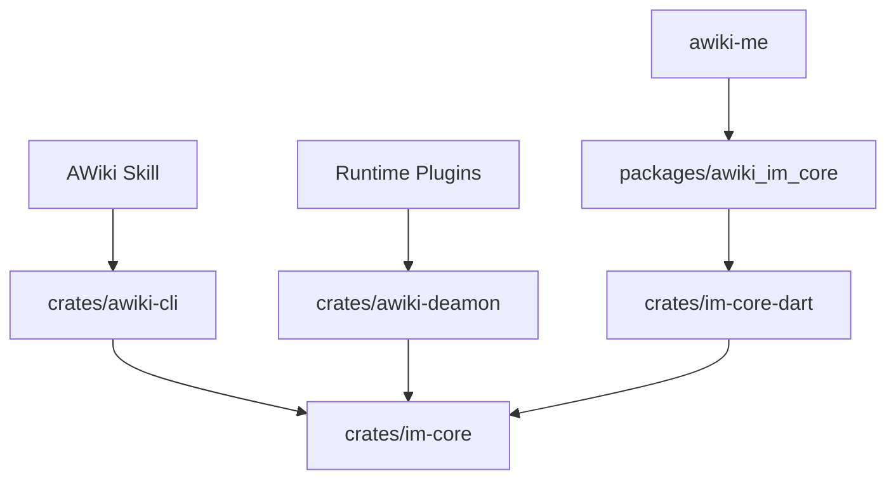

# AWiki Client Workspace Components

[English](workspace-components.md) | [简体中文](workspace-components.zh-CN.md)

## 1. Why this is a workspace

Despite the historical `awiki-cli-rs2` repository name, this repository contains several shared client surfaces: the CLI, Rust IM SDK, AWiki Daemon, Rust-Dart FFI, Flutter/Dart SDK, Agent Skills, and release/architecture documentation. Public documentation should explain the common goal first, then help each user choose an entry point.

## 2. Component boundaries

### `crates/im-core`

The shared Rust SDK owns DID/handle identity registration and recovery, profiles and authentication; directory, contacts, relationships, and display projections; Direct/Group messages, conversation projections, read watermarks, outbox, and reliable sync; group lifecycle and secure hooks; attachments and manifests; high-level realtime/WebSocket sessions; email, content, sites, and local SQLite/redb state; and SecretVault/security boundaries.

It is the shared source of product truth for the CLI, Daemon, Dart facade, and native apps.

### `crates/awiki-cli`

The thin CLI shell owns flags, configuration/path and file I/O, command parsing, dry-run plans, JSON/pretty/table/ndjson rendering, exit codes, and listener-service UX. It must not reimplement raw service RPC, WebSocket frames, local projections, or E2EE state machines.

### `crates/awiki-deamon`

AWiki Daemon is the local Agent Runtime Host. Public text uses the correct `Daemon` spelling; the crate and binary retain the historical `awiki-deamon` name.

It owns Daemon Agent and Runtime Agent DID lifecycles, Runtime plugins, controller-scoped command execution, local UDS RPC, workspace/session/audit state, runtime inbox and final-reply outbox, and SecretVault persistence for Daemon secrets. Concrete runtimes do not hold DID private keys or connect directly to Message Service.

### `crates/im-core-dart`

Exposes the Rust facade through `flutter_rust_bridge`; it does not own app presentation models.

### `packages/awiki_im_core`

The Flutter/Dart SDK provides native Android, iOS, macOS, and Linux entry points; identity-vault operations; DTOs, async APIs, and realtime streams; local conversation/thread projections; and high-level send, read-state, sync, and realtime APIs. Web is currently a stub that throws `UnsupportedError`.

### `skills`

Provides task routing and security rules for agents. Skills do not duplicate business logic; they direct agents to the CLI, Daemon, SDK, and stable documentation.

## 3. Dependency direction

Reverse dependencies are forbidden: Core does not depend on app UI; the Dart SDK does not contain AWiki Me presentation/cache models; Runtime plugins do not hold identity private keys; and Skills do not become another business implementation layer.

## 4. Product and development entry points

| Role | Product entry point | Development entry point |
| --- | --- | --- |
| Terminal user | `awiki-cli` | `crates/awiki-cli` |
| Agent | AWiki Skill and `awiki-cli` | `skills/` |
| Rust integrator | `awiki-im-core` | `crates/im-core` |
| Flutter integrator | `awiki_im_core` | `packages/awiki_im_core` |
| Runtime developer | AWiki Daemon | `crates/awiki-deamon` |
| AWiki Me developer | AWiki Me | Sibling SDK build scripts |

## 5. Versions and releases

Components have independent package versions but must remain compatible within a release. Publish one provenance/compatibility record rather than showing only separate version numbers.

Record at least the CLI package version and commit, `awiki-im-core` version, Daemon version, Flutter SDK version/native artifact commit, ANP SDK commit, compatible service versions, and platform target. Resolve any release-config/crate-version mismatch before release, or document distinct roles such as wrapper channel version and binary crate version.
