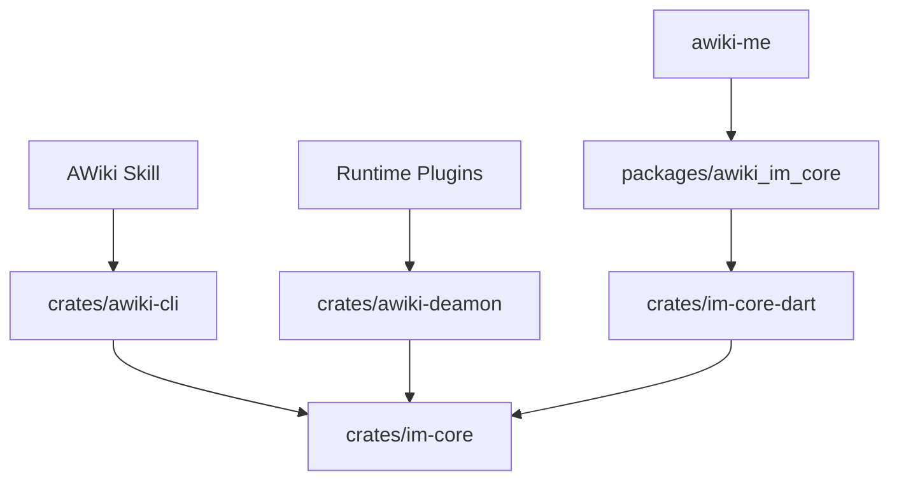

# AWiki Client Workspace 组件说明

[English](workspace-components.md) | [简体中文](workspace-components.zh-CN.md)

## 1. 为什么这是一个 Workspace

仓库虽然名为 `awiki-cli-rs2`，但当前承载的是多个共享客户端产品面：

- CLI；
- Rust IM SDK；
- AWiki Daemon；
- Rust-Dart FFI；
- Flutter/Dart SDK；
- Agent Skills；
- 发布和架构文档。

对外文档应先说明统一目标，再让不同用户选择入口。

## 2. 组件边界

### `crates/im-core`

共享 Rust SDK，负责：

- DID/handle identity registry、注册、恢复、profile 与 auth；
- directory、contacts、relationship 与 display projection；
- Direct/Group 消息、conversation projection、read watermark、outbox 与可靠 sync；
- group lifecycle 与 secure hooks；
- 附件上传/下载和 manifest；
- realtime/WebSocket 高层会话；
- email、content、site 与本地 SQLite/redb 状态；
- SecretVault 与安全能力边界。

它是 CLI、Daemon、Dart facade 和 Native App 的共享业务事实源。

### `crates/awiki-cli`

薄 CLI 产品壳，负责：

- flag、config/path 和文件 IO；
- 命令解析；
- dry-run plan；
- JSON/pretty/table/ndjson rendering；
- exit code；
- listener 本地服务 UX。

它不应重新实现 raw service RPC、WebSocket frame、本地投影或 E2EE 状态机。

### `crates/awiki-deamon`

AWiki Daemon，本地 Agent Runtime Host。公开文案使用正确拼写 `Daemon`；代码包和二进制当前仍是 `awiki-deamon`。

负责：

- Daemon Agent / Runtime Agent DID 生命周期；
- Runtime plugin；
- controller-scoped command execution；
- local UDS RPC；
- workspace/session/audit；
- runtime inbox 与 final reply outbox；
- Daemon 私有材料的 SecretVault 持久化。

具体 Runtime 不持有 DID private key，也不直接连接 Message Service。

### `crates/im-core-dart`

使用 `flutter_rust_bridge` 暴露 Rust facade，不承载 App presentation model。

### `packages/awiki_im_core`

Flutter/Dart SDK，面向 Native App：

- Android、iOS、macOS、Linux 原生入口；
- identity vault 操作；
- DTO、异步 API、realtime stream；
- conversation/thread local projection；
- send、read state、sync/realtime 高层接口。

Web 当前是抛出 `UnsupportedError` 的 stub。

### `skills`

面向 Agent 的任务路由和安全规则。Skill 不复制业务逻辑，只把 Agent 导向 CLI、Daemon、SDK 和稳定文档。

## 3. 依赖方向

禁止反向依赖：

- Core 不依赖具体 App UI；
- Dart SDK 不包含 AWiki Me presentation/cache model；
- Runtime plugin 不直接持有身份私钥；
- Skill 不成为另一个业务实现层。

## 4. 产品入口与开发入口

| 角色 | 产品入口 | 开发入口 |
| --- | --- | --- |
| 终端用户 | `awiki-cli` | `crates/awiki-cli` |
| Agent | AWiki Skill + `awiki-cli` | `skills/` |
| Rust 集成者 | `awiki-im-core` | `crates/im-core` |
| Flutter 集成者 | `awiki_im_core` | `packages/awiki_im_core` |
| Runtime 开发者 | AWiki Daemon | `crates/awiki-deamon` |
| AWiki Me 开发者 | AWiki Me | sibling SDK build scripts |

## 5. 版本与发布

当前组件拥有独立 package version，同时又必须在发布中保持兼容。对外发布应生成一个统一的 provenance/compatibility record，而不是只展示各自版本号。

至少记录：

- CLI package version 与 commit；
- `awiki-im-core` version；
- Daemon version；
- Flutter SDK version/native artifact commit；
- ANP SDK commit；
- compatible service versions；
- platform target。

如果 release config 与 crate version 不一致，必须在发布前解决或明确其角色（例如 wrapper channel version vs binary crate version）。
